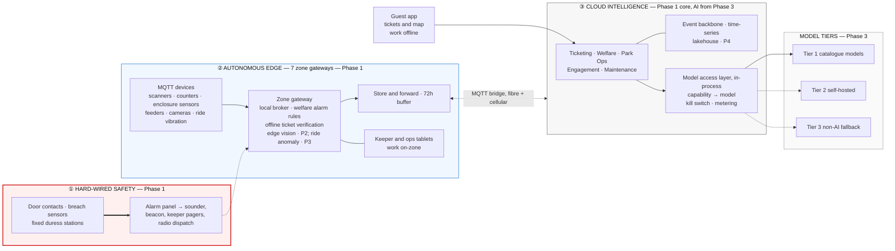

# Von Digitalis Estates Architecture Kata

An estate running 40 historic rides, a 200-animal exotic collection and a carnivorous plant house, for 5,000 daily visitors growing to 15,000, on a site where the network cannot be trusted. **The architecture is edge-first:** zone gateways keep gates, operational welfare alerts and keeper tools working with the cloud unreachable; hard-wired panels independently carry containment and duress; and the cloud owns ticketing, analytics and AI. Eight AI uses sit on top, each with a non-AI fallback, and every generative model is addressed by capability rather than by name — so model churn, price rises and vendor shutdowns are configuration events, not rewrites.

## The architecture in one view

**Line conventions, used in every diagram in this repository.** They are all about dependency.

- **`══>` thick** — hard-wired physical path. No software, no network, no configuration.
- **`──>` solid** — a dependency that must hold in the moment. If it breaks, the function stops.
- **`┄┄>` dotted** — a path allowed to fail or delay, or taken only when a solid path has failed. **This is where the architecture puts every dependency it cannot rely on**, the estate-to-cloud bridge included.
- **`───` plain** — association with no direction worth drawing.

**Shape conventions.** Shapes carry meaning too, so they get a key:

- **`[ ]` rectangle** — a service, component or step. The default; no special meaning.
- **`[( )]` cylinder** — a datastore: something that persists and can be read back.
- **`([ ])` stadium** — a library linked into a calling service, not a deployed hop of its own. Used for the model access layer, where the distinction is the decision ([ADR-005](docs/adr/ADR-005-model-access-and-capability-contracts.md)).
- **`{ }` diamond** — a decision or gate that some inputs do not pass, such as the simulation gym's safety and welfare constraints.
- **`subgraph` box** — a boundary: a zone, a cloud account, a failure domain.

Colour marks the three boundaries on this page only; elsewhere it carries no meaning. Phase tags mark what is *not* in the first deployment.

Read it as three boundaries, in decreasing order of how badly you want them to hold:

1. **Hard-wired safety depends on nothing else here.** Door contacts and duress stations are wired to the alarm panel, which drives the sounder, pagers and radio. A containment breach sounds with every computer on the estate switched off ([safety case](docs/architecture/06-safety-case.md)).
2. **The edge is autonomous.** Gates admit, alarms fire and keepers record with the cloud gone; buffers replay idempotently when it returns.
3. **AI runs on both sides of the bridge.** Vision and vibration models run on the gateway and never call out; forecasting and every generative feature run in the cloud. Only the generative half has a vendor, and it has a non-AI floor underneath.

## What it delivers

Two of the three are **hypotheses with a measurement plan**, not promises — and the delivery plan will not fund the next phase until the evidence arrives.

| Outcome | Status | Test |
|---|---|---|
| **Safe operation through an outage** | **Demonstrable.** A property of the design: the gate validator needs only cached validation material and a clock | Eight-hour cut drill — [walkthrough 1](docs/walkthroughs.md#1-gate-admission-during-an-eight-hour-outage) |
| **Welfare protection** | **Part demonstrable, part hypothesis.** The containment path is demonstrable. That anomaly detection beats a keeper's eye depends on whether the data carries that signal for these species, which nobody knows yet | Blind replay against vet verdicts; Phase 2 does not unlock Phase 3 unless it beats fixed thresholds — [walkthrough 2](docs/walkthroughs.md#2-welfare-alarm-with-the-cloud-and-the-gateway-both-unavailable) |
| **Sustainable visitor growth** | **Hypothesis.** That better staffing and a grounded guide lift return visits is the estate's commercial bet. The architecture makes it measurable and reversible, not certain | Forecast against a seasonal-naive baseline; re-engagement against a holdout — [walkthrough 3](docs/walkthroughs.md#3-the-guest-guide-answers-with-citations-then-is-killed-safely-mid-season) |

**The first deployable slice is small:** gateways, offline tickets, safety and telemetry, with no AI at all and a cloud tier of one managed database and four containers. Every heavier component has a named trigger before it is bought — the [delivery plan](docs/delivery-plan.md).

## Invariants, then ranked characteristics

Three properties are **invariants**. They do not enter the ranking and are never traded against cost or speed; a design that breaks one is rejected rather than scored.

| Invariant | Meaning |
|---|---|
| **Life safety** | The containment, duress and response path takes no dependency on software, network or AI. No automatic actuation, no software control over egress |
| **Data integrity** | Tickets, payments and animal records are never lost, silently altered or double-counted on replay. AI never writes to them |
| **Security and privacy** | Least privilege on every device; no raw video leaves the estate; no personal data without consent; no card data in estate systems |

The remaining four are genuine trade-offs, so *these* are ranked — when two conflict, the higher wins:

1. **Availability under partition** · 2. **Evolvability** · 3. **Observability** · 4. **Elastic scalability**

**Cost transparency is a constraint on how those are met, not a fifth thing to trade against them.** A budget cap may only degrade a feature to its non-AI fallback, never weaken an invariant — which is why the hard cap flips a capability to Tier 3 rather than relaxing a guardrail. Full definitions in [05-characteristics](docs/architecture/05-characteristics.md).

**Every fitness function has a verdict.** The [scorecard](docs/architecture/05-characteristics.md#fitness-function-scorecard) marks each as settled by arithmetic, settled by inspection, qualified by a stated limitation, or unproven until a system exists. **No number in this repository is presented as a measured result** — figures are arithmetic with the working shown, published list prices, or thresholds a later measurement must clear. The trade-offs this design accepts are collected in [known limitations](docs/limitations.md).

## The AI portfolio

Eight uses, each with a non-AI fallback, a phase and an evidence gate. **Three are the recommended first reads** — together they show edge-owned vision, the classic-ML-plus-GenAI split, and guest-facing GenAI with its full governance story.

| | Use case | Why it matters | Runs where | Phase |
|---|---|---|---|---|
| **AI-1** | [Piranha and aquatic counting](docs/ai/ai-01-piranha-counting.md) | The brief's most awkward ask, answered by an **owned vision model on the gateway** — no vendor, no tokens, no video leaving the estate, and a confidence interval rather than false precision | Edge | 2 |
| **AI-2** | [Welfare anomaly and keeper brief](docs/ai/ai-02-welfare-anomaly-and-brief.md) | The clearest **classic-ML-plus-GenAI split**: owned models find it, a generative model only puts it into words with citations. Also the sharpest boundary — AI never acts on an animal | Rules at the edge, models and briefs in the cloud | 2–3 |
| **AI-4** | [Guest guide and itinerary](docs/ai/ai-04-guest-guide.md) | The only feature a guest talks to directly, so it carries the whole **uncertainty and governance** story: capability indirection, enforced citations, safe refusals, cost caps, and a kill switch that falls to keyword search in under a minute | Cloud, cached in app | 3 |

Each is followed end to end in the [walkthroughs](docs/walkthroughs.md). The roadmap — [AI-3](docs/ai/ai-03-crowd-flow-and-staffing.md) crowd flow and staffing, [AI-5](docs/ai/ai-05-retention-and-revenue.md) retention and revenue, [AI-6](docs/ai/ai-06-ride-condition-monitoring.md) ride condition, [AI-7](docs/ai/ai-07-company-copilots.md) copilots, [AI-8](docs/ai/ai-08-simulation-gym.md) simulation gym — is documented and phased on the same terms. The full portfolio, including where AI is deliberately **not** used, is in [00-ai-overview](docs/ai/00-ai-overview.md).

## Start here

**If you read three things:** the [walkthroughs](docs/walkthroughs.md) for what this does on a bad day, the [delivery plan](docs/delivery-plan.md) for what gets built first, and [05-characteristics](docs/architecture/05-characteristics.md) for the yardstick everything is measured against.

| Then | For |
|---|---|
| [overview](docs/overview.md) | The short narrative |
| [01-context](docs/architecture/01-context.md) → [02-containers](docs/architecture/02-containers.md) → [03-edge-zone](docs/architecture/03-edge-zone.md) → [08-cloud-deployment](docs/architecture/08-cloud-deployment.md) → [04-data-flow](docs/architecture/04-data-flow.md) | C4 views, edge and cloud deployment, and the capacity arithmetic behind the edge sizing |
| [00-ai-overview](docs/ai/00-ai-overview.md), then [ai-01](docs/ai/ai-01-piranha-counting.md)–[ai-08](docs/ai/ai-08-simulation-gym.md) | Every AI use in detail |
| [uncertainty](docs/uncertainty.md) · [validation](docs/validation.md) · [limitations](docs/limitations.md) · [fault catalogue](docs/fault-catalogue.md) | Models, prices and vendors; how results are verified; accepted trade-offs and designed failure behaviour |
| [adr/](docs/adr/README.md) · [explainers/](docs/explainers/README.md) | 17 decisions with alternatives; concept notes the rest of the repository assumes |
| [traceability](docs/traceability.md) · [inferred-requirements](docs/inferred-requirements.md) | Every requirement to its design and evidence; 39 inferred items, including what we chose not to build |

## Submission criteria index

| Criterion | Where it is answered |
|---|---|
| Innovative use of AI | [00-ai-overview](docs/ai/00-ai-overview.md); [AI-1](docs/ai/ai-01-piranha-counting.md), [AI-2](docs/ai/ai-02-welfare-anomaly-and-brief.md), [AI-4](docs/ai/ai-04-guest-guide.md) |
| Suitability given the constraints | [02-containers](docs/architecture/02-containers.md), [03-edge-zone](docs/architecture/03-edge-zone.md), [08-cloud-deployment](docs/architecture/08-cloud-deployment.md), [04-data-flow](docs/architecture/04-data-flow.md); [ADR-001](docs/adr/ADR-001-edge-first-hybrid-architecture.md), [ADR-002](docs/adr/ADR-002-mqtt-topology-and-store-and-forward.md), [ADR-003](docs/adr/ADR-003-offline-verifiable-signed-tickets.md) |
| Appropriate level of detail | [traceability](docs/traceability.md); C4 views in [architecture/](docs/architecture/); targeted views in [ai/](docs/ai/); shapes in [implementation/](docs/implementation/) |
| Dealing with uncertainty in AI | [uncertainty](docs/uncertainty.md); [ADR-005](docs/adr/ADR-005-model-access-and-capability-contracts.md), [ADR-006](docs/adr/ADR-006-multi-provider-portfolio.md), [ADR-007](docs/adr/ADR-007-model-registry-and-cost-policies.md), [ADR-009](docs/adr/ADR-009-rag-over-fine-tuning.md), [ADR-014](docs/adr/ADR-014-caching-and-batch-cost-levers.md) |
| Characteristics match the architecture | [05-characteristics](docs/architecture/05-characteristics.md) and its [scorecard](docs/architecture/05-characteristics.md#fitness-function-scorecard); conformance table in [00-ai-overview](docs/ai/00-ai-overview.md); [ADR-004](docs/adr/ADR-004-classic-ml-vs-genai-selection.md) |
| Where AI is deliberately **not** used | [00-ai-overview](docs/ai/00-ai-overview.md#where-ai-is-deliberately-not-used); [06-safety-case](docs/architecture/06-safety-case.md); [ADR-016](docs/adr/ADR-016-local-incident-response.md) |
| Judgment about what not to build | [inferred-requirements](docs/inferred-requirements.md), 39 items each labelled and reasoned; [delivery plan](docs/delivery-plan.md), the trigger before each heavier component is bought |
| Delivery realism | [delivery plan](docs/delivery-plan.md), four phases with cost class, risk reduction and an evidence gate; [walkthroughs](docs/walkthroughs.md); [fault catalogue](docs/fault-catalogue.md) |
| Validation and verification of AI results | [validation](docs/validation.md); [eval-harness](docs/implementation/eval-harness.md); [ADR-008](docs/adr/ADR-008-evaluation-gated-promotion.md), [ADR-011](docs/adr/ADR-011-human-in-the-loop.md), [ADR-012](docs/adr/ADR-012-llm-observability-and-kill-switches.md) |

## Brief, decisions and authorship

The problem statement and product requirements are in [PRD.md](PRD.md); the source material is reproduced unchanged in [docs/source/](docs/source/). All 17 architecture decision records, with alternatives and trade-offs, are indexed in [docs/adr/README.md](docs/adr/README.md).

The team used AI assistants to draft and red-team ADRs, to generate first-pass diagrams and to build the cost models. Every decision, trade-off and diagram was reviewed and edited by the team, and several AI-suggested options were rejected on the way to those recorded here. We treated the assistant the way this architecture treats its models: useful, measured, and never the final authority.
