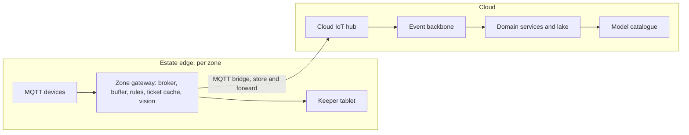

# ADR-001: Edge-first, event-driven hybrid architecture

## Status

Accepted, 2026-09-16. Supersedes / Superseded by: none.

## Context

The estate must sell and validate tickets, monitor 200+ animals across 55 enclosures, understand where 5,000 (rising to 15,000) daily visitors go, and keep 40 historic rides safe. WiFi on the park is patchy, cloud services are permitted, and there is a budget for MQTT-capable devices installed throughout the park.

Forces:

- Gates, alarms and keeper tools must keep working when the link to the cloud drops. A queue of families at a dead turnstile is a lost day.
- Visitor numbers are expected to triple. The cloud can absorb that elastically; hardware on the estate cannot be re-bought every season.
- Analytics, ticketing, CRM and generative AI all want central data and elastic compute.
- The base architecture must make its non-negotiable boundaries and its genuine trade-offs explicit, so later additions can be tested against them.

### Alternatives considered

| Option | Summary | Why not (or why partially) |
|---|---|---|
| A. Cloud-centric | Thin devices publish straight to a cloud IoT hub; all logic runs in the cloud | Fails the connectivity constraint outright. Every gate scan, alarm and keeper action becomes a cloud round trip on a link that is known to be unreliable |
| B. Edge-heavy | Everything runs on estate hardware; the cloud is backup only | Robust in the field, but 3x growth means buying and operating more on-site compute, analytics tooling is weak, and access to frontier AI models is awkward |
| C. Edge-first hybrid, event-driven | Zone gateways run local validation, operational welfare alerts and buffering; the cloud owns ticketing, analytics, AI and long-term data | Chosen. Each side degrades gracefully without the other |

## Decision

Adopt option C. The estate has seven physical operating zones: entrance; rides north and south; aquatic house; terrestrial house; gardens and plants; and back-of-house. The Z8 site core is backhaul infrastructure, not an operating zone. Each zone has a ruggedised gateway running a local MQTT broker, a time-series buffer, an operational welfare-and-maintenance rule engine, a ticket validation cache and, where vision is needed, a GPU-class module. Gateways bridge to a cloud IoT hub over private LTE/5G or fibre with store-and-forward. Venomous containment and keeper duress bypass the gateway entirely through the hard-wired alarm panel ([ADR-016](ADR-016-local-incident-response.md)).

The cloud tier is event-driven: an IoT hub feeds an event backbone, stream processing produces hot-path metrics, and an open-format data lake plus time-series store hold history. Domain services (Ticketing and Payments, Guest Identity and Consent, Park Operations, Animal Welfare, Guest Engagement, Analytics) each own their data and communicate through events. Generative models are not a service of their own: they are reached from a hyperscaler model catalogue through a shared client library, so the cloud tier gains a dependency rather than a component ([ADR-005](ADR-005-model-access-and-capability-contracts.md)).

Every later decision, including every AI addition, is tested against the three invariants — life safety, data integrity, and security and privacy — and the four ranked characteristics — availability under partition, evolvability, observability, and elastic scalability. Cost transparency constrains how all seven are met; it is not traded against any invariant ([Characteristics](../architecture/05-characteristics.md)).

## Consequences

### Positive

- Ticket validation, operational welfare alerts and keeper workflows continue during a cloud partition; hard-wired containment and duress work when the gateway is absent.
- The cloud tier scales with visitor growth; the edge tier scales by adding a zone.
- Video and raw sensor streams stay on the estate, which reduces bandwidth and privacy exposure.
- The characteristics give the estate a concrete conformance test for every later change.

### Negative

- Two deployment surfaces (edge and cloud) mean two release pipelines, two monitoring views and more operational skill.
- Gateway hardware is a capital cost per zone and must be maintained in outdoor and humid environments.
- Eventual consistency between edge and cloud must be designed for in ticketing and animal records.

### Trade-off analysis

| Quality attribute | Effect | Mitigation |
|---|---|---|
| Availability | Strongly improved at the edge | Local rule engine and ticket cache; tested partition drills |
| Simplicity | Reduced by two tiers | Shared observability stack; gateways as identical images |
| Cost | Higher up-front hardware spend | Standardised gateway build; cloud pay-as-you-grow |
| Consistency | Eventual between tiers | Idempotent events, deduplication on reconnect |
| Evolvability | Improved by service and event boundaries | Contracts on topics and events |

## Related

- [ADR-002](ADR-002-mqtt-topology-and-store-and-forward.md), [ADR-003](ADR-003-offline-verifiable-signed-tickets.md), [ADR-010](ADR-010-edge-vision-no-cloud-video.md)
- [Context](../architecture/01-context.md), [Containers](../architecture/02-containers.md), [Edge zone](../architecture/03-edge-zone.md), [Cloud deployment](../architecture/08-cloud-deployment.md), [Data flow](../architecture/04-data-flow.md), [Characteristics](../architecture/05-characteristics.md)
