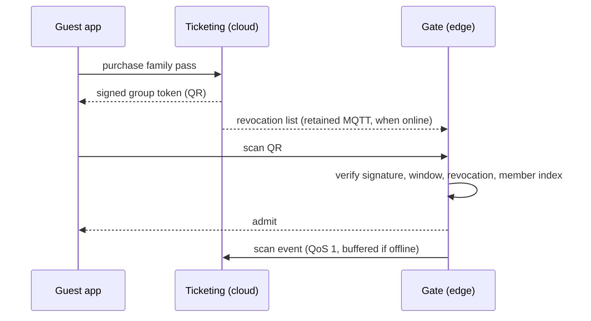

# ADR-003: Offline-verifiable signed tickets

## Status

Accepted, 2026-09-16. Supersedes / Superseded by: none.

## Context

The estate needs to sell tickets, including family passes, and admit up to 15,000 people a day. Gates sit in zones where the cloud link may be down for minutes or hours. A gate that cannot validate a ticket either lets everyone in (revenue loss) or nobody in (a queue and a refund line). Fraud (copied QR codes, expired tickets) must still be caught.

Forces:

- Entry must work with the backhaul down.
- Refunds and cancellations must be honoured within a reasonable window.
- A family pass is one purchase but several people who may not arrive together.
- Payment card data must never touch estate hardware.

### Alternatives considered

| Option | Summary | Why not (or why partially) |
|---|---|---|
| Online lookup per scan | Gate calls the ticketing service for every QR | Fails whenever the link is down, which the brief says is normal |
| Full ticket list synced to every gate | Gates hold a copy of every valid ticket | Works offline but the list is large, sensitive, and stale between syncs; every new sale must propagate before the guest arrives |
| Signed tokens with a small revocation list | Chosen | The token proves itself; only cancellations need to propagate |

## Decision

Every ticket is a compact signed token (Ed25519) rendered as a QR code. The token carries: ticket ID, product type, validity window, admission scope and reuse policy, group ID and group size for family passes, and a key ID. Gates hold the public keys and verify the signature offline. Gates also hold a small revocation list (cancelled or refunded ticket IDs) synced from the cloud via a retained MQTT topic whenever the link is up.

Scan events are published to the zone broker with QoS 1 and drained to the cloud, where the Ticketing service deduplicates re-scans and correlates cross-zone use. A single-use scope is refused by the local log at the same gateway, but can only be detected across gateways after reconciliation; permitted re-entry and ride/day-pass scopes are recorded rather than treated as fraud. A family pass is a group of distinct ticket IDs sharing a group ID and size, and the gate allows up to that number of distinct members per day.

Payments are handled by a payment provider; only a payment reference is stored.

Offline walk-up sales use a separate, low-privilege kiosk issuer key stored in that kiosk's secure element. Its `kid` is accepted only for approved walk-up products, the current operating-day validity window and a fixed daily cap; it cannot issue refunds, discounts, staff products or annual passes. The kiosk replays a tamper-evident sales journal to Ticketing on reconnect, which reconciles every signed `tid` and disables the issuer key on any cap or sequence anomaly. Gateways still hold public verification keys only and cannot mint tickets. The detailed custody and reconciliation protocol is in [Signed ticket format](../implementation/signed-ticket-format.md#offline-kiosk-delegation).

## Consequences

### Positive

- Entry works during any partition; the gate needs nothing but its keys and a small list.
- Ticket data stored on gates is minimal, which limits the impact of a stolen device.
- Family passes are handled without a shared account or an online lookup.
- Scan events feed the popularity analytics for free.

### Negative

- A refund issued while a gate is offline is not enforced until the revocation list syncs.
- Key rotation must be planned so old tokens still verify during their validity window.
- A copied QR with a single-use scope can be used at two gates in different zones before the scans reconcile; the reconciliation flags it after the fact. This window is normally seconds online and may last for a partition.
- A stolen or compromised offline kiosk can mint only its bounded daily allocation until its issuer key is revoked; secure-element custody, narrow product scope and journal reconciliation limit that exposure.

### Trade-off analysis

| Quality attribute | Effect | Mitigation |
|---|---|---|
| Availability | Entry independent of cloud | Keys and revocation list retained on the broker |
| Security | Signature stops forgery; a single-use scope can replay across zones before reconciliation | Short validity windows, post-hoc reconciliation, staff alert on repeated use |
| Consistency | Revocation is eventual | Refund policy states a short enforcement window |
| Privacy | Minimal data on gate hardware | No names in the token; group ID is opaque |
| Operability | Key rotation adds a process | Key ID in token; overlapping key validity |

## Related

- [ADR-001](ADR-001-edge-first-hybrid-architecture.md), [ADR-002](ADR-002-mqtt-topology-and-store-and-forward.md)
- [Containers](../architecture/02-containers.md), [Signed ticket format](../implementation/signed-ticket-format.md)
