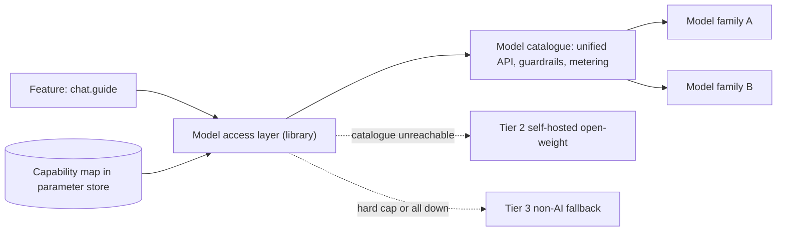

# ADR-005: Model access through a hyperscaler catalogue, with capability contracts in configuration

## Status

Accepted, 2026-09-16. Supersedes / Superseded by: none.

## Context

Several features need generative models: the guest guide, keeper welfare briefs, ops explanations, offer copy and company copilots. The brief asks directly how the design copes with the best model changing, a provider changing prices, and a provider shutting down. If each service integrates a vendor SDK on its own, every one of those events becomes a code change in several places, and there is no single place to meter cost or enforce policy.

Two things have to be true at once. Models must be replaceable without touching feature code. And replacing one must be cheap enough that a small platform team actually does it, rather than deferring it because the machinery is heavy. The second constraint is easy to lose in a diagram: the estate already runs zone gateways, a broker fleet, an event backbone and seven domain services on a team that also has to keep the gates open.

Forces:

- Models and prices change monthly; the estate's software should not.
- Cost must be visible per feature (characteristic: cost transparency).
- Failover must be automatic (characteristic: availability).
- Guest-facing calls need guardrails and PII handling in one place.
- Every extra component on the path of a guest chat is an on-call burden, not a box. The estate is not a model operations shop.

### Alternatives considered

| Option | Summary | Why not (or why partially) |
|---|---|---|
| A. Direct SDK, single vendor | Each service calls one provider's SDK with the model name in code | Fastest to build, but price and shutdown risk are unmitigated, there is no central metering, and a model swap is a change in five services |
| B. Hyperscaler catalogue as the front door, capability map in configuration | Chosen. One catalogue is the only integration; a shared client resolves a capability to a model from versioned configuration | Correlated failure: one cloud account and one control plane sit in front of every generative feature. Hard budget caps and per-guest rate limits are not provided and must be built |
| C. Library-level abstraction over many providers | A framework wraps several providers inside each service | The abstraction is scattered across services, frameworks churn as fast as models, and no service can see aggregate spend |
| D. Independent AI gateway | A separately deployed service in front of all providers | The strongest isolation, and the only option giving genuine cross-cloud failover. Rejected on cost of ownership: a component on the path of every guest chat, an adapter backlog per provider, and a high-availability burden this team cannot staff. Revisit if a second cloud becomes a requirement |

The decision between B and D is not about capability, it is about who maintains the adapters and who carries the pager. The catalogue's unified inference API already does the adapter work that was D's largest recurring cost, and does it for more model families than the estate would ever wire up by hand.

## Decision

**One catalogue is the only integration.** Every generative model call goes to a single hyperscaler model catalogue: AWS Bedrock in the worked example, with Vertex AI or Azure AI Foundry as equivalents. Its unified inference API is the adapter layer, so several model families are reachable without the estate writing or maintaining a per-provider adapter.

**Features address a capability, never a model.** `chat.guide`, `summarise.welfare`, `explain.ops`, `classify.sentiment`, `generate.offer`, `embed.text`. This is unchanged from earlier drafts of this decision and is the sentence the whole uncertainty answer rests on. What changes is only where the indirection lives.

**The indirection is configuration, not a service.** A thin shared client, the *model access layer*, is linked into each service that needs a model. Per call it resolves the capability to a model identifier and parameters from the capability map, attaches the guardrail policy and the cost-attribution tag, checks the feature flag, emits the OpenTelemetry span, and on failure walks the candidate list and then falls through to the capability's Tier 3 behaviour. It holds no state beyond a short-TTL cache of the capability map. Python and TypeScript implementations cover every service in the estate; a third would be a day's work, because the library is deliberately thin.

The capability map is a versioned artefact in git, rendered to the cloud parameter store and polled by the library with a short TTL. A capability can therefore be repointed estate-wide inside a minute and rolled back as fast, with no deployment. That polling cache is the one piece of gateway-like behaviour the library keeps, and a cache with a TTL is a much smaller thing to operate than a hop.

### What the catalogue gives us, and what remains ours to build

| Concern | Provided by the catalogue | Built by the estate |
|---|---|---|
| Provider adapters, streaming, tool use, structured output | Unified inference API across model families | — |
| Credentials and network path | IAM roles and VPC endpoints; no service holds a model API key | — |
| Guardrails | Managed policy: PII redaction, denied topics, content filters, contextual grounding check | Per-capability schema and citation assertions |
| Cost attribution | Per-feature tagging through application inference profiles | Capability roll-up and the priced view |
| Prompt caching and batch pricing | Native | Prompt discipline that keeps the cacheable prefix stable |
| Regional capacity and failover | Cross-region inference | — |
| Model evaluation | Native harness | Golden sets and the promotion gate ([ADR-008](ADR-008-evaluation-gated-promotion.md)) |
| **Hard budget cap** | Alerts only; account-level budget actions are too blunt to apply to one capability | A metering consumer that flips the capability's feature flag to Tier 3 |
| **Per-guest rate limit** | — | Public API edge and the Guest Engagement service |
| **Semantic cache of repeated questions** | — | Guest Engagement service, guest guide only |
| **Capability indirection** | — | Model access layer and the capability map |
| **A failure domain outside the cloud** | — | Tier 2 self-hosted and the Tier 3 non-AI floor ([ADR-006](ADR-006-multi-provider-portfolio.md)) |

The four rows in bold are the price of this decision. They are real work, but they are batch jobs, a config file and a library rather than a service on the guest path, and none of them has to be highly available: if the budget consumer is down, spend is unenforced for an hour, not uncontrolled forever.

```yaml
# Capability contract, design-level
capability: chat.guide
requires: [structured_output, tool_use, context>=32k]
latency_p95_ms: 2500
max_cost_per_1k_requests_usd: 4.00
min_eval_score: 0.85
guardrail_policy: guest-facing-v4      # managed guardrail in the catalogue
candidates:                            # ordered, all must be eval-passing
  - catalogue: primary-region   model: frontier-mid-2026
  - catalogue: secondary-region model: frontier-alt-2026
  - self_hosted: open-weight-8b        # tier 2, separate failure domain
fallback: faq-search                   # tier 3, non-AI
```



Routing remains by capability and health, not per-request cascading: prompt caches are model-scoped, so bouncing a request between models forfeits the cache and costs more than it saves. A capable model at a lower effort setting is measured before any cascade is considered.

## Consequences

### Positive

- A model change is a capability-map edit, not a code change, and reaches every service within a minute.
- No component was added to the path of a guest chat, and no adapter backlog was created. The catalogue absorbs provider churn.
- Credentials, residency, private networking and guardrails are inherited from the cloud's existing controls rather than reimplemented.
- Batch pricing, prompt caching and cross-region capacity are available on day one.
- Dropping the separate service also removes a naming collision: in this estate "gateway" now means only a zone or site gateway.

### Negative

- **Correlated failure.** One cloud account and one control plane sit in front of every generative feature. A catalogue or account-level outage takes all of them at once, which is why Tier 2 must live in a different failure domain and Tier 3 is now load-bearing rather than decorative.
- **Catalogue lag.** Frontier models reach first-party APIs before catalogues, and some never arrive at all. "The best model changes" is answered as "the best model available in the catalogue changes", which is a weaker claim and should be stated plainly rather than glossed.
- **Migration cost is deferred, not removed.** Guardrail policies, inference profiles and batch jobs are catalogue-shaped. Moving to a second cloud later means rebuilding them; the capability map and the eval sets are what make that survivable.
- Budget enforcement is now the estate's own code, so a gap in it is a gap nobody else will close.
- Per-call policy runs in-process, so a guardrail or metering bug ships with a service deployment rather than with one config change.

### Trade-off analysis

| Quality attribute | Effect | Mitigation |
|---|---|---|
| Evolvability | Improved, within the catalogue | Capability map and eval sets are the only coupling; portable by design |
| Availability | No new single point of failure added, but the catalogue becomes one | Cross-region inference, Tier 2 outside the cloud, Tier 3 exercised in every eval run |
| Latency | No extra hop | Native streaming straight from the catalogue to the caller |
| Cost transparency | Good, with one gap closed by hand | Inference-profile tags plus a metering consumer that owns the hard cap |
| Operability | Strongly improved | No service to run, secure or keep highly available |
| Vendor independence | Weakened, deliberately | Owned prompts, traces, embeddings and eval sets; exit plan in [uncertainty.md](../uncertainty.md) |

## Related

- [ADR-006](ADR-006-multi-provider-portfolio.md), [ADR-007](ADR-007-model-registry-and-cost-policies.md), [ADR-008](ADR-008-evaluation-gated-promotion.md), [ADR-012](ADR-012-llm-observability-and-kill-switches.md), [ADR-014](ADR-014-caching-and-batch-cost-levers.md)
- [Uncertainty](../uncertainty.md), [Model access config](../implementation/model-access-config.md), [AI overview](../ai/00-ai-overview.md)
