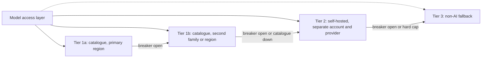

# ADR-006: Model portfolio with a self-hosted tier outside the catalogue

## Status

Accepted, 2026-09-16. Supersedes / Superseded by: none.

## Context

The brief asks what happens if the model provider suddenly shuts down. [ADR-005](ADR-005-model-access-and-capability-contracts.md) chose a single hyperscaler catalogue as the only integration, trading vendor independence for a very large reduction in what the estate has to build and operate. That trade is only defensible if the resulting correlated failure is answered somewhere, and this decision is where it is answered.

The catalogue removes *model* risk well: several families are reachable through one API, so a model being deprecated, degraded or repriced is absorbed by choosing a different entry. It does nothing about *catalogue* risk: one account, one control plane, one bill and one blast radius sit in front of every generative feature in the estate.

Forces:

- Guest-facing chat should not go dark because one API returned errors.
- Idle standby capacity costs money the estate does not have to spare.
- Fallback quality can be lower than primary quality, but it must be known and acceptable.
- The product must keep working with no generative model at all.
- Whatever is meant to survive a catalogue outage cannot itself depend on the catalogue.

### Alternatives considered

| Option | Summary | Why not (or why partially) |
|---|---|---|
| Catalogue only, with retries | Two model families in the catalogue and nothing else | Handles model failure, not account, control-plane or commercial failure. Every generative feature shares one fate |
| Catalogue plus a second catalogue | A second hyperscaler as the standby | Genuine independence, but it doubles the guardrail, profile, batch and eval configuration, which is most of the ownership cost ADR-005 was avoiding. Held as the documented escalation if dependence becomes unacceptable |
| Catalogue plus self-hosted open-weight | Chosen. A small open-weight tier in a different failure domain, plus a non-AI floor | One extra thing to operate, and a quality step down when it is used |
| Self-hosted only | Run open-weight models on own hardware | Lower quality on language tasks today, high fixed cost, and the estate is not a model operations shop |

## Decision

Every generative capability is served from a four-step portfolio, and the steps are ordered by *failure domain*, not by quality.

| Tier | Purpose | Failure domain | Example |
|---|---|---|---|
| 1a | Day-to-day quality | Catalogue, primary region | The best eval-passing frontier family in the catalogue |
| 1b | Model deprecation, model-specific degradation, regional capacity | Catalogue, secondary region | A second family, or the same family in another region via cross-region inference |
| 2 | Loss of the catalogue, the account or the commercial relationship | Outside the catalogue's control plane | An open-weight model (Llama, Qwen or Mistral class) on vLLM, in a separate account with a separate provider |
| 3 | Total loss of generative AI | The estate's own services | FAQ search for the guide, templated numeric reports for briefs, rule-based offers |

**Tier 1a and Tier 1b are not independent in account, billing or credentials.** The earlier gateway design required exactly that independence, and it was right to: two paths that share a control plane are one path with two names. Under this decision they share one, and the honest consequence is that everything above the model level fails together. The independence has therefore moved down a tier: **Tier 2 is no longer an optional continuity nicety, it is the only thing standing between a catalogue outage and Tier 3 for the whole estate.** It is funded, kept warm and drilled accordingly.

Tier 2 is kept cheap by running the smallest model that passes the capability's minimum eval score, scaled to a small warm pool, with cold start tested monthly as part of the partition drill. It must not be deployed into the same cloud account as the catalogue, because an account-level problem is one of the scenarios it exists for. The estate's Z8 rack already houses a spare gateway and is a defensible future home for it; that variant additionally survives a backhaul cut, but only for traffic that never leaves the estate, so it is recorded as an option rather than the default.

Tier 3 carries more weight under this decision than under the previous one and is exercised in every eval run so it never rots. A capability whose Tier 3 behaviour has not been designed and tested does not go live.

Each candidate has a circuit breaker that opens on error rate or latency over a short window and half-opens after a cool-down. Breaker state lives in the model access layer and is shared between replicas through the cache the library already keeps, so one service discovering that the catalogue is down does not leave the others to find out individually.

## Consequences

### Positive

- Model deprecation, degradation and price moves are absorbed inside the catalogue with no new integration.
- A catalogue or account failure degrades the estate to a measured, eval-scored quality level rather than to nothing.
- The self-hosted tier gives a real negotiating position on price, and its existence is what makes the single-catalogue decision defensible rather than merely convenient.
- One commercial relationship to manage instead of two, which is a genuine saving for a team this size.

### Negative

- Tier 1 has no independent standby. Between a catalogue outage and Tier 2 taking over there is a quality cliff, not a gentle slope, and guests see it.
- Tier 2 costs money while idle and needs someone who can operate a model server. Under the gateway design this was optional; here it is not.
- Prompt dialect differences between catalogue models and the open-weight tier add eval and prompt maintenance work.
- A commercial dispute with one cloud provider now affects ticketing, analytics and AI together, because they share an account relationship.

### Trade-off analysis

| Quality attribute | Effect | Mitigation |
|---|---|---|
| Availability | Improved against model failure, unchanged against cloud failure | Tier 2 outside the control plane; Tier 3 for every capability; monthly drill |
| Cost | One contract instead of two, offset by a Tier 2 that must be real | Smallest passing model, small warm pool, committed-use pricing on the catalogue |
| Quality | Step down at Tier 2 and Tier 3 | Minimum eval score per tier; guest sees a "reduced mode" notice |
| Operability | Strongly improved | One integration, one guardrail configuration, one bill |
| Vendor independence | Weakened at Tier 1, preserved at Tier 2 | Owned prompts, eval sets and embeddings; second-catalogue escalation documented above |

## Related

- [ADR-005](ADR-005-model-access-and-capability-contracts.md), [ADR-007](ADR-007-model-registry-and-cost-policies.md), [ADR-008](ADR-008-evaluation-gated-promotion.md)
- [Uncertainty](../uncertainty.md), [Model access config](../implementation/model-access-config.md)
