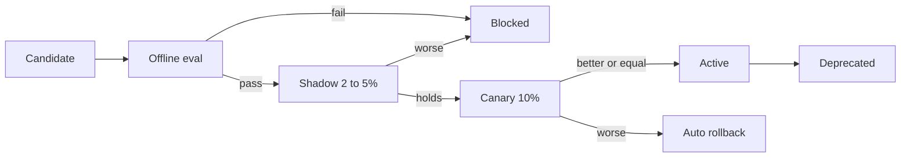

# ADR-008: Evaluation-gated model promotion

## Status

Accepted, 2026-09-16. Supersedes / Superseded by: none.

## Context

Swapping models is only safe if the replacement can be measured. Generative output is non-deterministic, so conventional unit tests do not tell you whether a new model or prompt is better, worse or merely different. The estate needs both pre-release evidence and production detection of misbehaviour.

Forces:

- Models change often; the estate must be able to adopt improvements without fear.
- A guest guide that starts hallucinating opening times damages trust quickly.
- Keepers will stop reading welfare briefs that cry wolf.
- Evaluation costs money and time; the process must be proportionate.

### Alternatives considered

| Option | Summary | Why not (or why partially) |
|---|---|---|
| Manual spot checks before release | Someone reads a few outputs | Not repeatable or comparable across models, and does not scale across the capability catalogue |
| Offline evals only | Golden-set scoring before release, nothing after | Misses drift and real-traffic surprises |
| Immediate full cutover after eval | Promote on offline pass | Real guests see any gap between the golden set and reality |
| Offline eval, shadow, canary, automatic rollback | Chosen | Proportionate confidence at each step |

## Decision

Each capability owns a golden dataset, human-labelled and version-controlled: guest questions with reference answers and required citations; anomaly windows with keeper verdicts; counting frames with ground-truth counts; roster scenarios with outcomes.

Promotion is a sequence of registry status changes, each gated by measurement:

1. Candidate: registered, not routable.
2. Offline eval: automated scoring in CI on every model, prompt or retrieval change. Metrics include accuracy, groundedness, refusal correctness, schema validity, tone, latency and cost. An LLM judge with a human-calibrated rubric scores language outputs, with a sampled human review every run. Below the capability's minimum score the candidate is blocked.
3. Shadow: 2 to 5 percent of live requests are mirrored to the candidate; outputs are scored offline and never shown to users.
4. Canary: 10 percent of live traffic is served by the candidate. Online signals ([ADR-012](ADR-012-llm-observability-and-kill-switches.md)) are compared with the control. If the canary is worse, the registry reverts automatically.
5. Active: first candidate in the routing list.
6. Deprecated: on the provider's calendar; successor evaluated early.

Tier 2 and Tier 3 fallbacks are evaluated in the same pipeline so their quality is known before they are needed.

## Consequences

### Positive

- New models are adopted with evidence, usually within days.
- The same gate that admits a better model blocks a worse one.
- Golden sets double as regression tests for prompt changes.
- Fallback quality is measured, not assumed.

### Negative

- Golden sets need curation and labelling effort, and go stale as the park changes.
- Shadow traffic doubles the cost of the mirrored fraction.
- LLM-as-judge has its own biases and must be recalibrated against humans periodically.

### Trade-off analysis

| Quality attribute | Effect | Mitigation |
|---|---|---|
| Confidence | High | Three gates before full traffic |
| Time to adopt | Days rather than minutes | Shadow and canary windows sized per capability |
| Cost | Eval and shadow spend | Small golden sets, batch pricing for eval runs |
| Judge validity | Rubric drift | Quarterly human calibration sample |

## Related

- [ADR-005](ADR-005-model-access-and-capability-contracts.md), [ADR-007](ADR-007-model-registry-and-cost-policies.md), [ADR-012](ADR-012-llm-observability-and-kill-switches.md)
- [Validation](../validation.md), [Eval harness](../implementation/eval-harness.md)
