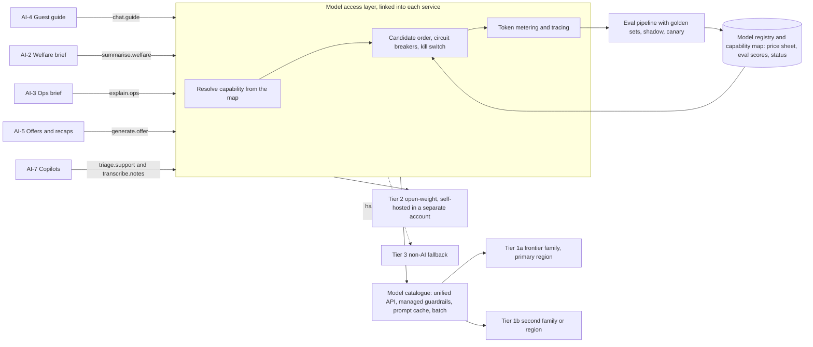
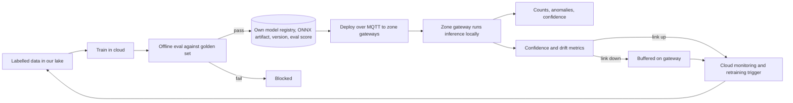

# AI at the Von Digitalis Estates: comprehensive view

This document is the map of every AI use in the solution. Each use has its own targeted view in this folder. The full treatment of vendor and cost uncertainty is in [../uncertainty.md](../uncertainty.md); validation and production monitoring are in [../validation.md](../validation.md).

## Selection principle

Use classic ML or rules wherever the input is numeric or visual and the output is a number or a class. Use GenAI only where language is the input or the output.

Classic models are owned artifacts: trained in our cloud account, versioned in our registry, deployed to zone gateways, and immune to vendor churn. GenAI is reached only by naming a capability, never a model; configuration resolves that capability to an entry in a single model catalogue, and every GenAI feature has a non-AI fallback. This principle is recorded in [ADR-004](../adr/ADR-004-classic-ml-vs-genai-selection.md).

## The seven uses

| ID | Use case | AI type | Runs where | Fallback if AI is unavailable |
|---|---|---|---|---|
| [AI-1](ai-01-piranha-counting.md) | Piranha and aquatic population counting | Computer vision, detection and tracking, owned model | Edge, aquatic zone GPU | Last confirmed count; monthly manual count |
| [AI-2](ai-02-welfare-anomaly-and-brief.md) | Welfare anomaly detection and keeper daily brief | Time-series anomaly detection, owned, plus GenAI summarisation | Edge for alarms; cloud for models and briefs | Threshold alarms; templated numeric report |
| [AI-3](ai-03-crowd-flow-and-staffing.md) | Crowd flow, demand forecasting, staffing | Forecasting and optimisation, owned, plus GenAI explanation | Cloud | Heatmap dashboard with manual rostering |
| [AI-4](ai-04-guest-guide.md) | Guest guide and personalised itinerary | GenAI RAG over curated knowledge plus live occupancy | Cloud, with cached content in the app | Keyword FAQ search and static map |
| [AI-5](ai-05-retention-and-revenue.md) | Retention and revenue | Propensity scoring, owned, plus GenAI content | Cloud, batch | Segment rules and fixed pricing |
| [AI-6](ai-06-ride-condition-monitoring.md) | Ride condition monitoring | Vibration anomaly detection, owned, advisory only | Edge | Scheduled inspections, unchanged |
| [AI-7](ai-07-company-copilots.md) | Company copilots | GenAI | Cloud | Manual process |

## The AI platform

Features never name a model. They name a capability, and configuration decides which registered, eval-passing model serves it. The resolution happens in a shared client library inside each service, not in a component of its own ([ADR-005](../adr/ADR-005-model-access-and-capability-contracts.md)).

Responsibilities, and where each one lives:

| Function | What it does | Where it runs |
|---|---|---|
| Capability contracts | Each capability declares required features, latency, cost ceiling and minimum eval score | Configuration in git |
| Candidate selection | Ordered list of eval-passing candidates per capability; circuit breaker per candidate; kill switch | Model access layer, in-process |
| Provider adaptation | One API across model families, streaming, tool use, structured output | Model catalogue |
| Caches | Prompt caching of the stable prefix; semantic cache for repeated questions | Catalogue; semantic cache in the Guest Engagement service |
| Guardrails | PII redaction, denied topics and content filters before any call; schema and citation assertions on the way back | Catalogue managed policy; assertions in the model access layer so they hold at Tier 2 and Tier 3 too |
| Metering | Every call logs input, output and cached tokens, priced from the registry sheet at the time of the call, tagged by capability | Model access layer, consumed by the budget job that owns the hard cap |

## The owned-model path

Edge vision and anomaly models never touch a vendor. They follow their own lifecycle.

## Capability catalogue

Cost ceilings are per 1,000 requests at list prices and are budget guardrails, not forecasts. Minimum eval scores are on the capability's own rubric, 0 to 100.

| Capability | Required features | p95 latency | Cost ceiling / 1k | Min eval | Consumed by |
|---|---|---|---|---|---|
| `chat.guide` | Grounded answers with citations, structured output, 32k context, tool call for live occupancy | 2.5 s | $6 | 85 groundedness, 95 refusal correctness | AI-4 |
| `summarise.welfare` | Structured input, citations to data points, structured output | 20 s, batch acceptable | $15 | 90 faithfulness | AI-2 |
| `explain.ops` | Structured input, plain-language output | 20 s, batch acceptable | $15 | 85 faithfulness | AI-3 |
| `classify.sentiment` | Short text classification, structured output | 1 s | $1 | 88 agreement with human labels | AI-5, AI-7 |
| `generate.offer` | Templated content, tone constraints, structured output | Batch only | $8 | 90 grounding, 95 tone compliance | AI-5 |
| `embed.text` | Text embeddings, re-embeddable in batch | 300 ms | $0.20 | Recall at 10 above 0.9 on golden queries | AI-4, AI-7 |
| `triage.support` | Classification plus short summary, structured output | 3 s | $3 | 85 routing accuracy | AI-7 |
| `transcribe.notes` | Speech to text plus extraction to schema | 10 s | $10 | 92 field-level extraction accuracy | AI-7 |
| `summarise.incident` | Long-context summarisation with timeline | 30 s | $20 | 85 faithfulness | AI-7 |

## Failure scenarios

```mermaid
flowchart TB
  subgraph S1["Provider outage"]
    A1["Circuit opens within seconds"] --> A2["Route to Tier 1b"]
    A2 -->|"also down"| A3["Route to Tier 2 self-hosted"]
    A3 -->|"also down"| A4["Tier 3 non-AI fallback, feature flag off"]
  end
  subgraph S2["Budget breach"]
    B1["Spend at 120 percent of plan"] --> B2["Alert owning team"]
    B2 -->|"150 percent"| B3["Shift to next eval-passing cheaper candidate"]
    B3 -->|"hard cap"| B4["Tier 3 non-AI fallback"]
  end
  subgraph S3["Link partition"]
    C1["Estate to cloud link drops"] --> C2["Edge models keep running, alarms local"]
    C2 --> C3["Guest app uses cached knowledge and static map"]
    C3 --> C4["Gateway buffers telemetry, replays on reconnect"]
  end
```

What each scenario means for the seven uses:

| Scenario | AI-1, AI-2 alarms, AI-6 | AI-2 briefs, AI-3, AI-5, AI-7 | AI-4 |
|---|---|---|---|
| Provider outage | Unaffected, owned models on the edge | Served by next tier; Tier 3 templated output if all tiers fail | Next tier; keyword FAQ if all tiers fail |
| Budget breach | Unaffected | Cheaper candidate, then templated output | Cheaper candidate, then FAQ search |
| Link partition | Unaffected | Delayed until reconnect; batch jobs run later | Cached content and static map |

## Conformance to the base architecture

The seven ranked characteristics in [05-characteristics.md](../architecture/05-characteristics.md) are the yardstick for every AI addition. The table below is the platform-level answer; each use-case document carries its own conformance table for the specifics.

| Characteristic | How the AI additions conform |
|---|---|
| Availability under partition | Owned models run on the zone gateways; cloud GenAI features degrade to their Tier 3 non-AI fallback; nothing safety-related depends on a model call |
| Evolvability | Models are registry entries behind capability contracts, repointed by configuration within a minute; owned models deploy as versioned ONNX artifacts over MQTT |
| Observability | Every model call is traced with tokens, cost, latency and eval-tagged outputs; edge models report confidence and drift metrics |
| Data integrity | AI never writes to ticketing, payments or animal records directly; it produces recommendations that humans or deterministic services apply |
| Elastic scalability | GenAI calls are stateless and made in-process, so there is no shared component to scale; batch workloads run off-peak; edge inference scales per zone |
| Cost transparency | Token metering per capability with budgets, thresholds and alerts, priced from the registry |
| Security and privacy | Video stays on the edge; PII is redacted before any external model call; consent gates personalisation |

## Related

- [../uncertainty.md](../uncertainty.md): models, prices and vendors
- [../validation.md](../validation.md): evals and production monitoring
- [../architecture/02-containers.md](../architecture/02-containers.md): where model access sits
- [ADR-005](../adr/ADR-005-model-access-and-capability-contracts.md), [ADR-006](../adr/ADR-006-multi-provider-portfolio.md), [ADR-007](../adr/ADR-007-model-registry-and-cost-policies.md), [ADR-008](../adr/ADR-008-evaluation-gated-promotion.md)
