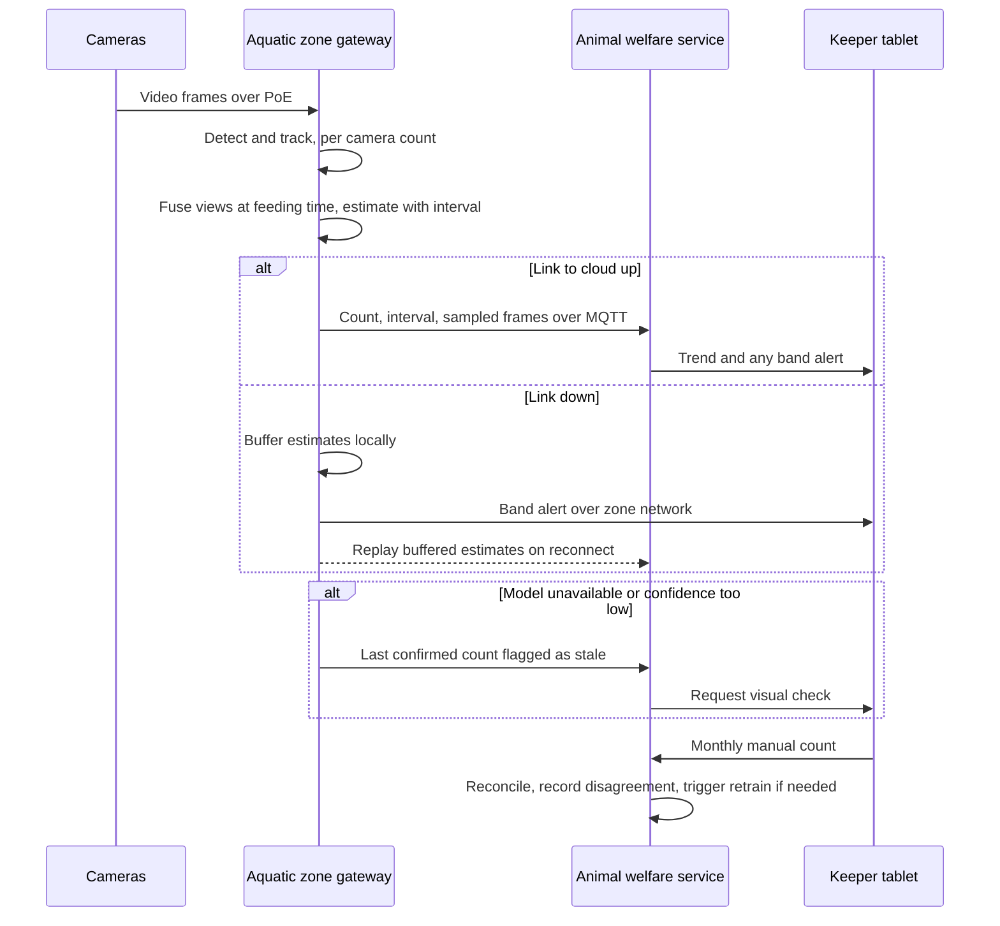

# AI-1 Piranha and aquatic population counting

## Problem

The brief asks for population checks on the jumping piranha collection (F4) and, more broadly, for careful monitoring of an animal collection whose care is costly (F3). Counting fast, shoaling fish by eye is unreliable, and manual tank counts are slow and stressful for the animals. A count that is wrong in either direction has a cost: unnoticed losses point to a health or water-quality problem that will spread; unnoticed breeding means overstocking and aggression. The estate needs a trustworthy count, a trend, and an early warning when the population moves.

## Approach

- Two to three fixed cameras per tank at different angles, wired over PoE to the aquatic zone gateway.
- An owned detection model (YOLO-class, trained on labelled frames from these tanks) plus multi-object tracking. Counting runs continuously as a trend and is anchored at feeding time, when the shoal clusters and occlusion is at its lowest.
- Each camera produces a per-frame count; the gateway fuses the views over a feeding window into a single population estimate with a confidence interval. The output is "38, likely 36 to 40", never a bare number.
- The gateway publishes the estimate, interval and a handful of sampled frames to the welfare service. The full video stays on the edge and is overwritten after a retention window.
- A keeper performs a manual count monthly. The system reconciles its estimate with the manual count and records the disagreement. Persistent disagreement triggers relabelling and retraining.
- The same pipeline extends to other aquatic displays once the piranha tank has proven it.

Human-in-the-loop points: keepers confirm or dispute any alert that the count has moved outside its expected band; keepers own the monthly count that grounds the model.

## Targeted view

## Data and models

| Input | Source | Cadence | Where stored |
|---|---|---|---|
| Video frames | Tank cameras | Continuous | Gateway only, rolling retention |
| Per-frame counts and tracks | Edge inference | Continuous | Gateway buffer, then time-series store |
| Feeding-time estimate with interval | Gateway fusion | Per feeding | Welfare service, time-series store |
| Sampled frames for audit | Gateway | Per feeding, a few frames | Object storage in our cloud account |
| Manual count | Keeper tablet | Monthly | Welfare service |
| Labelled frames | Keeper labelling tool | Ongoing | Data lake |

| Model | Type | Ownership |
|---|---|---|
| Fish detector | Object detection, ONNX | Owned, trained in our cloud, registered in our model registry |
| Tracker | Multi-object tracking | Owned |
| View fusion and interval estimator | Statistical model | Owned |

No generative capability is consumed. This use does not touch an external model provider.

## Where it runs

Entirely on the aquatic zone gateway, which carries a GPU-class module. Reasons: video bandwidth would not survive the estate backhaul; video of the tanks is not needed off-site; the count must keep running when the link is down. The gateway buffers estimates and replays them on reconnect. Model updates arrive from the cloud over MQTT as signed ONNX artifacts when the link is up.

## Degradation and fallback

| Condition | What the keeper sees |
|---|---|
| Cloud link down | Count and alerts continue on the tablet over the zone network; cloud trend catches up later |
| Camera fails | Estimate from remaining cameras with a wider interval, flagged |
| Confidence interval wider than the band | Estimate flagged as low confidence; keeper asked to check visually |
| Model unavailable | Last confirmed count shown as stale with its date; manual count requested |

## Validation

Pre-production:
- Golden set of labelled frames and feeding windows with ground-truth counts, across lighting conditions and water clarity.
- Metrics: detection precision and recall, count error against ground truth, interval calibration (the true count should fall inside the interval at the stated rate).
- Gate: a new model version is registered only if count error and calibration meet the thresholds on the golden set.

Production:
- Online signals: interval width, disagreement with the monthly manual count, frame-level confidence distribution, camera health.
- Thresholds: an alert when interval width grows beyond the agreed band or when the manual count falls outside the interval two months running.
- Rollback: the gateway keeps the previous model version and reverts on a signed command.
- Human audit: monthly manual count; quarterly review of sampled frames against model detections.

## Conformance

| Characteristic | How AI-1 honours it |
|---|---|
| Availability under partition | Runs on the gateway; alerts delivered over the zone network |
| Evolvability | Model is a versioned artifact swapped by registry, not code |
| Observability | Confidence, interval and drift metrics published per feeding |
| Data integrity | Estimates are recorded with interval and model version; the manual count is a separate record |
| Elastic scalability | Per-zone inference; adding tanks adds cameras, not cloud load |
| Cost transparency | Fixed edge hardware; no per-call spend |
| Security and privacy | Video never leaves the zone; only counts and sampled frames do |

## Value

- Replaces a stressful monthly manual count with a continuous trend and keeps the manual count as a check, not the only source.
- Detects losses or breeding within days rather than weeks, which lowers vet cost and prevents overstocking.
- Reusable for other aquatic displays and, with retraining, for terrestrial enclosures.
- Estimate: at a few hundred pounds per camera and one GPU module per aquatic zone, the hardware is a one-off cost far below a single serious water-quality incident.

## Related

- [ADR-004 Classic ML versus GenAI selection](../adr/ADR-004-classic-ml-vs-genai-selection.md)
- [ADR-010 Edge computer vision with no cloud video](../adr/ADR-010-edge-vision-no-cloud-video.md)
- [ADR-011 Human in the loop](../adr/ADR-011-human-in-the-loop.md)
- [ADR-002 MQTT topology and store-and-forward](../adr/ADR-002-mqtt-topology-and-store-and-forward.md)
- [Edge zone view](../architecture/03-edge-zone.md), [AI overview](00-ai-overview.md), [Validation](../validation.md)
