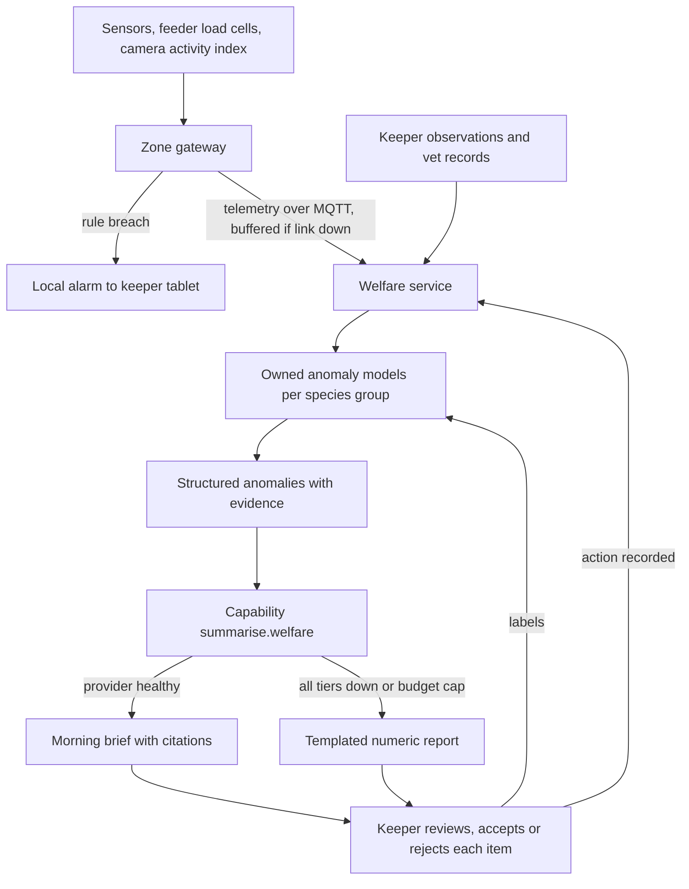

# AI-2 Animal welfare anomaly detection and keeper daily brief

## Problem

Looking after the animals is costly, and far more so when they get sick (brief F3, F4 and F9; requirements F3.1–F3.6). With 200 animals across 55 enclosures, keepers cannot watch every reading and every feeder every hour. The estate needs early, specific warnings about health and feeding, and a morning summary that tells each keeper where to look first, without adding screens to read.

## Approach

- Each enclosure has a sensor kit (temperature, humidity and, for aquatic displays, pH, dissolved oxygen, ammonia, salinity, turbidity) and a camera that produces a coarse activity index on the gateway (movement per hour, never identity). Fifty of the 55 also have a smart feeder with a load cell recording food dispensed and food left over; the remaining five are hand-fed, and the keeper enters the same two weights from the feed-prep scales ([03-edge-zone](../architecture/03-edge-zone.md)).
- **The model is told which mechanism an enclosure uses.** On a feeder enclosure, silence in the feed series is a fault and is flagged as one. On a hand-fed enclosure, the series is lower-frequency and human-entered, so the same silence is normal and the anomaly bands are fitted to that cadence. Conflating the two would generate a standing false alarm on five enclosures and teach keepers to dismiss the feature.
- Keepers add observations on the tablet (appetite, behaviour, stool, injuries). Vet records are held in the welfare service.
- Owned anomaly models per species group flag departures from each enclosure's own baseline. Start with statistical bands and seasonal decomposition; move to isolation forests where the simple bands prove noisy. Safety-critical thresholds (water chemistry out of range) are plain rules evaluated on the gateway.
- Every morning the welfare service assembles the structured anomalies for each enclosure and asks for the capability `summarise.welfare` to produce a plain-language brief that cites the data points behind each item. Briefs are generated in batch overnight.
- Keepers accept or reject each flagged item on the tablet. Those responses are labels that retrain the anomaly models and score the brief.
- AI never acts on an animal. It does not change a feeding schedule, adjust a heater or order medication. It recommends; a keeper or vet decides and records the action.

## Targeted view

## Data and models

| Input | Source | Cadence | Where stored |
|---|---|---|---|
| Environmental readings | Enclosure sensor kit over MQTT | Every 1 to 5 minutes | Gateway buffer, time-series store |
| Food dispensed and leftover | Feeder load cell | Per feeding | Time-series store, welfare service |
| Activity index | Gateway camera inference | Hourly | Time-series store |
| Keeper observations | Keeper tablet, offline-first | Ad hoc | Welfare service |
| Vet records | Welfare service | Ad hoc | Welfare service |
| Accept or reject labels | Keeper tablet | Daily | Data lake |

| Model | Type | Ownership |
|---|---|---|
| Safety thresholds | Rules on the gateway | Owned |
| Anomaly detectors per species group | Statistical bands, seasonal decomposition, isolation forest | Owned, trained in our cloud |
| Activity index | Lightweight vision model | Owned, runs on gateway |
| Brief generation | GenAI via `summarise.welfare` | Catalogue capability, model chosen by registry |

## Where it runs

Operational welfare rules and the activity index run on the zone gateway so that welfare alerts fire with the cloud unreachable. Anomaly models and brief generation run in the cloud because they need history across days and species groups. The brief is a batch job, so a slow or absent link delays it rather than breaks it.

## Degradation and fallback

| Condition | What the keeper sees |
|---|---|
| Cloud link down | Rule alarms continue locally; the morning brief is delayed until reconnect |
| Anomaly model unavailable | Rule alarms only, brief notes that trend analysis is missing |
| GenAI provider or budget unavailable | A templated numeric report listing anomalies with values and baselines, no prose |
| Sensor failure | Enclosure flagged as unmonitored with the time of last reading |

## Validation

Pre-production:
- Golden set of historical anomaly windows with keeper verdicts (true problem, false alarm) per species group.
- Metrics for anomaly models: precision and recall against keeper verdicts, alert volume per keeper per day.
- Metrics for briefs: faithfulness to the structured anomalies (every claim cites a data point that supports it), completeness (no anomaly omitted), tone.
- Gate: no model or prompt goes live below the capability minimum; alert volume must stay under the agreed daily cap.

Production:
- Online signals: keeper accept rate per item, time to acknowledge, citation coverage in briefs, schema failures, anomalies later confirmed by the vet.
- Thresholds: an alert when the accept rate falls below the agreed floor for a species group or when citation coverage drops.
- Rollback: prompt and model versions are registry entries; the previous version is restored by config, and the templated report is the kill-switch state.
- Human audit: weekly sample of briefs checked against raw data by a senior keeper; quarterly vet review of missed cases.

## Conformance

| Property | How AI-2 honours it |
|---|---|
| **Invariant — life safety** | Containment and duress remain hard-wired; anomaly output is an advisory to a keeper and cannot suppress or create an alarm |
| **Invariant — data integrity** | AI writes recommendations, never records; keepers record actions |
| **Invariant — security and privacy** | No video leaves the zone; no personal data enters prompts |
| Availability under partition | Operational welfare alerts are rules on the gateway; the brief is batch and tolerates delay |
| Evolvability | Anomaly models are registry artifacts; the brief names a capability, not a model |
| Observability | Alert volume, accept rate, citation coverage and token cost are all metered |
| Elastic scalability | Batch generation off-peak; per-enclosure models scale linearly |
| Cost transparency *(constraint)* | `summarise.welfare` has its own budget; 55 briefs a day is negligible |

## Value

- **Hypothesis:** problems become visible earlier than a keeper would notice them, when treatment is cheaper and losses are avoidable. The size of that lead time is unknown before deployment and is the thing the Phase 2 evidence gate measures.
- Keepers start the day with a prioritised list rather than a wall of charts.
- Every accept or reject makes the models better, so the system improves with use.
- **Break-even, stated as a condition rather than a result:** the feature's running cost is covered if early detection avoids roughly one serious veterinary case per quarter. Whether it does is exactly what the blind historical replay and the keeper acceptance rate are there to find out. The estate should treat this as the threshold the feature must clear, not as a benefit already banked.

## Related

- [ADR-004 Classic ML versus GenAI selection](../adr/ADR-004-classic-ml-vs-genai-selection.md)
- [ADR-005 Model access and capability contracts](../adr/ADR-005-model-access-and-capability-contracts.md)
- [ADR-011 Human in the loop](../adr/ADR-011-human-in-the-loop.md)
- [ADR-014 Caching and batch as cost levers](../adr/ADR-014-caching-and-batch-cost-levers.md)
- [AI overview](00-ai-overview.md), [Validation](../validation.md), [Data flow](../architecture/04-data-flow.md)
