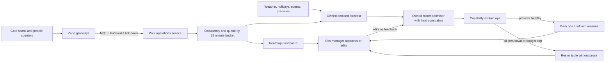

# AI-3 Crowd flow, demand forecasting and staffing

## Problem

The estate has no real idea which parts are most popular, so it cannot tell where to invest or where to deploy staff (brief F2; requirements F2.1–F2.5). Growth to 15,000 visitors a day will make guesswork expensive: overstaffed quiet corners and understaffed queues both cost money and return visits (brief F6, F7 and F8). The estate needs to know where people are now, where they will be tomorrow, and how to place staff accordingly.

## Approach

- Occupancy per attraction in 15-minute buckets (grain and operating-hour normalisation in [ADR-015](../adr/ADR-015-occupancy-grain-and-operating-hour-normalisation.md)) from gate scans at rides and enclosures, plus anonymous people counters at zone boundaries (time-of-flight or thermal, no device tracking). Queue length is estimated from counter pairs at queue entry and ride entry, cross-checked against ride cycle counts.
- Derived measures: dwell time, pass-by versus enter conversion, heatmaps by hour and day.
- An owned demand forecast per attraction and for the whole estate, using history, weather forecast, school holidays, events and ticket pre-sales. Horizon: next day at 15-minute resolution, and next four weeks at daily resolution.
- An owned roster optimiser turns the forecast into a staffing suggestion under hard constraints (minimum staff per ride for safety, skills, contracted hours, breaks).
- The capability `explain.ops` turns the forecast and roster into a short daily operations brief that explains the recommendation in plain language and cites the numbers.
- Operations managers approve, edit or reject the roster. Their edits are recorded and used to tune the optimiser.

## Targeted view

## Data and models

| Input | Source | Cadence | Where stored |
|---|---|---|---|
| Gate scans | Ride and enclosure scanners over MQTT | Per scan | Event backbone, time-series store |
| Zone counts | Anonymous people counters | Per minute | Time-series store |
| Ride cycles | Ride sensors | Per cycle | Time-series store |
| Weather forecast | External API | Hourly | Warehouse |
| Holidays and events | Ops calendar | As changed | Warehouse |
| Pre-sales | Ticketing service | Hourly | Warehouse |
| Roster decisions and edits | Ops dashboard | Daily | Warehouse |

| Model | Type | Ownership |
|---|---|---|
| Queue estimator | Counter-pair arithmetic with smoothing | Owned |
| Demand forecast | Gradient-boosted or seasonal time-series model | Owned, retrained weekly |
| Roster optimiser | Constraint optimisation | Owned |
| Ops brief | GenAI via `explain.ops` | Catalogue capability |

## Where it runs

Counting and scan capture run on gateways and survive a link outage. Forecasting, optimisation and the brief run in the cloud because they need estate-wide history and external feeds. All of it is batch or near-real-time; nothing here is on the guest's critical path.

## Degradation and fallback

| Condition | What the ops manager sees |
|---|---|
| Cloud link down | Live heatmap stale with a timestamp; gateways replay counts on reconnect |
| Forecast model unavailable | Same-day-last-week baseline shown as the forecast, clearly labelled |
| Optimiser unavailable | Yesterday's roster proposed with the baseline forecast |
| GenAI provider or budget unavailable | Roster table and forecast chart without the prose brief |

## Validation

Pre-production:
- Golden set of historical days with actual occupancy, queue lengths and rosters worked.
- Metrics: forecast error (MAPE per attraction and estate-wide), queue estimate error against manual spot counts, optimiser constraint satisfaction, brief faithfulness to the numbers.
- Gate: forecast error must beat the same-day-last-week baseline; brief must meet the `explain.ops` minimum score.

Production:
- Online signals: daily forecast error, manager edit rate on rosters, queue outcomes on days the suggestion was followed versus edited, citation coverage in briefs.
- Thresholds: alert when forecast error worsens for a week or manager edit rate rises sharply.
- Rollback: forecast and optimiser versions are registry entries; the brief prompt is versioned; previous versions restored by config.
- Human audit: monthly review of forecast versus actuals with ops; quarterly spot counts to recalibrate queue estimation.

## Conformance

| Property | How AI-3 honours it |
|---|---|
| **Invariant — life safety** | The recommendation has no authority over containment, duress, ride clearance or emergency response |
| **Invariant — data integrity** | Scans are idempotent events; rosters are approved by a manager before they take effect |
| **Invariant — security and privacy** | Counters are anonymous; no device tracking or faces enter the model |
| Availability under partition | Capture is on the edge; analysis is batch and tolerant of delay |
| Evolvability | Forecast and optimiser are versioned artifacts; the brief names a capability |
| Observability | Forecast error and edit rate are first-class metrics |
| Elastic scalability | Batch in the cloud; adding attractions adds counters |
| Cost transparency *(constraint)* | `explain.ops` is one call a day per site; counters are fixed cost |

## Value

- Ends the guesswork about which parts of the estate are popular, which directs investment.
- Puts staff where queues will be, which shortens waits. The onward link from shorter waits to more return visits is plausible and widely assumed, but it is not something this design measures directly; what it measures is forecast error and realised queue outcomes.
- **Break-even, stated as a condition rather than a result.** The feature's running cost is a batch forecast and a daily explanation, measured in tens of pounds a month. It pays for itself if it improves staffing efficiency by a fraction of a percentage point against a workforce sized for 15,000 visitors a day. Whether it does is measured by roster acceptance and by forecast error against a seasonal-naive baseline, not assumed — and the Phase 3 gate does not pass on a forecast that fails to beat the baseline.

## Related

- [ADR-004 Classic ML versus GenAI selection](../adr/ADR-004-classic-ml-vs-genai-selection.md)
- [ADR-013 Privacy-preserving footfall](../adr/ADR-013-privacy-preserving-footfall-and-consent.md)
- [ADR-011 Human in the loop](../adr/ADR-011-human-in-the-loop.md)
- [ADR-005 Model access and capability contracts](../adr/ADR-005-model-access-and-capability-contracts.md)
- [AI-8 Simulation gym](ai-08-simulation-gym.md), which models the estate as it might be rather than forecasting it as it is
- [AI overview](00-ai-overview.md), [Data flow](../architecture/04-data-flow.md), [AI-5](ai-05-retention-and-revenue.md)
