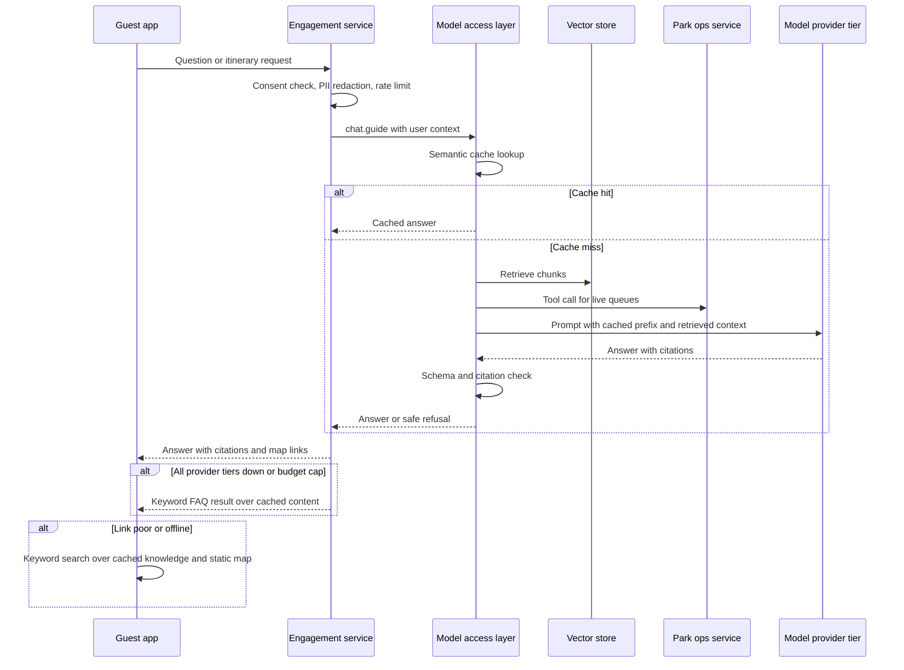

# AI-4 Guest guide and personalised itinerary

## Problem

The estate wants more visitors and more returning visitors but is not sure how (F5). A first-time family arriving at a sprawling estate with 40 rides, 55 enclosures and patchy WiFi needs help deciding what to see, when, and how to avoid queues. A guide that answers questions accurately, plans a day around the family's needs and nudges them towards quiet attractions turns a confusing visit into a good one, which is what brings people back.

## Approach

- A conversational guide in the guest app, backed by retrieval-augmented generation over curated estate content: animals, rides, history, accessibility, food, opening times, safety rules. Content is written and approved by the estate, chunked and embedded through the `embed.text` capability, and stored in our own vector store alongside the source text.
- Live inputs through a tool call: queue lengths and occupancy from AI-3, show times, weather.
- Itinerary planning: given family composition (ages, mobility needs, interests) and time available, the guide proposes a route that balances interests against predicted queues. Push alerts when a favourited ride's queue drops.
- The guide calls the `chat.guide` capability, which configuration resolves to a model in the catalogue. The stable prefix (system prompt, guardrail rules, estate profile) is prompt-cached by the catalogue; frequent questions are served from a semantic cache in the Engagement service without a model call at all.
- Guardrails: answers must cite retrieved content or a live tool result, otherwise the guide says it does not know and points to staff. Medical, safety and emergency topics are refused with a fixed message and a route to staff. PII is redacted before any external call. Per-user and per-device rate limits cap abuse and cost.
- Offline behaviour: the app ships with a cached knowledge base, a static map and the day's show times. When the link is poor the same question box falls back to keyword search over the cached content, labelled as offline mode.

## Targeted view

## Data and models

| Input | Source | Cadence | Where stored |
|---|---|---|---|
| Curated estate content | Content team, approved | As edited | CMS in our cloud, source text kept with embeddings |
| Embeddings | `embed.text` capability | On content change, re-embed in batch | Our vector store |
| Live queues and occupancy | AI-3 via park ops service | Per minute | Time-series store |
| Guest preferences and consent | Guest app | Per session | CRM and consent service |
| Conversation traces | Model access layer | Per turn | Trace store, retention limited |
| Guest feedback | Thumbs on answers | Per answer | Data lake |

| Model | Type | Ownership |
|---|---|---|
| Guide answers and itinerary | GenAI via `chat.guide` | Catalogue capability, model chosen by registry |
| Text embeddings | Embedding model via `embed.text` | Catalogue capability, re-embeddable in batch |
| Offline keyword search | Deterministic search in the app | Owned |

## Where it runs

In the cloud, because it needs the estate-wide knowledge base, live occupancy and an external model. The app carries enough cached content to be useful with no link. Guest WiFi is not relied on; the app works over mobile data and falls back to cached mode.

## Degradation and fallback

| Condition | What the guest sees |
|---|---|
| Poor or no link | Offline mode: keyword search over cached content, static map, cached show times |
| One model or region fails | No visible change; the next candidate in the catalogue serves the call |
| The whole catalogue is unreachable | Tier 2 self-hosted answers at lower quality behind a "reduced mode" notice, then Tier 3 keyword search over cached content |
| All tiers down or budget cap | Keyword FAQ answers served by the engagement service, labelled as limited mode |
| Live queue feed down | Answers still work; itinerary uses forecast rather than live queues and says so |
| Answer fails citation check | Guide says it is not sure and directs to staff |

## Validation

Pre-production:
- Golden set of several hundred guest questions with reference answers, required citations and expected refusals, including adversarial prompts (prompt injection, medical advice, off-topic).
- Metrics: groundedness (every claim supported by a cited chunk), answer accuracy, refusal correctness, schema validity, tone, latency, cost per answer.
- Gate: the `chat.guide` minimum scores must be met by any candidate model or prompt before it can serve traffic.

Production:
- Online signals: citation coverage, schema failure rate, thumbs-down rate, escalation-to-staff rate, semantic cache hit rate, p95 latency, cost per 1,000 answers.
- Thresholds: alert on rising thumbs-down or falling citation coverage; automatic canary rollback when the canary's signals fall below the control's.
- Rollback: model and prompt are registry entries; the feature flag switches to FAQ mode instantly.
- Human audit: weekly sample of conversations reviewed by the content team; monthly red-team session against the guardrails.

## Conformance

| Characteristic | How AI-4 honours it |
|---|---|
| Availability under partition | Cached content and keyword search in the app; FAQ mode in the cloud |
| Evolvability | Names `chat.guide` and `embed.text`, never a model; source text kept so re-embedding is a batch job |
| Observability | Every turn traced with retrieved chunks, citations, tokens and cost |
| Data integrity | The guide reads from approved content and live services; it writes nothing |
| Elastic scalability | Stateless calls with no shared component to scale; caches absorb peaks |
| Cost transparency | Dominant GenAI spend, so it has its own budget, rate limits and cost dashboard |
| Security and privacy | Consent-gated personalisation; PII redacted before external calls; traces retention-limited |

## Value

- Guests get a day plan that fits their family and avoids queues, which is the visible difference between a good visit and a tiring one.
- The estate gets a channel for nudging guests to under-used attractions and a record of what guests ask, which feeds content and investment decisions.
- Estimate: at target scale roughly 22,000 answered turns a day, costing in the low thousands of pounds a month before caching. A small lift in return visits pays for it many times over.

## Related

- [ADR-005 Model access and capability contracts](../adr/ADR-005-model-access-and-capability-contracts.md)
- [ADR-006 Multi-provider portfolio](../adr/ADR-006-multi-provider-portfolio.md)
- [ADR-009 RAG over fine-tuning](../adr/ADR-009-rag-over-fine-tuning.md)
- [ADR-012 LLM observability and kill switches](../adr/ADR-012-llm-observability-and-kill-switches.md)
- [ADR-013 Consent-based personalisation](../adr/ADR-013-privacy-preserving-footfall-and-consent.md)
- [ADR-014 Caching and batch](../adr/ADR-014-caching-and-batch-cost-levers.md)
- [AI overview](00-ai-overview.md), [Uncertainty](../uncertainty.md), [Validation](../validation.md)
