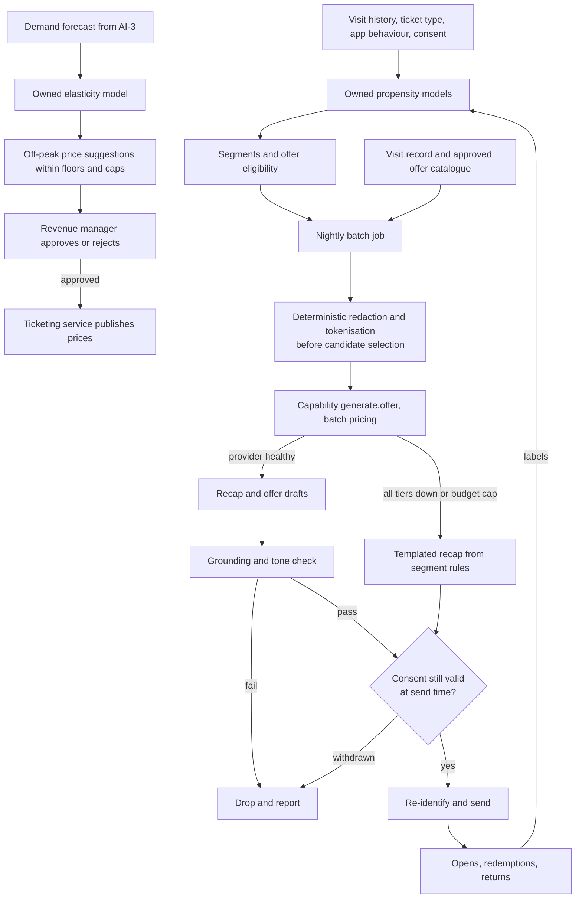

# AI-5 Retention and revenue

## Problem

The estate must grow visitor numbers, get more of them to return, and become more profitable, or the family is back in the garden gnome business (brief F6, F7 and F8; requirements F5.4, F5.5). Today it cannot tell which visitors are likely to come back, which offers work, or whether its prices match demand. It needs to understand its guests and act on that understanding without alienating them.

## Approach

- Owned propensity models score each consented guest for likelihood to return and for responsiveness to memberships, family passes and seasonal events. Inputs are visit history, ticket type, app behaviour and the attractions visited. Guests who have not consented are treated as an anonymous segment.
- Off-peak pricing suggestions: an owned demand-elasticity model proposes price adjustments for quiet days and slots, using the forecast from AI-3. Hard guardrails apply: price floors and caps, no per-person or per-segment pricing, changes published in advance. A revenue manager approves every change; nothing goes live automatically.
- Post-visit recap and offers: overnight batch jobs assemble each consented guest's visit (attractions seen, favourite animal, photos they opted into) and call the `generate.offer` capability to write a short recap and a relevant offer from an approved offer catalogue. The `classify.sentiment` capability scores reviews and support messages to detect unhappy guests for a service recovery offer.
- **Redaction before routing.** The batch job passes pseudonymised records: the model receives visit facts and an offer identifier, never a name, email, address or account identifier. The model access layer applies deterministic redaction and tokenisation before it selects a candidate, so the payload is stripped whichever tier serves it, including the self-hosted Tier 2 that sits outside the catalogue ([ADR-012](../adr/ADR-012-llm-observability-and-kill-switches.md)). Re-identification happens in the Engagement service after the text returns, never in the prompt.
- **Consent is re-checked at send time.** Scoring-time consent is not sufficient: a guest may withdraw between the overnight batch and the morning send, and the withdrawal must win. The send step re-reads the consent flag immediately before dispatch and drops the message if it has changed, which is the behaviour [traceability](../traceability.md) records as the evidence for F5.4.
- Every generated message is checked for grounding (only facts from the visit record and the offer catalogue) and tone before send. Messages that fail are dropped and reported, never sent.
- Outcomes (opens, redemptions, returns) flow back as labels for the propensity models and as an offline eval set for the content.

## Targeted view

## Data and models

| Input | Source | Cadence | Where stored |
|---|---|---|---|
| Visit history and ticket type | Ticketing and gate scans | Per visit | Warehouse |
| App behaviour | Guest app, consented | Per session | Warehouse |
| Consent flags | Consent service | As changed | CRM |
| Demand forecast | AI-3 | Daily | Warehouse |
| Offer catalogue | Marketing team, approved | As edited | CMS |
| Reviews and support messages | App, email, review sites | Daily | Data lake |
| Campaign outcomes | Email and app analytics | Daily | Warehouse |

| Model | Type | Ownership |
|---|---|---|
| Return propensity, offer responsiveness | Gradient-boosted classifiers | Owned, retrained monthly |
| Demand elasticity | Regression on history and forecast | Owned |
| Recap and offer text | GenAI via `generate.offer` | Catalogue capability, batch |
| Sentiment | GenAI via `classify.sentiment` | Catalogue capability |

## Where it runs

Entirely in the cloud, entirely in batch. Nothing here is on the estate's critical path, and nothing needs to happen while a guest is standing at a gate. Batch generation runs overnight on the catalogue's batch inference pricing, which is the cheapest way to call a model.

## Degradation and fallback

| Condition | What happens |
|---|---|
| Propensity model unavailable | Segment rules based on ticket type and visit count |
| Elasticity model unavailable | Fixed price calendar; no suggestions raised |
| GenAI provider or budget unavailable | Templated recap and offer from segment rules; still grounded, less personal |
| Grounding or tone check fails | Message dropped, reported to marketing, never sent |

## Validation

Pre-production:
- Golden set: historical guests with known return outcomes for the propensity models; a set of visit records with reference recaps and forbidden claims for the content; labelled reviews for sentiment.
- Metrics: propensity AUC and calibration; recap grounding (no claim outside the visit record and catalogue), tone compliance, offer relevance; sentiment agreement with human labels.
- Gate: propensity must beat the segment-rule baseline on held-out data; content and sentiment must meet the capability minimums.

Production:
- Online signals: redemption and return rates by segment against a holdout that receives the templated fallback; unsubscribe and complaint rates; grounding check failure rate; price change approval rate.
- Thresholds: alert when unsubscribe rate rises or when the personalised path stops beating the holdout.
- Rollback: switch the feature flag to templated messages; revert prompt or model versions in the registry; prices revert to the fixed calendar.
- Human audit: revenue manager approves every price change; marketing reviews a weekly sample of sent messages; quarterly fairness review of pricing and offers.

## Conformance

| Property | How AI-5 honours it |
|---|---|
| **Invariant — life safety** | Offers and propensity scores cannot control safety functions, access control or emergency operations |
| **Invariant — data integrity** | Prices change only through the ticketing service after approval; messages are generated from the record, never edit it |
| **Invariant — security and privacy** | Consent-gated; no per-person pricing; PII never leaves estate systems unredacted |
| Availability under partition | Batch in the cloud; no dependency on the estate link |
| Evolvability | Owned models are registry artifacts; content names a capability |
| Observability | Outcome metrics per segment with a permanent holdout |
| Elastic scalability | Overnight batch sized to the guest base |
| Cost transparency *(constraint)* | Batch route at reduced price; own budget for `generate.offer` |

## Value

- Turns one-off visitors into members and repeat visitors with offers that reflect what they actually did.
- Raises revenue on quiet days without alienating guests, because pricing is transparent and human-approved.
- **Break-even is measured, not forecast:** the capability remains within its configured budget until a holdout comparison can show incremental contribution after offer cost. The brief supplies neither ticket price nor gross margin, so the design does not invent the return-visit uplift required to pay for it. A material gain remains an upside case, not an expected result.

## Related

- [ADR-004 Classic ML versus GenAI selection](../adr/ADR-004-classic-ml-vs-genai-selection.md)
- [ADR-011 Human in the loop](../adr/ADR-011-human-in-the-loop.md)
- [ADR-013 Consent-based personalisation](../adr/ADR-013-privacy-preserving-footfall-and-consent.md)
- [ADR-014 Caching and batch](../adr/ADR-014-caching-and-batch-cost-levers.md)
- [AI-3](ai-03-crowd-flow-and-staffing.md), [AI overview](00-ai-overview.md), [Validation](../validation.md)
