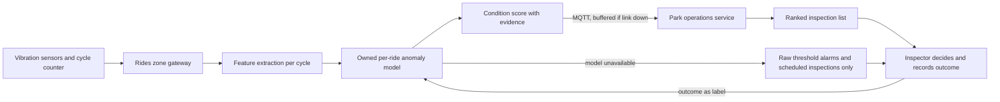

# AI-6 Ride condition monitoring

## Problem

The 40 rides are historically important, 18th century, and have only recently passed inspection. A ride out of service loses revenue and disappoints guests (F6, F5); a ride that fails in use is unthinkable. The inspection regime is deterministic and stays exactly as it is. What the estate lacks is a way to tell inspectors which ride to look at first.

## Approach

- Each ride carries vibration sensors on its main bearings and drive, plus a cycle counter, all publishing over MQTT to the zone gateway.
- An owned anomaly model per ride learns that ride's own baseline signature (spectral features per cycle, drift by temperature and load) and flags departures. Baselines are per ride because no two of these machines are alike.
- Output is a condition score and a ranked list of rides for inspection, with the evidence: which feature moved, when, and by how much.
- Strictly advisory. The model does not stop a ride, does not change its schedule and does not sign anything off. Only an inspector can take a ride out of service, and every inspection outcome is recorded against the model's score to grade it.

## Targeted view

## Data and models

| Input | Source | Cadence | Where stored |
|---|---|---|---|
| Vibration samples | Ride sensors over MQTT | Per cycle, windowed | Gateway buffer, features to time-series store |
| Cycle count and load | Ride sensors | Per cycle | Time-series store |
| Ambient temperature | Zone sensor | Per 5 minutes | Time-series store |
| Inspection outcomes | Inspector tablet | Per inspection | Park operations service |

| Model | Type | Ownership |
|---|---|---|
| Feature extraction | Spectral features per cycle | Owned, runs on gateway |
| Per-ride anomaly detector | Baseline model per ride, retrained after each inspection cycle | Owned |
| Raw thresholds | Rules on the gateway | Owned |

No generative capability is consumed.

## Where it runs

Feature extraction and scoring run on the rides zone gateway, so scores and threshold alarms are produced with the cloud unreachable. Retraining runs in the cloud on accumulated features and inspection outcomes; new model versions deploy over MQTT.

## Degradation and fallback

| Condition | What the inspector sees |
|---|---|
| Cloud link down | Scores still produced locally; the cloud list updates on reconnect |
| Model unavailable | Raw threshold alarms only; the scheduled inspection regime continues unchanged |
| Sensor failure | Ride flagged as unmonitored and placed at the top of the list |

## Validation

Pre-production:
- Golden set: historical feature windows with inspection outcomes, including known faults where they exist and synthetic faults injected on a test rig.
- Metrics: ranking quality (faults found near the top of the list), false alarm rate per ride per month, lead time between first flag and confirmed fault.
- Gate: a per-ride model is enabled only after a burn-in period with no more than the agreed false alarm rate.

Production:
- Online signals: inspection hit rate on flagged rides, false alarm rate, score drift after maintenance.
- Thresholds: alert when false alarms exceed the cap or when a confirmed fault was never flagged.
- Rollback: previous model version restored on the gateway by signed command; thresholds remain in place regardless.
- Human audit: every inspection is a human audit; quarterly review of missed faults with the inspection lead.

## Conformance

| Characteristic | How AI-6 honours it |
|---|---|
| Availability under partition | Scoring and thresholds run on the gateway |
| Evolvability | Per-ride models are versioned artifacts deployed by registry |
| Observability | Scores, evidence and inspection outcomes are all recorded together |
| Data integrity | Inspection records are written only by inspectors |
| Elastic scalability | Per-zone; adding rides adds sensors |
| Cost transparency | Fixed sensor cost; no per-call spend |
| Security and privacy | No personal data involved |

## Value

- Inspectors spend their time on the rides most likely to need it, which finds faults earlier and cheaper.
- Fewer unplanned closures, which protects revenue and the guest experience.
- The safety regime is untouched, which is what the inspectors, the insurer and the judges will want to hear.
- Estimate: avoiding a single week of unplanned closure on a popular ride covers the sensor cost for the whole park.

## Related

- [ADR-004 Classic ML versus GenAI selection](../adr/ADR-004-classic-ml-vs-genai-selection.md)
- [ADR-011 Human in the loop](../adr/ADR-011-human-in-the-loop.md)
- [ADR-002 MQTT topology and store-and-forward](../adr/ADR-002-mqtt-topology-and-store-and-forward.md)
- [Edge zone view](../architecture/03-edge-zone.md), [AI overview](00-ai-overview.md)
