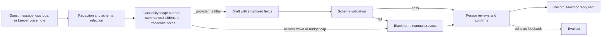

# AI-7 Company copilots

## Problem

The estate's staff spend time on work that language models do well: sorting support requests, writing up incidents, and turning a keeper's spoken notes into structured records. None of it is guest-facing or safety-critical, all of it is language in and language out, and all of it slows the people who should be looking after animals and guests (F3, F6).

## Approach

Three internal copilots, all reached by naming a capability, all producing drafts that a person confirms.

| Copilot | Capability | What it does | Who confirms |
|---|---|---|---|
| Support triage | `triage.support`, `classify.sentiment` | Classifies incoming guest messages (ticketing, lost property, complaint, accessibility), drafts a reply from approved templates, and flags unhappy guests to AI-5 for service recovery | Support agent before send |
| Incident summaries | `summarise.incident` | Builds a timeline and summary from ops logs, alerts and staff notes for any incident (ride stoppage, animal escape drill, first aid) | Duty manager before filing |
| Keeper voice notes | `transcribe.notes` | Transcribes a keeper's spoken observation on the tablet and extracts it to the welfare record schema (animal, behaviour, appetite, concern level) | Keeper reviews fields before saving |

Prompts and the extraction schema are versioned in the registry. All three copilots run over redacted text and produce structured output that is validated before it is shown.

How the team used AI during the kata: we used an AI assistant to decode the brief against the judges' criteria, draft the first pass of ADRs and diagrams, and red-team the design by asking it to argue for each rejected option and to find features that would break under a link outage or a vendor shutdown. Every decision was reviewed and rewritten by the team; the assistant's role was to widen the search and shorten the writing, which is exactly the role the copilots above play for estate staff.

## Targeted view

## Data and models

| Input | Source | Cadence | Where stored |
|---|---|---|---|
| Guest messages | Email, app, web form | Continuous | Support system |
| Ops logs and alerts | Park operations service | Continuous | Event backbone, warehouse |
| Keeper voice notes | Keeper tablet, offline-first | Ad hoc | Uploaded on reconnect, audio deleted after extraction is confirmed |
| Reply templates | Support lead, approved | As edited | CMS |
| Confirmed edits | Staff | Per use | Eval set in data lake |

| Model | Type | Ownership |
|---|---|---|
| Triage and reply drafting | GenAI via `triage.support` | Catalogue capability |
| Sentiment | GenAI via `classify.sentiment` | Catalogue capability |
| Incident summary | GenAI via `summarise.incident` | Catalogue capability |
| Transcription and extraction | Speech to text plus GenAI via `transcribe.notes` | Catalogue capability |

## Where it runs

In the cloud. The keeper tablet records audio offline and uploads it when a link is available; the extracted record comes back on the next sync. Support and incident copilots are used from the office network.

## Degradation and fallback

| Condition | What staff see |
|---|---|
| Keeper tablet offline | Note is stored locally; extraction arrives after sync; keeper can type fields manually |
| One model or region fails | No visible change; the next candidate in the catalogue serves the call |
| The whole catalogue is unreachable | Tier 2 self-hosted drafts at lower quality; if it is gone too, staff get the blank form and the manual process |
| All tiers down or budget cap | Blank form and manual process, exactly as today |
| Schema validation fails | Draft discarded; blank form shown; failure counted |

## Validation

Pre-production:
- Golden sets: labelled support messages with correct categories and reference replies; past incidents with reference timelines; recorded keeper notes with hand-filled records.
- Metrics: routing accuracy, reply grounding in templates, timeline faithfulness, field-level extraction accuracy, schema validity.
- Gate: each capability's minimum score must be met; extraction must reach the agreed field accuracy before keepers see it.

Production:
- Online signals: edit distance between draft and confirmed version, schema failure rate, time saved per item, staff thumbs.
- Thresholds: alert when edit rate rises or schema failures cross the cap.
- Rollback: prompt and model versions in the registry; feature flag returns the blank form.
- Human audit: every draft is reviewed before use; monthly sample of confirmed records checked against source audio and logs.

## Conformance

| Characteristic | How AI-7 honours it |
|---|---|
| Availability under partition | Tablet works offline; copilots are non-critical and fail to the manual form |
| Evolvability | Capabilities, not models; schemas and prompts are versioned |
| Observability | Edit rate and schema failures per capability |
| Data integrity | A person confirms before any record is saved or reply sent |
| Elastic scalability | Stateless calls, made in-process against the catalogue |
| Cost transparency | Small budgets per capability; negligible volume |
| Security and privacy | Redaction before external calls; audio deleted after confirmation |

## Value

- Keepers spend minutes on records instead of half an hour, and records become structured enough to feed AI-2.
- Support replies go out faster and unhappy guests are spotted the same day.
- Incident write-ups are complete and consistent, which matters to the insurer and the inspectors.
- Estimate: a few hours saved per staff member per week across keepers, support and duty managers, for a running cost measured in tens of pounds a month.

## Related

- [ADR-005 Model access and capability contracts](../adr/ADR-005-model-access-and-capability-contracts.md)
- [ADR-011 Human in the loop](../adr/ADR-011-human-in-the-loop.md)
- [ADR-012 LLM observability and kill switches](../adr/ADR-012-llm-observability-and-kill-switches.md)
- [AI-2](ai-02-welfare-anomaly-and-brief.md), [AI-5](ai-05-retention-and-revenue.md), [AI overview](00-ai-overview.md)
