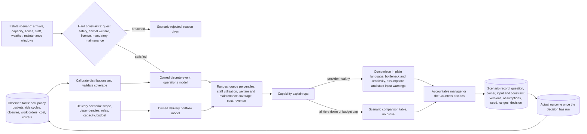

# AI-8 Simulation gym for capacity, staffing and investment decisions

## Problem

The estate has to triple its visitors while keeping 200 poisonous animals well and 40 eighteenth-century rides running. That means a run of expensive, irreversible decisions: which zones to invest in, how many qualified staff to put where, whether an operating plan is survivable at 15,000 a day, and in what order to deliver the programme itself.

[AI-3](ai-03-crowd-flow-and-staffing.md) forecasts demand and suggests a roster for *tomorrow*, against the estate as it is today. It cannot answer "what happens if we open the aquatic house an hour earlier, close two rides for conservation work, and triple the gate" — because those factors interact. Queues feed dwell time, dwell time feeds occupancy, closures displace crowds onto neighbouring attractions, and a staffing plan that works at 5,000 visitors can fail at 15,000 for reasons no forecast reveals.

The alternative to modelling is testing changes on live guests and live animals. On this estate that is not an acceptable experiment.

## Approach

Two deliberately separate owned models, plus the existing explanation capability.

**1. Estate operations model.** A discrete-event simulation of a park day: arrival profiles, timed-entry capacity, per-attraction throughput and cycle times, queue formation, ride and enclosure availability, staff roles and qualifications, weather and events, maintenance work windows, operating cost, revenue, and guest itinerary choices.

**2. Delivery portfolio model.** The same discipline applied to the programme: project scope, dependencies, required roles and capabilities, team availability, ramp-up, budget and delivery risk. Kept separate on purpose — how the park operates and how the transformation is staffed are different questions, and conflating them produces a model that answers neither.

**Inputs are distributions, not single numbers.** Arrival rates, service times and closure durations are probability distributions calibrated from the estate's own observed data ([ADR-015](../adr/ADR-015-occupancy-grain-and-operating-hour-normalisation.md) occupancy buckets, ride cycle counts, work orders). A simulation fed single "correct" values produces a confident answer about a park that does not exist.

**Constraints are checked before revenue is discussed.** A scenario is rejected outright if it breaches a guest-safety, animal-welfare, licence, or mandatory-maintenance constraint. Only among the surviving scenarios does the gym compare service quality, cost, maintenance resilience and revenue. The ordering is the point: revenue is never bought by accepting an unsafe or unsustainable plan.

**Outputs are ranges with their reasoning**, never a single recommended number: queue percentiles, qualified-staff utilisation, welfare and maintenance coverage, cost and revenue ranges, milestones at risk, and the binding bottleneck. The capability `explain.ops` — the same one AI-3 uses, not a new one — turns a scenario comparison into plain language that cites the figures. A manager decides.

**It starts small.** The first version answers exactly three questions and no others:

1. Which zones break first at 15,000 visitors a day, and what is the binding constraint in each?
2. What qualified staffing mix does a proposed operating plan need?
3. What team capability mix and sequencing does the roadmap need?

A 3D digital twin is not a prerequisite and is not planned. Visualisation is added only if it changes a decision, because the impressive part of a digital twin is rarely the part that answers the question.

## Targeted view

The gym is **read-only**. It cannot publish a roster or a price, schedule maintenance, alter a ride control, or operate an enclosure. It has no write path into any operational service, which is what keeps a modelling error from becoming an operational incident.

## Data and models

| Input | Source | Cadence | Where stored |
|---|---|---|---|
| Occupancy and queue history | Occupancy buckets ([ADR-015](../adr/ADR-015-occupancy-grain-and-operating-hour-normalisation.md)) | 15-minute | Time-series store, warehouse |
| Ride throughput and cycle times | Ride cycle counters | Per cycle | Time-series store |
| Closures and maintenance windows | Work orders ([07-attraction-economics](../architecture/07-attraction-economics.md)) | As raised | Warehouse |
| Operating cost per asset | Maintenance and Assets service | Per work order | Warehouse |
| Staff roles, qualifications, contracted hours | Rostering | As changed | Warehouse |
| Welfare constraints and species bands | Animal Welfare service, veterinary sign-off | As changed | Warehouse |
| Weather, holidays, events, pre-sales | External feeds and ops calendar | Hourly to daily | Warehouse |
| Delivery plan, roles, budget | Programme management | Weekly | Warehouse |
| Actual outcomes of past decisions | Operations | Per decision | Scenario record store |

| Model | Type | Ownership |
|---|---|---|
| Arrival, service and closure distributions | Fitted statistical distributions, recalibrated on a defined cadence | Owned |
| Estate operations model | Discrete-event simulation | Owned |
| Delivery portfolio model | Dependency and capacity model with risk ranges | Owned |
| Constraint checker | Deterministic rules, authored with safety and welfare owners | Owned |
| Scenario explanation | GenAI via the existing `explain.ops` capability | Catalogue capability |

No decision-grade calculation here depends on a model vendor. Consistent with [ADR-004](../adr/ADR-004-classic-ml-vs-genai-selection.md), the numeric work is owned because the input and the output are numbers; only the optional prose explanation uses GenAI and the scenario table remains when it is unavailable.

## Where it runs

Entirely in the cloud, in batch, off the operational path. A scenario run takes minutes to hours and nobody waits on it. The gym reads from the warehouse and the event lake and writes only to its own scenario record store. It is a P4 capability: it cannot compete for delivery attention with gates, alarms and welfare records, and it cannot block them.

## Degradation and fallback

| Condition | What the decision-maker sees |
|---|---|
| Calibration stale or failing | The gym refuses to run the scenario and says which inputs are stale. A scenario is not served on uncalibrated data |
| Input data incomplete for a zone or asset | Scenario runs with that zone marked as low-coverage and excluded from ranked comparison |
| Constraint definitions unsigned by the safety or welfare owner | Scenario rejected; constraints must be owned before they can be relied on |
| GenAI provider or budget unavailable | Scenario comparison table, bottleneck and sensitivity figures without the prose explanation |
| Gym entirely unavailable | Decisions are made the way they are made today, from dashboards, forecasts and judgement. Nothing operational depends on it |

The last row is the honest one: the gym improves decisions, it does not enable operations. That is why it sits at P4 and why its absence degrades nothing.

## Validation

This is the part that separates a simulation gym from a plausible-looking toy.

Pre-production:
- **Blind historical back-test.** Replay a past period using only data available at the time, and compare predicted ranges with what actually happened: arrivals, queue times, throughput, staff utilisation, closures and cost.
- **Interval coverage.** A stated 80% range should contain the actual outcome about 80% of the time. A model whose ranges are too narrow is more dangerous than one that admits uncertainty.
- **Constraint tests.** Named tests proving that a scenario breaching a safety, welfare, licence or maintenance constraint is rejected and never ranked, including adversarial scenarios constructed to be profitable and unsafe.
- **Sensitivity disclosure.** Every result reports which assumptions it is most sensitive to, so a decision resting on a fragile assumption is visible as such.
- Gate: no scenario informs a material decision until back-test coverage and constraint tests pass.

Production:
- **Actual versus predicted review.** Every scenario record is retained with its question, owner, input and constraint versions, assumptions and random seed. When the decision has run, the actual outcome is recorded against it. This is the gym's real quality signal, and it is the reason the record store exists.
- **Recalibration on a defined cadence**, and on any material change: a new ride or enclosure, a new operating pattern, a step change in visitor volume.
- **Blocking conditions.** Use is blocked when calibration breaches its threshold, when input completeness falls below its floor, or when a constraint definition is unowned.
- **Drift on the estate, not just the model.** Growth from 5,000 to 15,000 a day means the estate the model was calibrated against is continuously disappearing. Coverage is therefore tracked per volume band, so a model that is well calibrated at 6,000 and unvalidated at 12,000 says so.

## Conformance

| Property | How AI-8 honours it |
|---|---|
| **Invariant — life safety** | A scenario is advisory and cannot actuate an operational system; unsafe scenarios are rejected by explicit constraints before ranking |
| **Invariant — data integrity** | Strictly read-only, with no write path into any operational store. Scenario records are append-only |
| **Invariant — security and privacy** | Aggregates and asset-level facts only. No visitor identifiers enter the model at any point |
| Availability under partition | Not operationally required. It is batch, cloud-only, and its absence degrades no estate function |
| Evolvability | Models are versioned owned artifacts; the explanation names a capability, not a model; constraints are authored configuration |
| Observability | Scenario records carry inputs, assumptions, seed and decision, so prediction and outcome can be compared. Coverage and calibration are first-class metrics |
| Elastic scalability | Batch compute, scaled per run; simulation replications parallelise naturally |
| Cost transparency *(constraint)* | Compute is per scenario and attributable to the decision that requested it; `explain.ops` adds a handful of calls per run |

Against the deliberate boundaries in [the AI overview](00-ai-overview.md#where-ai-is-deliberately-not-used): the gym does not publish rosters or prices, does not produce the investment figures ([07-attraction-economics](../architecture/07-attraction-economics.md) does that from recorded facts), and holds no safety function. It ranks and evidences options; a named person chooses.

## Value

- **Answers the Countess's actual question.** "Investment and staffing are guesswork" is a decision problem, and a scenario the estate can interrogate before committing capital is the direct answer to it.
- **De-risks the growth path.** Knowing which zone breaks first at 15,000 visitors, and why, converts the three-year target from an aspiration into a sequenced plan with named bottlenecks.
- **Makes safety and welfare structurally non-negotiable.** Because constraints are checked before revenue is compared, an unsafe-but-profitable plan cannot reach the ranking, let alone a decision-maker's desk.
- **Costs one expensive mistake.** A single avoided misinvestment — a ride upgrade that did not relieve the binding constraint, or a staffing model that fails at scale — pays for the capability. The estate's margin for error is small, which is exactly why modelling beats experimenting on it.

## Related

- [ADR-017 Simulation gym for estate and delivery decisions](../adr/ADR-017-simulation-gym.md)
- [ADR-004 Classic ML versus GenAI selection](../adr/ADR-004-classic-ml-vs-genai-selection.md)
- [ADR-011 Human in the loop](../adr/ADR-011-human-in-the-loop.md)
- [ADR-015 Occupancy grain and operating-hour normalisation](../adr/ADR-015-occupancy-grain-and-operating-hour-normalisation.md)
- [AI-3 Crowd flow and staffing](ai-03-crowd-flow-and-staffing.md), which forecasts the estate as it is; AI-8 models the estate as it might be
- [07-attraction-economics](../architecture/07-attraction-economics.md), the recorded-fact view of popularity against cost
- [06-safety-case](../architecture/06-safety-case.md), the constraints the gym must never trade away
- [AI overview](00-ai-overview.md), [Validation](../validation.md)
