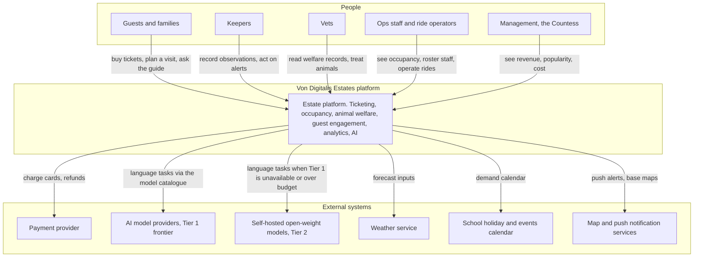

# System context (C4 level 1)

This document shows the Von Digitalis Estates platform as a single system, the people who use it and the external systems it depends on. It is the outermost zoom level; [02-containers.md](02-containers.md) opens the box. The purpose is to make every external dependency explicit, because each one is a place where the estate can be let down: a payment provider outage, a weather feed that goes stale, or an AI model provider that changes its prices or disappears.

## People

| Actor | What they need from the platform | Works offline? |
|---|---|---|
| Guests and families | Buy tickets and family passes, hold them in a wallet, get in at the gate, find their way, ask questions, get a recap and a reason to come back | Yes. Tickets, map and cached guide content work with no signal |
| Keepers | Daily brief per enclosure, alarms for water quality and feeding anomalies, quick observation entry including voice notes, population counts | Yes. Tablet app works on the zone network with the cloud down |
| Vets | Full welfare history per animal, anomaly timelines, treatment records | Partly. Reads from cloud; urgent data is on the keeper tablet |
| Ops staff and ride operators | Live occupancy and queue lengths, staffing recommendations, ride condition advisories, incident log | Partly. Zone dashboards work locally; forecasts need the cloud |
| Management | Revenue, popularity, cost per feature including AI, growth against the 15,000 a day target | No. Reporting is a cloud function |

## External systems

| System | Role | If it fails |
|---|---|---|
| Payment provider | System of record for money. Holds card data so the estate stays out of PCI scope | Online sales pause; gate sales fall back to a card terminal with deferred settlement; existing tickets are unaffected because validation is offline |
| Model catalogue, Tier 1 | A single hyperscaler catalogue (Bedrock, Vertex AI or Azure AI Foundry) carrying the frontier families used for the guest guide, welfare briefs, ops explanations and offers | A circuit breaker moves traffic to a second family or region inside the catalogue. If the catalogue itself is lost, every generative feature degrades together to Tier 2, then to a non-AI fallback. See [ADR-006](../adr/ADR-006-multi-provider-portfolio.md) |
| Self-hosted open-weight models, Tier 2 | Continuity tier in a separate account with a separate provider, deliberately outside the catalogue's control plane | Non-AI fallback keeps every feature usable |
| Weather service | Input to demand forecasting and itinerary advice | Forecast degrades to calendar-only; itinerary drops weather hints |
| School holiday and events calendar | Input to demand forecasting | Manual calendar maintained by ops |
| Map and push notification services | Guest app maps and alerts | App uses cached tiles; alerts shown in-app only |

## Boundaries worth stating

- Video from enclosure and ride cameras is processed inside the estate and never leaves it, so no external vision provider appears on this diagram. See [ADR-010](../adr/ADR-010-edge-vision-no-cloud-video.md).
- No external system can write to ticketing, welfare or occupancy data. AI providers only ever return text that a human or a deterministic service acts upon. See [ADR-011](../adr/ADR-011-human-in-the-loop.md).

## Related

- [02-containers.md](02-containers.md)
- [08-cloud-deployment.md](08-cloud-deployment.md)
- [05-characteristics.md](05-characteristics.md)
- [ADR-001 Edge-first hybrid architecture](../adr/ADR-001-edge-first-hybrid-architecture.md)
- [ADR-006 Multi-provider portfolio](../adr/ADR-006-multi-provider-portfolio.md)
- [ADR-010 Edge vision, no cloud video](../adr/ADR-010-edge-vision-no-cloud-video.md)
- [ADR-011 Human in the loop](../adr/ADR-011-human-in-the-loop.md)
- [AI overview](../ai/00-ai-overview.md)
