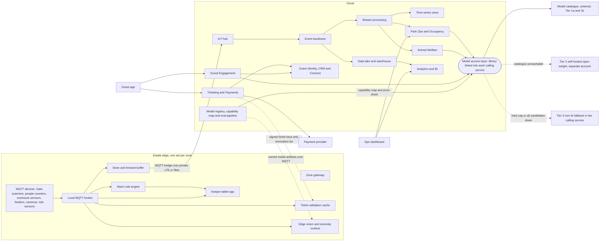

# Containers (C4 level 2)

This document opens the platform box and shows the deployable units, split into the estate edge and the cloud. The split is the whole point of the architecture: the edge keeps the estate running when the cloud is unreachable, and the cloud provides the analytics, ticketing, AI and long-term storage that the edge cannot. Every container states what it owns and how it behaves when the two halves are partitioned.

## Container catalogue

| Container | Responsibility | Technology options | Owns | When partitioned |
|---|---|---|---|---|
| MQTT devices | Sense and act at the asset: scan a ticket, count people, read water quality, weigh feed, capture video, measure vibration | Vendor devices with MQTT 3.1.1 or 5 client, per-device certificate | Nothing durable beyond a small outbound queue | Publish to the local broker as normal; queue if the broker is unreachable |
| Zone gateway | Hosts every edge container for a zone. Ruggedised industrial PC, GPU module in vision zones | Industrial PC, Jetson-class module, containerised runtime | Zone configuration, device registry for its zone | Fully autonomous |
| Local MQTT broker | Fan-out for the zone, ACLs, retained state, last-will | Mosquitto or EMQX Edge | Retained last-known values per topic | Serves the zone unchanged |
| Alarm rule engine | Threshold and rate rules on telemetry; routes alarms to keeper devices and sounders | Node-RED style flows or a small rules service | Rule definitions synced from the cloud | Keeps evaluating with the last synced rules |
| Ticket validation cache | Verifies signed tickets offline; holds the revocation list and recent scans | Small service on the gateway; signed key bundle | Revocation list, scan log for dedupe | Admits valid tickets; scans replay on reconnect. See [signed-ticket-format.md](../implementation/signed-ticket-format.md) |
| Edge vision and anomaly runtime | Runs owned models: fish counting, activity index, ride vibration anomaly | ONNX Runtime or TensorRT on the GPU module | Model artifacts, inference results, sampled audit frames | Keeps inferring; results buffer for replay |
| Store and forward buffer | Persists every outbound event until the cloud acknowledges it | Broker persistence plus a bridge with a local queue on disk | Up to 72 hours of zone events | Fills, then replays in order on reconnect |
| Keeper tablet app | Observations, voice notes, alarm acknowledgement, daily brief, counts | Offline-first mobile app on the zone network | Local draft observations until synced | Full use on the zone network; briefs are the last synced copy |
| IoT hub | Terminates the bridges, authenticates gateways, forwards to the backbone | AWS IoT Core, Azure IoT Hub or EMQX Cloud | Gateway identities | Not applicable; cloud side |
| Event backbone | Durable, ordered event log shared by all cloud services | Kafka or a managed equivalent | Event history for replay | Not applicable |
| Stream processing | Hot path: occupancy by 15-minute bucket, queue estimates, welfare anomaly scoring, alert enrichment | Flink or a managed equivalent | Derived metrics | Not applicable |
| Time-series store | Sensor and occupancy history for dashboards and models | TimescaleDB or InfluxDB | Telemetry history | Not applicable |
| Data lake and warehouse | Cold path: raw events in open table format, curated marts, model training sets | Iceberg or Delta on object storage, plus a warehouse | Long-term data, training data | Not applicable |
| Ticketing and Payments | Products, family passes, orders, signed ticket issuance, key rotation, revocations, reconciliation | Containerised service; payment provider SDK | Orders, tickets, keys | Online sales pause if the provider is down; issued tickets unaffected |
| Guest Identity, CRM and Consent | Accounts, households, consent flags, visit history, segments | Containerised service; identity provider | Personal data and consent | Not applicable |
| Park Ops and Occupancy | Occupancy, queues, forecasts, staffing recommendations, ride advisories | Containerised service; forecasting models | Occupancy history, rosters | Zone dashboards show local counts only |
| Animal Welfare | Enclosure and animal records, feeding logs, vet records, anomaly cases, population counts | Containerised service; append-only records | Welfare records | Keeper tablet holds local drafts; alarms are local |
| Guest Engagement | App backend, itineraries, guide sessions, notifications, offers | Containerised service | Guide sessions, itineraries, notification log | App uses cached content and keyword search |
| Analytics and BI | Popularity, revenue, cost per feature, growth tracking | Warehouse plus BI tool | Reports and marts | Not applicable |
| Model access layer | Not a service. A thin client library linked into every service that calls a model: resolves capability to model from the capability map, attaches the guardrail policy and cost tag, checks the kill switch, emits the trace, walks the candidate list | Shared library, Python and TypeScript | None; a short-TTL cache of the capability map | Walks to Tier 2, then returns a fallback signal so the caller uses Tier 3 |
| Model registry, capability map and eval pipeline | Catalogue of models, price sheet, eval scores, promotion state, and the capability-to-model map; deploys owned edge models | Configuration artefacts in git rendered to the parameter store, plus eval jobs in CI and nightly | Registry, golden datasets, eval results | Not applicable; last-known config stays cached in each service |
| Guest app | Tickets in wallet, map, guide, itinerary, alerts, recap | Offline-first PWA or native | Cached content, tickets | Works offline for tickets, map and cached content |
| Ops dashboard | Live occupancy, staffing, advisories, incidents | Web app | Nothing durable | Zone-local view from the gateway when the cloud is unreachable |

## Coupling rules

- Cloud services couple only through the event backbone and explicit APIs; no shared databases.
- The edge never calls a cloud service synchronously on a guest-facing or safety path. Anything the edge needs from the cloud (keys, revocations, rules, model artifacts) is pushed down and cached.
- Every GenAI call names a capability and is resolved to a model by the model access layer. No service holds a model API key; access is by IAM role to one model catalogue. See [ADR-005](../adr/ADR-005-model-access-and-capability-contracts.md).
- AI containers only ever produce recommendations, briefs and scores. Writes to tickets, payments and welfare records come from humans or deterministic services. See [ADR-011](../adr/ADR-011-human-in-the-loop.md).

## Related

- [01-context.md](01-context.md)
- [03-edge-zone.md](03-edge-zone.md)
- [04-data-flow.md](04-data-flow.md)
- [05-characteristics.md](05-characteristics.md)
- [ADR-001 Edge-first hybrid architecture](../adr/ADR-001-edge-first-hybrid-architecture.md)
- [ADR-002 MQTT topology and store-and-forward](../adr/ADR-002-mqtt-topology-and-store-and-forward.md)
- [ADR-003 Offline-verifiable signed tickets](../adr/ADR-003-offline-verifiable-signed-tickets.md)
- [ADR-005 Model access through a hyperscaler catalogue](../adr/ADR-005-model-access-and-capability-contracts.md)
- [ADR-010 Edge vision, no cloud video](../adr/ADR-010-edge-vision-no-cloud-video.md)
- [AI overview](../ai/00-ai-overview.md)
