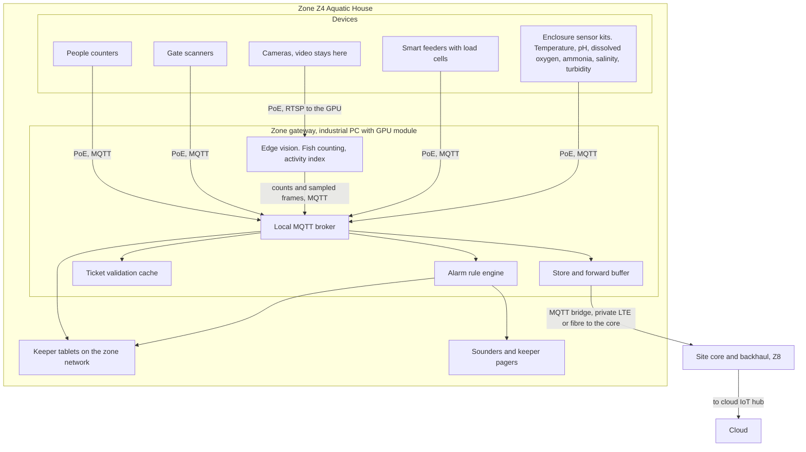

# Edge zone deployment view

This document describes how the estate is divided into zones, what hardware sits in each, how devices reach their zone gateway and how gateways reach the cloud. It exists because the constraint that shapes everything is patchy connectivity: the zone is the unit that must keep working on its own. Device counts are estimates for sizing and budgeting and will be refined by a site survey.

## Zones

| Zone | Covers | Why it is its own zone |
|---|---|---|
| Z1 Entrance | Main gates, ticket office, car park | Highest scan rate; must admit guests with nothing else working |
| Z2 Rides North | About 20 of the 40 rides | Ride operators need local advisories and gate scans; vibration data is high rate |
| Z3 Rides South | The other 20 rides | Same as Z2; two zones keep the radio and PoE runs short |
| Z4 Aquatic House | Tanks including the jumping piranha collection | Water chemistry alarms are life-critical for the animals; vision counting needs a GPU |
| Z5 Terrestrial House | Land enclosures including the poisonous collection | Environmental alarms and activity cameras; keeper safety |
| Z6 Gardens and Plants | Carnivorous plant collection, walks, outdoor enclosures | Low-rate sensors over long distances; LoRaWAN territory |
| Z7 Back of House | Kitchens, feed store, vet room, workshop, plant room | Feed preparation weights, vet records, energy |
| Z8 Central (optional) | Site core network, backhaul aggregation, spare gateway | Aggregates backhaul; holds the cold spare for any zone |

## Device estimates per zone

All counts are estimates for the design, not a bill of materials.

| Zone | Gate or ride scanners | People counters | Enclosure sensor kits | Smart feeders | Cameras | Ride sensors | Other |
|---|---|---|---|---|---|---|---|
| Z1 Entrance | 8 | 4 | 0 | 0 | 2 | 0 | 2 ticket kiosks |
| Z2 Rides North | 20 | 10 | 0 | 0 | 4 queue cameras | 20 vibration, 20 cycle counters | Sounders |
| Z3 Rides South | 20 | 10 | 0 | 0 | 4 queue cameras | 20 vibration, 20 cycle counters | Sounders |
| Z4 Aquatic House | 2 | 4 | 20 | 20 | 12 | 0 | Water quality probes are part of the kits |
| Z5 Terrestrial House | 2 | 4 | 25 | 25 | 10 | 0 | Hard-wired door and breach contacts on venomous enclosures |
| Z6 Gardens and Plants | 2 | 6 | 10 | 5 | 0 | 0 | Soil and greenhouse sensors, LoRaWAN |
| Z7 Back of House | 0 | 0 | 0 | 0 | 0 | 0 | Feed prep scales, cold store sensors, energy meters |
| Totals | 54 | 38 | 55 | 50 | 32 | 80 | |

The 55 enclosure kits match the 55 displays and enclosures of the **animal** collection in the brief. The carnivorous plant collection is a separate asset and is not counted here; its monitoring is the LoRaWAN soil and greenhouse sensors in Z6's *Other* column, which measure substrate moisture, humidity and temperature rather than feeding. The 40 ride scanners plus 40 vibration and 40 cycle sensors match the 40 rides.

**Why there are 55 kits but 50 feeders.** The five without a smart feeder are outdoor animal enclosures in Z6 that are **hand-fed**, which is ordinary for specialist and seasonally-fed species where a hopper on a schedule is the wrong instrument. F3.2 asks that food dispensed and leftover be recorded per feeding and deviations flagged; it does not require that the recording be automatic. For these five the keeper weighs the portion on the Z7 feed-prep scales before the round, weighs what is left after it, and both figures post to the welfare record from the tablet against that enclosure — the same two numbers a load cell would publish, captured by a person.

The rule is that **every enclosure has feed capture; not every enclosure has automated feed capture.** Which mechanism applies is recorded against the asset, so a silent automated stream is treated as a fault on a feeder enclosure and as normal on a hand-fed one. That distinction matters for AI-2: the anomaly models must not read the absence of feeder telemetry as a missed feeding, and the five hand-fed enclosures carry a lower-frequency, human-entered series that is modelled on its own terms.

## Capacity: what those devices actually generate

Hardware above was specified before the load was calculated, which is the wrong way round. This section does the arithmetic so the sizing can be checked rather than taken on trust. Every input is an assumption and is stated; the conclusion is robust to all of them being wrong by a factor of several.

**Assumptions.** A ten-hour operating day. Enclosure kits publish one bundled reading a minute. People counters publish a per-minute aggregate, never a per-crossing event (a privacy requirement that happens to reduce load). Feeders publish per feeding, roughly four a day. Vibration sensors publish a summarised feature vector every ten seconds — the raw waveform is consumed locally and never published. Cycle counters publish once per ride cycle at roughly 30 cycles an hour. Cameras publish inference *results*, never frames. Each visitor scans in once and rides about six times, so 5,000 visitors produce roughly 35,000 scans.

| Source | Devices | Rate | Events/s |
|---|---|---|---|
| Enclosure sensor kits | 55 | 1/min | 0.9 |
| People counters | 38 | 1/min | 0.6 |
| Ride vibration | 40 | 1 per 10 s | **4.0** |
| Gate and ride scans | 54 | 35,000/day | 1.0 |
| Cycle counters | 40 | ~30/hr each | 0.3 |
| Cameras (queue estimates, activity indices) | 32 | 1/min to 1/15 min | 0.2 |
| Smart feeders | 50 | ~4/day each | <0.01 |
| **Estate-wide total during operating hours** | | | **≈ 7/s, ≈ 9/s at the opening peak** |

That is roughly **330,000 events in a calendar day**, including overnight sensor traffic: about **3.8/s over 24 hours**. At the 15,000-visitor target only the scan row triples, taking the operating-hours rate to about 9/s and the opening peak into the low-to-mid teens.

**Three conclusions worth stating, because two of them are mildly embarrassing.**

**1. Ride vibration is the largest single source, and it is the one the design already throttles.** Four events a second out of seven come from 40 sensors. Publishing raw waveforms instead of summarised features — say 1 kHz per sensor — would be 40,000 events a second, four orders of magnitude more, and would need a different architecture entirely. Keeping the raw signal on the sensor and the anomaly model on the gateway is not just an AI decision ([ADR-004](../adr/ADR-004-classic-ml-vs-genai-selection.md)); it is the load-bearing capacity decision at the edge.

**2. The 72-hour buffer is nowhere near the constraint.** The busiest zone, Z2 Rides North, generates about 2.8 events a second. Seventy-two hours spans roughly 30 operating hours, so the buffer holds on the order of **300,000 events, about 50–90 MB** depending on envelope encoding. Against the 1 TB SSD in the gateway spec, that is a rounding error. **The SSD is sized by the operating system, container images and model artifacts, not by the buffer** — and 72 hours is therefore a *policy* choice about how long an outage the estate plans to survive, not a hardware limit. Weeks would fit. If that number ever needs to change, it changes in configuration.

**3. Telemetry does not size the backhaul either.** Seven events a second at a few hundred bytes each is roughly **17 kbit/s** steady — less than a voice call. The two things that do size the link are:

| Driver | Size | Implication |
|---|---|---|
| Replay burst after an outage | An eight-hour backlog is ~60 MB estate-wide; throttled to a fraction of the link so live traffic is not starved, it drains in **under a minute at 10 Mbit/s**, minutes on a slower link | The backlog is never the reason an outage takes long to clear |
| Edge model artifact distribution | Tens to hundreds of MB per model version, occasionally, to two vision zones | The largest scheduled transfer on the estate. Push off-peak |

So a modest fibre service carries this comfortably, and **cellular failover at a few Mbit/s carries the steady load with a large margin** — it simply takes longer to drain a backlog and to push a model. Guest app traffic does not appear here at all: it goes over guest WiFi and cellular to the cloud, never over the estate backhaul ([04-device-connectivity](../explainers/04-device-connectivity.md)).

**What is deliberately absent: video.** No raw video crosses the bridge ([ADR-010](../adr/ADR-010-edge-vision-no-cloud-video.md)), and none is retained on the gateway beyond a short rolling window for model debugging. What is kept is sampled, blurred audit frames — on the order of a few MB a day for the aquatic zone, a few hundred MB over a 90-day retention. For scale, CCTV-style retention of 12 cameras for a week would be roughly 180 GB, which is why it would need its own recorder and is **not** a function of this platform.

**Read this as an order of magnitude, not a specification.** Device counts are estimates pending a site survey, and every publish rate above is a design assumption. The point is the gap: the load is one to two orders of magnitude below what the specified hardware handles, so the sizing risk is over-provisioning, not under.

## One zone

## Gateway hardware classes

| Class | Zones | Spec sketch | Notes |
|---|---|---|---|
| Standard | Z1, Z2, Z3, Z6, Z7 | Fanless industrial PC, 8 cores, 32 GB RAM, 1 TB SSD, dual NIC, PoE switch alongside | Runs broker, rules, ticket cache, buffer; deliberately uniform so the same hardened image and replacement procedure work in every non-vision zone |
| Vision | Z4, Z5 | Standard plus a Jetson-class GPU module or a discrete GPU | Runs vision models for counting and activity; ride queue cameras in Z2 and Z3 use a smaller accelerator |
| Spare | Z8 | One Vision class unit | Cold spare configured to take over any zone by restoring its config and buffer |

## Connectivity

| Link | Used for | Why |
|---|---|---|
| PoE and Ethernet | Fixed devices in buildings: scanners, sensor kits, feeders, cameras | Power and data on one cable; no dependence on WiFi |
| LoRaWAN | Low-rate outdoor sensors in Z6 and outlying enclosures | Kilometre range, years of battery, immune to the patchy WiFi |
| Private LTE or 5G, or point-to-point radio | Gateway to site core backhaul where fibre does not exist | Licensed or engineered links are predictable; public WiFi is not |
| Fibre | Site core to cloud, and to buildings where it exists | Primary backhaul |
| Cellular failover at the core | Cloud bridge when fibre is cut | Second path for the whole site |
| Guest WiFi | Guest app only | Never on the critical path. The app is offline-first |

## Store and forward

- The local broker persists sessions and QoS 1 messages. The bridge to the cloud keeps a disk queue sized for 72 hours of zone events at peak rate.
- On reconnect the bridge replays in publication order. Every payload carries a device identifier and sequence number so cloud consumers deduplicate. See [mqtt-topics.md](../implementation/mqtt-topics.md).
- Retained messages hold the last known value per topic so a restarted consumer or a keeper tablet sees current state immediately.
- Cloud-to-edge traffic (rules, keys, revocation lists, model artifacts) is published to retained configuration topics so a gateway that was offline picks up the latest on reconnect.

## Local alarm rules

Rules run on the gateway and never wait for the cloud. Examples:

| Rule | Condition | Action |
|---|---|---|
| Water quality critical | pH, dissolved oxygen or ammonia outside the species band for 2 consecutive readings | Local operational welfare sounder in Z4, page the on-duty keeper, raise a welfare case when the cloud is reachable |
| Feeder fault | Dispensed weight differs from scheduled by more than 20 percent, or no dispense event at the scheduled time | Notify the keeper tablet |
| Venomous enclosure door or breach contact | Direct hard-wired path to the alarm panel; a safety-owned local bypass is used only during an authorised maintenance window | Sounder, beacon, on-zone pagers and radio dispatch; the gateway receives an advisory copy only |
| Device silent | No heartbeat for 5 minutes, or a last-will message received | Notify ops; mark the asset degraded on the local dashboard |
| Ride vibration anomaly | Edge anomaly score above threshold for 3 cycles | Advisory to the ride operator; never stops the ride automatically. See [ai-06](../ai/ai-06-ride-condition-monitoring.md) |

Gateway rule definitions are authored in the cloud and pushed to a retained topic; the gateway keeps the last synced version. They cover operational welfare and maintenance alerts, never containment detection, duress, or the life-safety alarm path.

The zone alarm panel drives the sounders, beacons and keeper pagers. Door and breach contacts, and fixed keeper duress stations, are wired directly to it; the panel is separately powered. The gateway only receives a non-blocking copy for context and records. That layering means containment alerting and duress survive the gateway being off or failed; it is detailed and drilled in [06-safety-case.md](06-safety-case.md) and [ADR-016](../adr/ADR-016-local-incident-response.md).

## Offline ticket validation

The gate validator on the zone gateway verifies the ticket signature using cached signing keys, checks the validity window, admission scope and revocation snapshot, records the scan, and instructs the scanner to admit or deny. The scanner is a capture and display device, not an independent admission authority. Scans carry a unique identifier so cloud reconciliation deduplicates replays. The full design is in [signed-ticket-format.md](../implementation/signed-ticket-format.md).

## Related

- [02-containers.md](02-containers.md)
- [04-data-flow.md](04-data-flow.md)
- [05-characteristics.md](05-characteristics.md)
- [MQTT topics](../implementation/mqtt-topics.md)
- [Signed ticket format](../implementation/signed-ticket-format.md)
- [ADR-001 Edge-first hybrid architecture](../adr/ADR-001-edge-first-hybrid-architecture.md)
- [ADR-002 MQTT topology and store-and-forward](../adr/ADR-002-mqtt-topology-and-store-and-forward.md)
- [ADR-003 Offline-verifiable signed tickets](../adr/ADR-003-offline-verifiable-signed-tickets.md)
- [ADR-010 Edge vision, no cloud video](../adr/ADR-010-edge-vision-no-cloud-video.md)
- [ADR-013 Privacy-preserving footfall and consent](../adr/ADR-013-privacy-preserving-footfall-and-consent.md)
- [ADR-016 Local incident response](../adr/ADR-016-local-incident-response.md)
- [06-safety-case.md](06-safety-case.md)
