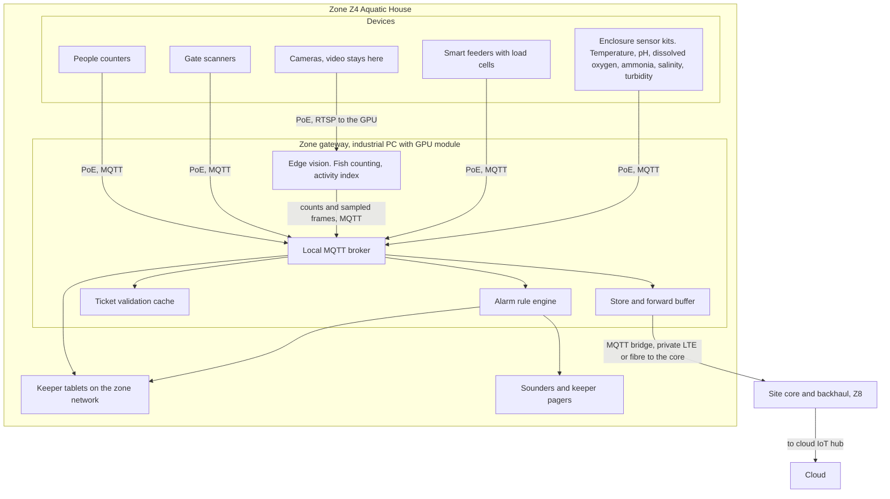

# Edge zone deployment view

This document describes how the estate is divided into zones, what hardware sits in each, how devices reach their zone gateway and how gateways reach the cloud. It exists because the constraint that shapes everything is patchy connectivity: the zone is the unit that must keep working on its own. Device counts are estimates for sizing and budgeting and will be refined by a site survey.

## Zones

| Zone | Covers | Why it is its own zone |
|---|---|---|
| Z1 Entrance | Main gates, ticket office, car park | Highest scan rate; must admit guests with nothing else working |
| Z2 Rides North | About 20 of the 40 rides | Ride operators need local advisories and gate scans; vibration data is high rate |
| Z3 Rides South | The other 20 rides | Same as Z2; two zones keep the radio and PoE runs short |
| Z4 Aquatic House | Tanks including the jumping piranha collection | Water chemistry alarms are life-critical for the animals; vision counting needs a GPU |
| Z5 Terrestrial House | Land enclosures including the poisonous collection | Environmental alarms and activity cameras; keeper safety |
| Z6 Gardens and Plants | Carnivorous plant collection, walks, outdoor enclosures | Low-rate sensors over long distances; LoRaWAN territory |
| Z7 Back of House | Kitchens, feed store, vet room, workshop, plant room | Feed preparation weights, vet records, energy |
| Z8 Central (optional) | Site core network, backhaul aggregation, spare gateway | Aggregates backhaul; holds the cold spare for any zone |

## Device estimates per zone

All counts are estimates for the design, not a bill of materials.

| Zone | Gate or ride scanners | People counters | Enclosure sensor kits | Smart feeders | Cameras | Ride sensors | Other |
|---|---|---|---|---|---|---|---|
| Z1 Entrance | 8 | 4 | 0 | 0 | 2 | 0 | 2 ticket kiosks |
| Z2 Rides North | 20 | 10 | 0 | 0 | 4 queue cameras | 20 vibration, 20 cycle counters | Sounders |
| Z3 Rides South | 20 | 10 | 0 | 0 | 4 queue cameras | 20 vibration, 20 cycle counters | Sounders |
| Z4 Aquatic House | 2 | 4 | 20 | 20 | 12 | 0 | Water quality probes are part of the kits |
| Z5 Terrestrial House | 2 | 4 | 25 | 25 | 10 | 0 | Door contacts on venomous enclosures |
| Z6 Gardens and Plants | 2 | 6 | 10 | 5 | 0 | 0 | Soil and greenhouse sensors, LoRaWAN |
| Z7 Back of House | 0 | 0 | 0 | 0 | 0 | 0 | Feed prep scales, cold store sensors, energy meters |
| Totals | 54 | 38 | 55 | 50 | 32 | 80 | |

The 55 enclosure kits match the 55 displays and enclosures in the brief. The 40 ride scanners plus 40 vibration and 40 cycle sensors match the 40 rides.

## One zone

## Gateway hardware classes

| Class | Zones | Spec sketch | Notes |
|---|---|---|---|
| Standard | Z1, Z2, Z3, Z6, Z7 | Fanless industrial PC, 8 cores, 32 GB RAM, 1 TB SSD, dual NIC, PoE switch alongside | Runs broker, rules, ticket cache, buffer |
| Vision | Z4, Z5 | Standard plus a Jetson-class GPU module or a discrete GPU | Runs vision models for counting and activity; ride queue cameras in Z2 and Z3 use a smaller accelerator |
| Spare | Z8 | One Vision class unit | Cold spare configured to take over any zone by restoring its config and buffer |

## Connectivity

| Link | Used for | Why |
|---|---|---|
| PoE and Ethernet | Fixed devices in buildings: scanners, sensor kits, feeders, cameras | Power and data on one cable; no dependence on WiFi |
| LoRaWAN | Low-rate outdoor sensors in Z6 and outlying enclosures | Kilometre range, years of battery, immune to the patchy WiFi |
| Private LTE or 5G, or point-to-point radio | Gateway to site core backhaul where fibre does not exist | Licensed or engineered links are predictable; public WiFi is not |
| Fibre | Site core to cloud, and to buildings where it exists | Primary backhaul |
| Cellular failover at the core | Cloud bridge when fibre is cut | Second path for the whole site |
| Guest WiFi | Guest app only | Never on the critical path. The app is offline-first |

## Store and forward

- The local broker persists sessions and QoS 1 messages. The bridge to the cloud keeps a disk queue sized for 72 hours of zone events at peak rate.
- On reconnect the bridge replays in publication order. Every payload carries a device identifier and sequence number so cloud consumers deduplicate. See [mqtt-topics.md](../implementation/mqtt-topics.md).
- Retained messages hold the last known value per topic so a restarted consumer or a keeper tablet sees current state immediately.
- Cloud-to-edge traffic (rules, keys, revocation lists, model artifacts) is published to retained configuration topics so a gateway that was offline picks up the latest on reconnect.

## Local alarm rules

Rules run on the gateway and never wait for the cloud. Examples:

| Rule | Condition | Action |
|---|---|---|
| Water quality critical | pH, dissolved oxygen or ammonia outside the species band for 2 consecutive readings | Sounder in Z4, page the on-duty keeper, raise a welfare case when the cloud is reachable |
| Feeder fault | Dispensed weight differs from scheduled by more than 20 percent, or no dispense event at the scheduled time | Notify the keeper tablet |
| Venomous enclosure door open | Door contact open outside a scheduled maintenance window | Sounder, page the keeper lead |
| Device silent | No heartbeat for 5 minutes, or a last-will message received | Notify ops; mark the asset degraded on the local dashboard |
| Ride vibration anomaly | Edge anomaly score above threshold for 3 cycles | Advisory to the ride operator; never stops the ride automatically. See [ai-06](../ai/ai-06-ride-condition-monitoring.md) |

Rule definitions are authored in the cloud and pushed to a retained topic; the gateway keeps the last synced version.

## Offline ticket validation

Each gate scanner verifies the ticket signature locally using the current signing keys, checks the validity window and the revocation list held on the gateway, records the scan, and admits the guest. Scans are published with a unique identifier so cloud reconciliation deduplicates replays. The full design is in [signed-ticket-format.md](../implementation/signed-ticket-format.md).

## Related

- [02-containers.md](02-containers.md)
- [04-data-flow.md](04-data-flow.md)
- [05-characteristics.md](05-characteristics.md)
- [MQTT topics](../implementation/mqtt-topics.md)
- [Signed ticket format](../implementation/signed-ticket-format.md)
- [ADR-001 Edge-first hybrid architecture](../adr/ADR-001-edge-first-hybrid-architecture.md)
- [ADR-002 MQTT topology and store-and-forward](../adr/ADR-002-mqtt-topology-and-store-and-forward.md)
- [ADR-003 Offline-verifiable signed tickets](../adr/ADR-003-offline-verifiable-signed-tickets.md)
- [ADR-010 Edge vision, no cloud video](../adr/ADR-010-edge-vision-no-cloud-video.md)
- [ADR-013 Privacy-preserving footfall and consent](../adr/ADR-013-privacy-preserving-footfall-and-consent.md)
