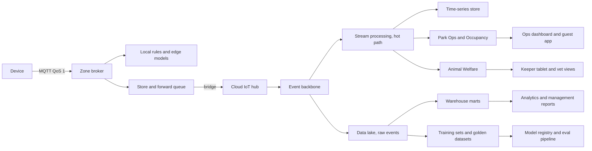
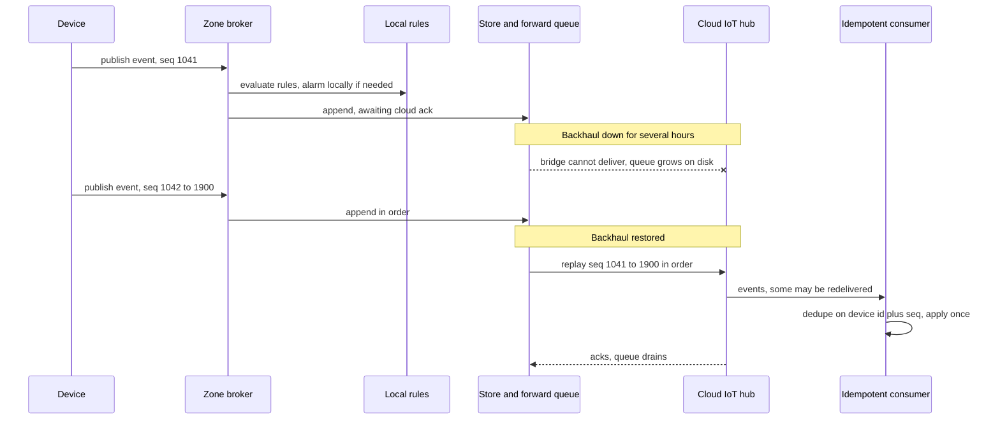

# Data flow from device to cloud to warehouse

This document follows an event from a device on the estate to the dashboards, models and reports in the cloud, in both the normal case and the case where the backhaul is down. It also classifies the data the platform holds, states how long each class is kept and how far it may travel. The rule that shapes the design is that the edge never loses an event and the cloud never double-counts one.

## Normal path

| Stage | Latency target | Notes |
|---|---|---|
| Device to zone broker | Under 1 second | Local network |
| Broker to local rules and keeper devices | Under 5 seconds | Alarms never wait for the cloud |
| Bridge to cloud hub | Under 10 seconds with backhaul up | Bounded only by the link |
| Hot path to dashboards | Under 2 minutes | Occupancy in 15-minute buckets, refreshed as events arrive |
| Cold path to warehouse | Hourly to daily | Batch loads; nothing operational depends on it |

## Partition path

Rules that make the partition path safe:

- Every event carries `device_id` and a monotonic `seq`, plus a timestamp set at the device. Consumers keep a small window of seen keys and apply each event once.
- The bridge replays in publication order per device, so occupancy buckets and feeding logs are rebuilt correctly for the outage window.
- Retained topics carry last-known values, so dashboards show the latest state immediately on reconnect while history backfills.
- Ticket scans during an outage are admitted locally and reconciled on replay; the same scan replayed twice counts once. See [signed-ticket-format.md](../implementation/signed-ticket-format.md).

## Hot and cold paths

| Path | Purpose | Consumers | Examples |
|---|---|---|---|
| Hot | Operational decisions in minutes | Stream processing, domain services, dashboards, keeper tablets | Occupancy per attraction, queue estimates, welfare anomaly scores, feeder faults, device health |
| Cold | Analysis, training and reporting in hours or days | Lake, warehouse, BI, model registry | Popularity by day and weather, revenue per zone, training sets for anomaly models, golden datasets for GenAI evals |

The cold path feeds the model lifecycle described in [validation.md](../validation.md): raw events become labelled datasets, and eval results flow back to the registry.

## Cloud to edge

Configuration flows the other way on retained topics: alarm rules, signing keys and revocation lists, owned model artifacts for the edge runtime, and knowledge base snapshots for the guest app. A gateway that was offline picks up the latest retained version on reconnect. Model artifacts are versioned and signed by the registry so a gateway never runs an unverified model.

## Data classification and travel

| Class | Examples | Personal? | Leaves the zone? | Retention | Notes |
|---|---|---|---|---|---|
| Telemetry | Water chemistry, temperatures, feeder weights, vibration, counter totals | No | Yes, to cloud | Raw 2 years, aggregates indefinitely | Anonymous by construction |
| Inference results | Fish counts with confidence, activity index, anomaly scores | No | Yes, to cloud | Same as telemetry | The output of edge models, not the input |
| Sampled audit frames | A few frames per day per camera for count audits | Possibly, if a keeper is in frame | Yes, after local review | 90 days | Faces blurred at the edge before upload |
| Video | Continuous enclosure and queue camera feeds | Possibly | No, never | 7 days on the gateway, then overwritten | See [ADR-010](../adr/ADR-010-edge-vision-no-cloud-video.md) |
| Ticket events | Scan events with ticket id, gate, time | Indirectly, via the order | Yes, to cloud | 2 years | Linked to a household only in the cloud CRM |
| Orders and payments | Order, product, amount, payment provider reference | Yes | Cloud only, never to the edge | 7 years for accounting | Card data never enters the platform |
| Guest personal data | Account, household, consent flags, visit history, app behaviour | Yes | Cloud only | Until consent is withdrawn, then deleted or anonymised | Consent gates every use; see [ADR-013](../adr/ADR-013-privacy-preserving-footfall-and-consent.md) |
| Guide conversations | Guest questions and answers, retrieved chunks | Yes, may contain free text | Cloud, and to a model provider after PII redaction | 90 days raw, then aggregated for evals | Redaction happens in the catalogue's managed guardrail policy, before the prompt reaches a model |
| Keeper observations and voice notes | Free text, audio, structured records | Yes, keeper identity | Cloud; audio to a model provider only after consent and redaction | Welfare records indefinitely, audio 30 days | Append-only welfare record |
| Welfare and vet records | Animal history, treatments, population counts | No | Cloud, cached on keeper tablets | Indefinitely | Append-only with audit trail |

## Related

- [02-containers.md](02-containers.md)
- [03-edge-zone.md](03-edge-zone.md)
- [05-characteristics.md](05-characteristics.md)
- [MQTT topics](../implementation/mqtt-topics.md)
- [Validation and monitoring](../validation.md)
- [ADR-002 MQTT topology and store-and-forward](../adr/ADR-002-mqtt-topology-and-store-and-forward.md)
- [ADR-010 Edge vision, no cloud video](../adr/ADR-010-edge-vision-no-cloud-video.md)
- [ADR-012 LLM observability and kill switches](../adr/ADR-012-llm-observability-and-kill-switches.md)
- [ADR-013 Privacy-preserving footfall and consent](../adr/ADR-013-privacy-preserving-footfall-and-consent.md)
