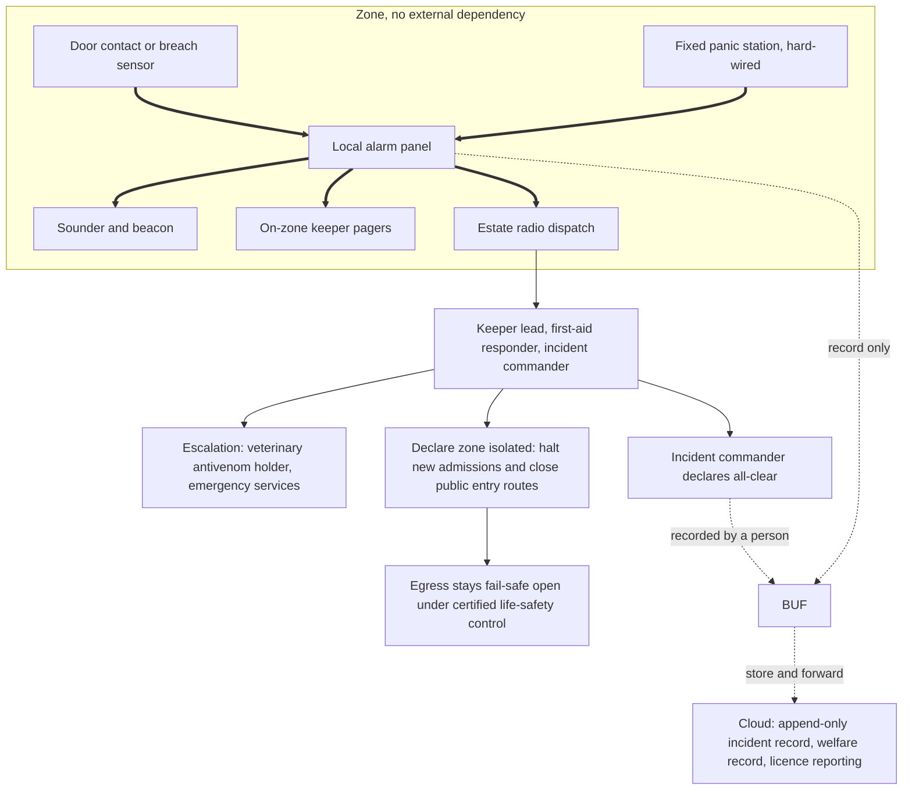

# Keeper and public safety case

This document is the design view behind [ADR-016](../adr/ADR-016-local-incident-response.md). It answers one question: when a venomous animal is out of containment or a keeper is envenomated inside an enclosure, what happens, what does it depend on, and what still works when the rest of this architecture is switched off?

It exists because the estate's most consequential requirement is not a functional one. Everything else in this repository can be late; this cannot be wrong.

## Scope

**In scope.** Containment breach and escape detection for the venomous and poisonous collection, keeper duress inside enclosures and work areas, the dispatch and escalation path, zone isolation with preserved egress, and the incident record.

**Not in scope.** A general emergency-command system for medical events, lost children, fire or ride faults. Those follow the estate's existing procedures. This design deliberately does not become the estate's emergency platform, because a system that owns everything urgent is trusted for things it was never validated for. Where an event is outside this scope, the path is the existing procedure and the radio.

## The five layers

Each layer assumes the one above it may have failed.

| Layer | What it is | Depends on | Survives |
|---|---|---|---|
| 1. Physical containment | Enclosure construction, locks, double-door vestibules, species-appropriate barriers | Nothing electrical | Everything below it failing |
| 2. Hard-wired detection | Door contacts and breach sensors wired directly to the alarm panel; an authorised, safety-owned panel bypass covers a maintenance window | Local power, wiring and the alarm panel | Gateway loss, broker loss, cloud loss, WiFi loss and AI unavailability |
| 3. Hard-wired alerting | Local sounder, beacon and on-zone keeper pagers driven directly by the alarm panel | Local power and wiring, not the gateway | Gateway failure, broker failure, any software fault |
| 4. Keeper duress | Fixed panic stations in every venomous enclosure and work area, wired to the alarm panel and estate radio dispatch, reachable at floor level | Local power and wiring | Gateway off, network down, keeper unable to reach or operate a device |
| 5. Human response | Named on-duty roles dispatched by radio: keeper lead, qualified first-aid responder, incident commander; documented escalation to the antivenom holder and emergency services | Trained people and radio coverage | Every computer on the estate being dead |

Layer 5 is the floor. If layers 2 to 4 are all unavailable, the estate still has a drilled procedure and a radio, which is the state the collection was managed in before any of this was built.

### Layers 2, 3 and 4 share the alarm panel

They do, and it is the consequence of taking software off the detection path: the gateway used to be a second, independent piece of hardware in that chain, and removing it was right for every other reason. The layers remain independent of *software, network, cloud and AI*, but not of each other. **A panel failure takes all three at once**, leaving layer 1 and layer 5.

That makes panel failure the one fault this design must never discover late, so it is detected rather than waited for:

- **The panel is supervised.** Line monitoring on every containment contact and panic-station circuit detects an open, a short or a disconnected device; loss of the panel's own health signal is itself a fault condition. This is standard practice for life-safety panels and is a procurement requirement, not an estate-written feature.
- **A fault annunciates locally and audibly**, at the panel and at the keeper station, in a form distinguishable from an alarm. A silent fault is the failure mode being designed against, so a panel that cannot report its own health must fail to the audible fault state.
- **The gateway independently watches for panel silence.** The panel's advisory feed is the one thing the gateway does receive; a heartbeat gap raises an operational alert. This is a second pair of eyes and explicitly *not* a dependency: if the gateway is also down, supervision and local annunciation still stand.
- **Loss of panel is a declared stop-work condition**, with the response in the failure-mode table below, and it is drilled rather than assumed.

## The response path

This diagram uses the repository's standard [line conventions](../../README.md#the-architecture-in-one-view). Thick arrows are the physical containment and duress path; they carry no dependency on the gateway, broker, cloud, backhaul, guest WiFi or AI. Dashed arrows are recording and reporting only; every one of them can fail, be delayed, or be permanently unavailable without changing the outcome of the incident.

The gateway still evaluates ordinary welfare and maintenance rules, but it cannot suppress, delay or create the containment alarm. The safety-owned alarm-panel bypass is a local, authorised maintenance procedure, not configuration served by the gateway.

## What is deliberately absent from this path

| Absent | Why |
|---|---|
| Any AI or model inference | Probabilistic output cannot be a safety function, and a provider outage must not touch this path. Restated in [the AI overview](../ai/00-ai-overview.md#where-ai-is-deliberately-not-used) and [ADR-011](../adr/ADR-011-human-in-the-loop.md) |
| The cloud and the estate-to-cloud path | The brief states the link is intermittent. A path that needs it is not a safety path ([02-estate-to-cloud-path](../explainers/02-estate-to-cloud-path.md)) |
| Guest WiFi and the guest app | Guest-facing networks are segregated from operations and safety by design ([security-and-privacy invariant](05-characteristics.md#invariant-3-security-and-privacy)) |
| Automatic containment or door actuation | It could trap a keeper or a guest, and would require certification as a safety function. Rejected in [ADR-016](../adr/ADR-016-local-incident-response.md) |
| Software control over egress | Egress is held by the certified access-control and life-safety system. No estate-written service can lock a person in |

## Failure modes

The test of this design is the right-hand column.

| Failure | Effect on detection | Effect on response |
|---|---|---|
| Cloud unreachable | None | None. Incident records buffer on the gateway and replay later |
| Backhaul cut | None | None |
| Guest WiFi down or saturated | None | None; it is not on the path |
| Zone gateway powered off or failed | None for containment detection; operational welfare rules and automatic recording stop | Containment alarm, panic stations, sounder, beacon and radio all still work. The incident commander uses the controlled radio/paper log |
| Local MQTT broker stopped | None for containment detection; sensor-driven welfare rules stop | Hard-wired containment alerting and duress are unaffected |
| Alarm panel failed, isolated or unavailable | Layers 2–4 are unavailable together: automatic breach detection, local sounder/beacon and pagers, and fixed panic stations. Physical containment remains. | This is a declared degraded-safety condition, not a silent failover. The keeper lead stops work in the affected venomous area, radios the response roles, places the area under manual observation and follows the pre-digital radio procedure until safety engineering restores and witnesses a panel test. |
| Estate power cut | Detection remains available for the alarm panel's defined backup duration; gateway UPS expiry has no effect | Alarm panel and radio use separate backup supplies. The response stays on the drilled radio-led procedure for their defined endurance |
| Keeper's phone or tablet dead | None | None; alerting is pagers and radio, and duress is a wall-mounted station |
| Every AI feature unavailable or wrong | None | None; AI is not in this path |
| Radio coverage lost in one area | None | Degraded. This is the single dependency of layer 5 and is why coverage is surveyed and drilled, and why panic stations also drive a local sounder that is audible without any network |

The last row is the honest weak point: the human response depends on radio. It is stated rather than hidden, and the mitigation is coverage survey, spare handsets and the local audible alarm that needs no network at all.

## Fitness functions

| Check | Method | Owner |
|---|---|---|
| Breach alarm reaches an on-zone keeper with the cloud unreachable | Quarterly drill, timed | Keeper lead |
| Breach alarm and duress still work with the zone gateway powered off | Quarterly drill, one per year with the gateway physically off | Safety engineering |
| Alarm panel and radio meet their owner-set backup duration with estate mains removed | Facilities power test, witnessed | Facilities engineering and safety engineering |
| Egress remains open during a declared zone isolation | Certified access-control test, witnessed | Safety engineering and access-control contractor |
| Escalation to the antivenom holder completes within the agreed time | Drill with the veterinary function | Veterinary lead |
| A panel or circuit fault annunciates audibly and locally, and is distinguishable from an alarm | Quarterly supervision test: open a containment contact circuit and a panic-station circuit in turn and confirm the fault state is raised and identifiable | Safety engineering |
| Loss of the alarm panel is detected and the stop-work procedure runs | Annual loss-of-panel drill: panel isolated with the gateway running, and repeated once with the gateway also off, timed to the point where the affected venomous area is under manual observation | Safety engineering and keeper lead |
| False-alarm rate per containment contact stays within its agreed ceiling | Monthly review of panel events and authorised maintenance bypasses | Keeper lead and safety engineering |
| Incident record is complete enough to audit: fired, acknowledged, elapsed, actions, outcome, all-clear authority, and any reconstruction gap | Audit of every incident, including records first captured in the controlled radio/paper log | Incident commander |

## Values owned elsewhere

These are not architecture decisions and are not invented here. Each has a safe default that holds until its owner sets the real value.

| Value | Owner | Safe default until set |
|---|---|---|
| Species environmental thresholds; containment-panel maintenance bypass | Veterinary and keeper leads; safety engineering | Conservative environmental band; alarm rather than suppress, and no bypass without local authorisation |
| Antivenom stock, location and custody | Veterinary lead and local health service | Escalate to emergency services as the primary route |
| Responder roster, coverage and qualifications | Estate operations and HR | No venomous enclosure entry without a second qualified person on shift |
| Lone-worker wearable duress devices | Safety risk assessment | Fixed panic stations only; a wearable is an addition, never a replacement |
| Radio dispatch procedure and coverage plan | Estate operations | Existing estate radio procedure |
| Dangerous-species licence reporting format and retention | Legal and licensing | Controlled radio/paper log entered as a reconstructed append-only incident record, with missing telemetry declared |
| Gateway and alarm-panel UPS duration | Facilities engineering | Alarm panel on a separate supply from the gateway |
| Panel supervision standard, fault-annunciation form and permitted time to repair | Safety engineering, against the applicable life-safety standard | Supervised circuits with an audible local fault state; a panel that cannot report its own health fails to fault, and loss of panel is a stop-work condition |

## Related

- [ADR-016 Local incident response](../adr/ADR-016-local-incident-response.md), the decision and its alternatives
- [ADR-011 Human-in-the-loop](../adr/ADR-011-human-in-the-loop.md), why AI recommends and a person decides
- [03-edge-zone.md](03-edge-zone.md), zone network, local alarm rules and gateway classes
- [05-characteristics.md](05-characteristics.md), availability under partition and security and privacy
- [Inferred requirements](../inferred-requirements.md), dispositions for I15, I18 and I21
- [Traceability](../traceability.md), evidence for F3.6
- [Walkthrough 2](../walkthroughs.md#2-welfare-alarm-with-the-cloud-and-the-gateway-both-unavailable), this path followed with the cloud and the gateway both gone
