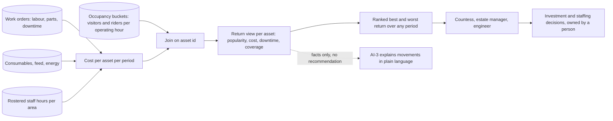

# Attraction economics: popularity against cost

This document designs F2.6 (value per attraction) and F6.5 (maintenance log per ride and enclosure). It exists because the Countess's first stated business challenge is not a data problem, it is a decision problem: *"no real idea which parts of the estate are most popular, so investment and staffing are guesswork."*

Popularity alone does not end the guesswork. A ride can be busy and still lose money, and a quiet enclosure can be cheap enough to be the best thing the estate owns. The occupancy work ([ADR-015](../adr/ADR-015-occupancy-grain-and-operating-hour-normalisation.md)) supplies one half of the answer. This document supplies the other half and joins them.

## What it answers

| Question | Needs |
|---|---|
| Which attractions are most popular? | Visitors or riders per operating hour, already delivered by F2.1 and F2.5 |
| What does each one cost to run? | Maintenance hours, parts, downtime and staff time per asset — F6.5, designed here |
| Which are worth the investment? | The two above, side by side, per asset, over any period — F2.6 |
| How much of this can we trust? | Data coverage stated alongside every figure, because early cost data will be patchy |

## Maintenance and asset records (F6.5)

A new **Maintenance and Assets** service owns the asset register and the work-order log. Every ride, enclosure and display is an asset with a stable identifier — the same identifier the MQTT topic scheme uses ([mqtt-topics.md](../implementation/mqtt-topics.md)), so telemetry, alarms, occupancy and cost all key to one thing.

| Record | Fields | Source |
|---|---|---|
| Asset | Asset id, type (ride, enclosure, display, plant), zone, opened date, conservation class | Set up once; conservation class comes from the historic-rides constraint |
| Work order | Asset id, opened at, category (planned, reactive, inspection, conservation), labour hours, parts cost, downtime window, outcome, engineer | Engineer's tablet, offline-first |
| Downtime | Asset id, from, to, cause, planned or unplanned | Derived from work orders and ride status topics |
| Consumables | Asset id, feed and bedding cost for enclosures, energy where metered | Back of house (Z7) scales and meters, plus periodic allocation |

Work-order capture runs on the engineer's tablet with a local outbox, exactly like the keeper tablet in [03-edge-zone](03-edge-zone.md): the workshop and the ride platforms are where the signal is worst, and a maintenance record that requires connectivity will be written on paper instead. Records are append-only with a correction entry rather than an edit, the same discipline as welfare records ([ADR-011](../adr/ADR-011-human-in-the-loop.md)).

The honest constraint: today this is on paper. The PRD records the risk that it stays there, and the mitigation is that the capture is simple enough to be faster than paper and that every cost figure shows its own coverage.

## Return per attraction (F2.6)

The return view is arithmetic over recorded facts: popularity per operating hour, cost per period, downtime, and the coverage of each. No model is involved in producing it, which is deliberate — an investment decision must rest on numbers the estate can recompute by hand and defend to an inspector or an accountant. [AI-3](../ai/ai-03-crowd-flow-and-staffing.md) may *explain* a movement in plain language; it never produces the figure.

Two patterns the view is designed to surface, both of which the estate currently cannot see:

- **A popular loss-maker.** High riders per operating hour, high reactive maintenance and downtime. The 18th-century collection makes this likely, and it is exactly the case where "it's our most popular ride" has been driving investment.
- **A cheap favourite.** Modest footfall, long viewing time, almost no cost. Under a pure popularity ranking it looks like a candidate for closure; under return it is the estate's best asset per pound.

Neither conclusion is drawn automatically. The view ranks and evidences; a named person decides.

## Coverage, not false precision

Early cost data will be incomplete, and a confident-looking return figure built on three work orders is worse than no figure. Every asset row carries:

| Coverage signal | Meaning |
|---|---|
| Work-order coverage | Share of the period with maintenance records present |
| Cost completeness | Which cost categories are populated for this asset |
| Occupancy confidence | Counter health and open-or-closed hours for the period |

An asset below an agreed coverage floor shows its popularity and its coverage gap, and is excluded from the ranked return list rather than ranked on a guess. The PRD's year-one success metric — all 40 rides and 55 enclosures carrying both popularity and cost data — is precisely the work of closing this gap.

## Conformance

| Property | How this upholds it |
|---|---|
| **Invariant — life safety** | The view is read-only and cannot alter containment, duress, ride operation or emergency response |
| **Invariant — data integrity** | Append-only work orders with corrections rather than edits; cost joins on asset id, never on a name |
| **Invariant — security and privacy** | Aggregate and asset-level only. No visitor identifiers are involved at any point |
| Availability under partition | Work-order capture is offline-first with a local outbox; the return view is reporting and may be stale without consequence |
| Evolvability | Asset id is the same key as the MQTT topic scheme, so new asset types join without changing consumers |
| Observability | Coverage signals make the data's own gaps visible, which is the difference between a report and a claim |
| Elastic scalability | Batch reporting over the event lake; no hot path |
| Cost transparency *(constraint)* | This *is* the estate-side counterpart of the AI cost ledger: per-asset cost visible next to the value it returns |

## Evidence

| Check | Method |
|---|---|
| Cost attributes to the right asset | Named test: a work order raised on a ride appears in that ride's cost and nowhere else |
| Downtime excluded from the popularity denominator | Named test against the operating-hour normalisation in [ADR-015](../adr/ADR-015-occupancy-grain-and-operating-hour-normalisation.md) |
| Offline work-order capture survives a shift with no signal | Drill: engineer completes a day's orders with the tablet offline, then syncs |
| A low-coverage asset is never ranked | Named test on the coverage floor |
| The return figure is reproducible by hand | Audit: recompute one asset's period figure manually from source records |

## Related

- [ADR-015 Occupancy grain and operating-hour normalisation](../adr/ADR-015-occupancy-grain-and-operating-hour-normalisation.md), the popularity half
- [02-containers.md](02-containers.md), the Maintenance and Assets service in the container view
- [AI-3 Crowd flow and staffing](../ai/ai-03-crowd-flow-and-staffing.md), which explains movements but does not produce the figure
- [AI-6 Ride condition monitoring](../ai/ai-06-ride-condition-monitoring.md), which generates the inspection work that becomes cost
- [05-characteristics.md](05-characteristics.md), cost transparency
- [Traceability](../traceability.md), evidence for F2.6 and F6.5
