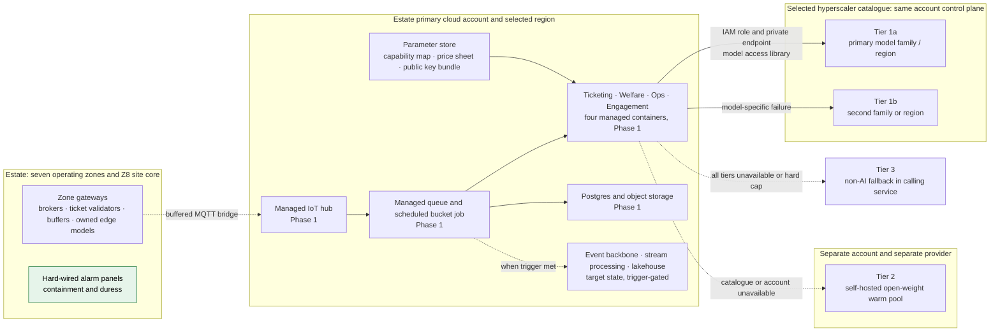

# Cloud deployment and failure domains

This view complements the [edge-zone deployment view](03-edge-zone.md). It shows where the estate's cloud workloads run, what is present in the Phase 1 minimum, and which boundaries make Tier 2 independent of the primary model catalogue. It is deliberately provider-neutral: a named provider is chosen only during procurement, and the controls shown here are required whichever provider is selected.

## Deployment view

The hard-wired safety circuit has no arrow to a cloud account, a gateway broker or a model tier. It is drawn here only to make the deployment boundary explicit.

## What each boundary means

| Boundary | What it contains | Failure consequence and designed response |
|---|---|---|
| Estate edge | Gate validation, operational alerts, buffers and owned edge inference | Backhaul loss leaves local functions working and queues events for replay. Containment and duress are not edge-software functions |
| Primary cloud account | IoT ingestion, services, data stores, parameter store, Tier 1 catalogue access | Ticket sales, analytics and cloud AI degrade; already-issued tickets, edge operation and hard-wired safety continue |
| Tier 1a and Tier 1b | One catalogue account and control plane | A model or regional issue can move to 1b; an account or catalogue failure affects both and moves to Tier 2 |
| Tier 2 | Separate account and provider | Supplies only warm-pool capacity; overflow uses Tier 3 while it scales |
| Tier 3 | The calling estate service | No model dependency: FAQ search, templated report or manual form remains available |

## Phase 1 versus target state

| Concern | Phase 1 | Target state | Trigger |
|---|---|---|---|
| Ingestion and services | IoT hub, managed queue, four containers, Postgres and object storage | Same services with independent scaling | A service's own scale or release cadence becomes a constraint |
| Stream and analytical processing | Scheduled 15-minute bucket job and nightly rollups | Event backbone, stream processing, lakehouse and warehouse | Independent replay consumers, sub-minute occupancy, or multi-season analytical workload ([delivery plan](../delivery-plan.md#the-minimum-cloud-baseline)) |
| Generative models | Absent | Tier 1a, Tier 1b, Tier 2 and Tier 3 | A GenAI feature passes its Phase 3 evidence gate |
| Configuration | Git-rendered parameter store and a short-TTL cache | Same | No trigger: configuration is not a separately deployed service |

## Security and operational controls

- Services call the catalogue with workload IAM roles through private endpoints; no service stores a model API key.
- The parameter store holds configuration and public verification keys, never the Ticketing private signing key or an offline-kiosk private issuer key.
- Ticketing keeps its primary signing keys in a cloud key-management service. An offline kiosk holds its distinct, restricted issuer key in its own secure element; its public key is distributed in the retained gateway key bundle.
- Every primary-account deployment is independently observable from the estate edge; the same incident must not depend on the account that may have failed.

## Related

- [02-containers.md](02-containers.md), the logical container view
- [03-edge-zone.md](03-edge-zone.md), edge deployment and hardware classes
- [Delivery plan](../delivery-plan.md), Phase 1 minimum and target-state triggers
- [ADR-005](../adr/ADR-005-model-access-and-capability-contracts.md), catalogue access and configuration
- [ADR-006](../adr/ADR-006-multi-provider-portfolio.md), model failure domains
- [ADR-016](../adr/ADR-016-local-incident-response.md), independent life-safety path
