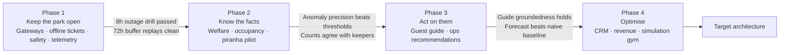

# Delivery plan: the first deployable slice, and what unlocks the next

The architecture in this repository is the target state. It is not the first thing built, and nothing here requires the estate to build it all before it gets value. This document answers two questions a reader is entitled to ask of any target architecture: **what is the smallest thing that goes live**, and **what evidence has to exist before the next heavier component is bought**.

Every phase below states its cost class and cost drivers, the risk it removes, and the evidence that unlocks the phase after it. The brief provides neither an estate budget nor supplier quotes, so this plan does not invent capex totals; procurement must quote the named components before each phase commits. A phase that does not produce its evidence does not unlock the next one; the estate stops there and still has a working park. That is the test of whether a phase was a sensible slice.

## The shape of it

Phases 1 and 2 are the estate's operational floor: they are not optional and they carry no GenAI. Phases 3 and 4 are the growth case, and each is individually cancellable without stranding the phases before it.

## Phase 1: keep the park open

**Build.** Zone gateways in all seven zones plus the cold spare ([05-site-core-and-spare](explainers/05-site-core-and-spare.md)), local MQTT brokers, deterministic operational welfare-and-maintenance rules, offline-verifiable signed tickets ([signed-ticket-format](implementation/signed-ticket-format.md)), the store-and-forward buffer, gate scanners and people counters, the aggregated estate-to-cloud path, and the cloud minimum baseline below. The life-safety layers in [06-safety-case](architecture/06-safety-case.md) are commissioned here, because they are hard-wired and independent of everything else.

**No AI at all in this phase.** Not as caution: there is nothing for a model to be right about until telemetry exists.

**Cost class, driver and risk.** Capital investment: seven gateways, one cold spare, sensors, scanners, cabling, backhaul and the independent life-safety panel, panic stations and alerting. These are intentionally quoted as a site-surveyed package rather than invented per-unit prices. This phase removes the risk the brief actually describes. Today an unreliable link means a gate that cannot admit a paying guest and an alarm that nobody hears. After Phase 1 the estate admits guests, sounds alarms and records welfare events with the cloud switched off entirely.

**Evidence that unlocks Phase 2.**

| Evidence | Threshold |
|---|---|
| Gate admission drill with the backhaul cut | Eight hours, every gate admitting, no manual fallback used |
| Buffer replay after the drill | Every buffered event delivered; replay idempotent on `scan_id` so each scan reconciles exactly once; no welfare event lost |
| Containment and duress drill | Response times within the [safety case](architecture/06-safety-case.md) fitness functions, cloud powered off throughout |
| Telemetry completeness | Two weeks of continuous data from every zone, with per-device gap reporting |

That last row is what Phase 2 is made of. A model trained on telemetry with unlogged gaps learns the gaps.

## Phase 2: know the facts

**Build.** The Animal Welfare service and keeper tablet, time-series storage, 15-minute occupancy buckets ([ADR-015](adr/ADR-015-occupancy-grain-and-operating-hour-normalisation.md)), welfare anomaly detection ([AI-2](ai/ai-02-welfare-anomaly-and-brief.md), the detection half only — the owned anomaly models run in the cloud welfare service against buffered telemetry; what runs on the gateway is the deterministic threshold rules, and those are Phase 1), and the piranha counting pilot in the aquatic zone ([AI-1](ai/ai-01-piranha-counting.md)) on one tank before all of them.

**All owned classic models. Still no GenAI.** Numbers and images in, numbers and classes out — the selection principle in [ADR-004](adr/ADR-004-classic-ml-vs-genai-selection.md) says these are not language problems, and they carry no vendor dependency, no token cost and no prompt to drift.

**Cost class, driver and risk.** Incremental capital plus cloud operating cost: the aquatic GPU module, model-development effort and the welfare service. The risk removed is diagnostic: the estate currently learns an animal is unwell from a vet bill and learns where guests go from staff impressions. Phase 2 replaces both with measurement, and the piranha census stops being a guess without draining a tank.

**Evidence that unlocks Phase 3.**

| Evidence | Threshold |
|---|---|
| Anomaly detection versus fixed thresholds | Beats the threshold baseline on precision at equal recall over a full season, judged against keeper and vet verdicts |
| Piranha counts versus manual counts | Within the stated interval on monthly manual cross-checks, three months running |
| Keeper acceptance | Keepers act on flags rather than dismissing them; rejection rate tracked weekly per [validation](validation.md) |
| Occupancy data quality | Bucket coverage above the completeness bar across operating hours, re-entries deduplicated correctly |

If the anomaly models do not beat thresholds, the estate keeps the thresholds and skips the model. That is a legitimate outcome, not a failure of the phase.

## Phase 3: act on them

**Build.** Demand forecasting and staffing optimisation ([AI-3](ai/ai-03-crowd-flow-and-staffing.md)), the guest guide over curated content ([AI-4](ai/ai-04-guest-guide.md)), the keeper daily brief (the GenAI half of AI-2), ride vibration monitoring ([AI-6](ai/ai-06-ride-condition-monitoring.md)), and the whole AI platform that governs them: capability map, model registry and price sheet, eval pipeline, model access layer, kill switches, LLM observability.

**This is where GenAI enters,** and where the machinery in [ADR-005](adr/ADR-005-model-access-and-capability-contracts.md) through [ADR-008](adr/ADR-008-evaluation-gated-promotion.md) earns its cost. It is deliberately not built in Phase 1 to serve a single feature.

**Cost class, driver and risk.** Recurring cloud and model spend, dominated by the guest guide; the [worked cost model](uncertainty.md#worked-cost-model) gives sensitivity rather than a quote. The material ongoing cost is evaluation and observability discipline, not a one-time line item. The risk removed is commercial: the estate stops staffing by habit and stops losing first-time visitors to a confusing map.

**Evidence that unlocks Phase 4.**

| Evidence | Threshold |
|---|---|
| Forecast accuracy | Beats the seasonal-naive baseline on MAPE over a full season, including a wet weekend and a bank holiday |
| Roster acceptance | Operations managers accept or lightly edit the majority of suggestions |
| Guide groundedness and refusals | Rubric and citation coverage above the release gate; refusal correctness at 100% on the medical and safety golden set |
| Kill switch drill | Guide killed estate-wide inside a minute, guests land on keyword FAQ, no error state |

## Phase 4: optimise

**Build.** Retention and revenue ([AI-5](ai/ai-05-retention-and-revenue.md)) with the CRM, consent and segmentation it depends on; company copilots ([AI-7](ai/ai-07-company-copilots.md)); the simulation gym ([AI-8](ai/ai-08-simulation-gym.md), [ADR-017](adr/ADR-017-simulation-gym.md)); the lakehouse and warehouse that attraction economics ([07-attraction-economics](architecture/07-attraction-economics.md)) needs to answer return per attraction.

**Cost class, driver and risk.** Recurring analytical-storage and batch-compute cost, driven by the lakehouse, warehouse and scenario runs. The lakehouse is deliberately last: it earns its cost only once several seasons of clean event history exist, which Phases 1 to 3 produce as a by-product. The simulation gym is last of all, because a simulator calibrated on one season of data is a confident guess. The risk removed is investment risk — the estate stops choosing between a new ride and an enclosure refurbishment on instinct.

**Why this is last and not first.** Everything in Phase 4 is a judgement aid for decisions the estate already makes today, by other means, adequately. Everything in Phase 1 is a decision the estate currently cannot make at all when the link drops.

## The minimum cloud baseline

The container view in [02-containers](architecture/02-containers.md) names Kafka, Flink, a time-series store, a lakehouse, a warehouse, Kubernetes, a model registry and three model tiers. That is the target state at 15,000 visitors a day with four seasons of history. **None of it is the Phase 1 deployment**, and reading it as such would be enterprise overreach for a five-thousand-visitor estate.

At 5,000 visitors a day the estate generates roughly **330,000 events a calendar day across seven zones — about 7 a second while the park is open, 3.8 a second across 24 hours, and 9 at the opening peak**, with a burst when a buffer flushes after an outage. That arithmetic is worked in [03-edge-zone](architecture/03-edge-zone.md#capacity-what-those-devices-actually-generate). It is a workload one managed database handles without noticing. The Phase 1 cloud is therefore small enough to be run by a team that also has to keep the gates open:

| Function | Phase 1 minimum | Target state | Trigger to move |
|---|---|---|---|
| Ingest | Managed IoT hub (AWS IoT Core or equivalent) | Same | None. This one is right at both scales |
| Event backbone | The hub's built-in rules routing to a managed queue | Kafka or managed equivalent | A third consumer needs independent replay of the same stream, or replay windows must exceed the queue's retention |
| Stream processing | A scheduled job computing 15-minute buckets from the queue | Flink or managed equivalent | Occupancy is needed in under a minute rather than per bucket, or stateful joins across zones appear |
| Telemetry storage | Postgres with a time-series extension, one instance | Dedicated time-series store, separate instance | Ingest or query latency degrades under retention, or telemetry query load starts affecting transactional load |
| Analytical storage | The same Postgres, with nightly rollups | Lakehouse in open table format plus warehouse | Multi-season attraction economics ([07-attraction-economics](architecture/07-attraction-economics.md)) or model training sets exceed what one instance serves — realistically Phase 4 |
| Services | Ticketing, Welfare, Ops and Engagement as four containers on a managed container runtime; no Kubernetes | Kubernetes or serverless per service | Independent scaling or deployment cadence per service becomes the constraint, not the team |
| Model registry | Configuration in git rendered to the parameter store. It is already this ([ADR-007](adr/ADR-007-model-registry-and-cost-policies.md)) | Same | None. It is configuration, not a service, at every scale |
| Model tiers | Tier 1a and the Tier 3 non-AI fallback | Add Tier 1b and self-hosted Tier 2 | Tier 2 is funded when a GenAI feature becomes load-bearing for daily operations — Phase 3 at the earliest ([ADR-006](adr/ADR-006-multi-provider-portfolio.md)) |
| Data lake | Raw events to object storage in open format from day one | Curated marts on top | Object storage is cheap and the format is the lock-in decision. Start correct, query later |

Two things deliberately do **not** shrink. Raw events land in an open table format on object storage from the first day, because that is the decision that is expensive to reverse. And the edge is built at full strength in Phase 1, because the edge is the architecture — a scaled-down gateway is just an outage waiting for a guest.

**The edge barely scales with visitors.** Growth from 5,000 to 15,000 a day adds gate scanners and people counters inside existing zones; it adds a gateway only if the estate opens a new physical area. The seven gateways sized in [05-site-core-and-spare](explainers/05-site-core-and-spare.md) carry the target load, and a new zone is one gateway and a topic prefix — the [elastic-scalability characteristic](architecture/05-characteristics.md#4-elastic-scalability). The cloud tier is what genuinely scales, and it scales by the triggers above rather than by anticipation.

## What this plan is not

It is not a schedule. The kata brief gives no team size, no budget and no season boundaries, so putting months against these phases would be invented precision ([uncertainty](uncertainty.md) records what is genuinely unknown). The ordering and the evidence gates are the architectural content; the calendar is the estate's.

## Related

- [Walkthroughs](walkthroughs.md), three end-to-end scenarios through the Phase 1 and Phase 3 slices
- [02-containers](architecture/02-containers.md), the target container set this plan phases in
- [05-characteristics](architecture/05-characteristics.md), the invariants and ranked characteristics every phase must uphold
- [validation](validation.md), the measurement machinery behind the evidence gates
- [inferred-requirements](inferred-requirements.md), what is deliberately not built in any phase
