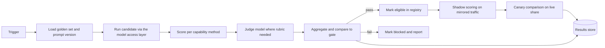

# Evaluation Harness Design

The harness is what makes model swapping safe and what feeds the CI gate in [validation.md](../validation.md). Design only; no runnable code.

## Flow



## Golden set format

One JSONL file per capability, versioned with the prompt. Fields:

| Field | Meaning |
|---|---|
| `id` | Stable row id |
| `capability` | For example `chat.guide` |
| `input` | The user or system input, including any structured context |
| `context_refs` | Ids of knowledge chunks or data series the answer must draw on |
| `expected` | Reference answer, expected schema instance, or numeric ground truth |
| `must_cite` | Chunk or series ids that a grounded answer must cite |
| `must_refuse` | Boolean, for safety cases |
| `rubric` | Rubric id when judged |
| `source` | How the row was created: authored, production label, manual count |
| `labelled_by`, `labelled_at` | Provenance |

Example row:

```json
{"id":"guide-0142","capability":"chat.guide","input":{"question":"Which rides suit a four year old with no queue right now?","live":{"occupancy_snapshot":"snap-2026-08-14T11:15"}},"context_refs":["ride-carousel","ride-swingboat","policy-height"],"expected":"Carousel and Swing Boat, both under 5 minutes, both suitable under 1.2 m","must_cite":["policy-height","snap-2026-08-14T11:15"],"must_refuse":false,"rubric":"guide-answer-v2","source":"production label","labelled_by":"guest-experience-lead","labelled_at":"2026-08-15"}
```

## Scoring methods per capability

| Capability | Method |
|---|---|
| `chat.guide` | Schema check; citation match against `must_cite`; refusal correctness against `must_refuse`; rubric score by judge |
| `summarise.welfare` | Schema check; every claim maps to an anomaly id in `context_refs` (no invented anomalies); rubric score for clarity and recommendation quality |
| `explain.ops` | Claim-to-data mapping; rubric score |
| `generate.offer` | Schema check; rubric for tone and factual grounding; blocked-content check |
| `classify.sentiment` | Exact label match; macro F1 |
| `embed.text` | Retrieval recall at k on a labelled query set |
| `count.piranha` (edge) | Absolute error against manual count; interval coverage rate |
| Anomaly models (edge and cloud) | Precision and recall against verdict windows |
| Forecast models | MAPE against actuals over a held-out period |

### Sample rubric, `guide-answer-v2`

Scored 0 to 2 per line by the judge, averaged, then normalised to 0 to 1.

1. Answers the question asked, not a nearby one.
2. Every factual claim is supported by a cited chunk or live data point.
3. Applies the height and safety policy correctly.
4. Uses the live occupancy snapshot when the question is about queues.
5. Tone is warm, brief and suitable for a family audience.
6. Does not invent times, prices or animal facts.

The judge is calibrated against a human panel before use and re-calibrated quarterly or whenever the judge model changes. Agreement below the agreed threshold blocks the judge until the rubric is revised.

## Triggers

| Trigger | Scope |
|---|---|
| Registry change (new candidate, price change does not trigger) | Full run for every capability the model is eligible for |
| Prompt, retrieval index or guardrail change | Full run for the affected capability |
| Nightly | Full run for all active and candidate models |
| Production label batch | Golden set version bump, then full run |

## Promotion gate rules

- Score at or above the capability's `min_eval_score`.
- Citation coverage at or above the contract minimum.
- Zero failures on `must_refuse` rows.
- Schema validity 100% on structured capabilities.
- p95 latency and cost per 1,000 requests within the contract, measured during the run.
- No regression greater than the agreed margin against the current active model on the same golden set version.

Failing any rule sets the registry status to blocked for that capability with the report attached.

## Shadow and canary scoring

- **Shadow.** A mirrored 2 to 5% of live requests is sent to the candidate; responses are not shown to users. Both outputs are scored offline with the same methods, and the candidate must match or beat the active model.
- **Canary.** 10% of live traffic is served by the candidate. Online signals from [validation.md](../validation.md) are compared with the control. Automatic rollback when the candidate's signals fall below the control's by more than the margin.

## Where results live

- Per-run reports and per-row scores in the results store (our own warehouse), keyed by capability, model, prompt version and golden set version.
- Summary scores written back to the registry entry.
- Traces for shadow and canary in the LLM observability tool, linked to the run id.
- Nothing is stored only at the provider.
