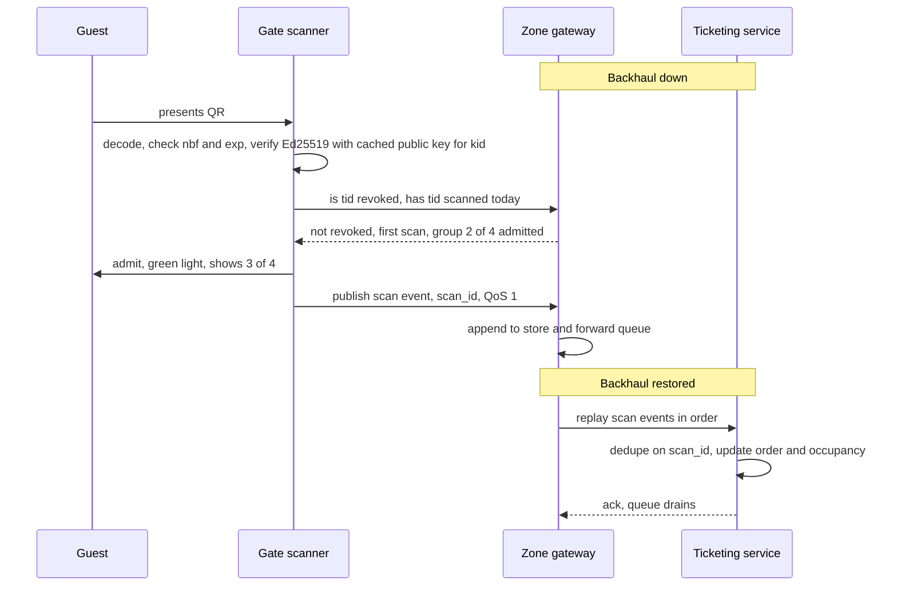

# Offline-verifiable signed ticket format

This document defines the ticket token that lets a gate admit a guest with no connection to the cloud, which is the single most important thing the platform must do on a day the backhaul is down. The design is a compact signed token in a QR code, verified locally with a public key, backed by a small revocation list, with scans replayed and deduplicated when the link returns.

## Token fields

| Field | Type | Purpose |
|---|---|---|
| `tid` | 16-byte identifier, base32 | Ticket identifier, unique for ever |
| `oid` | identifier | Order identifier, for reconciliation only |
| `typ` | small integer | Product type: adult, child, concession, family pass, annual pass, staff |
| `grp` | identifier, optional | Group identifier shared by the members of a family pass |
| `gsz` | small integer, optional | Number of members in the group, so the gate can show 3 of 4 admitted |
| `nbf` | unix time | Not valid before, the start of the visit window |
| `exp` | unix time | Not valid after, the end of the visit window |
| `zon` | bitmask | Zones the ticket admits to, for zoned products such as aquatic house entry |
| `kid` | small integer | Identifier of the signing key used |
| `sig` | 64 bytes | Ed25519 signature over all fields above |

The token is encoded as CBOR then base32 and rendered as a QR code. At these sizes the payload is roughly 120 to 150 bytes, which fits a version 8 to 10 QR code with medium error correction and scans reliably from a phone screen in daylight. Nothing personal is in the token; names and emails live only in the cloud CRM against the order.

## Signing and key rotation

- The Ticketing service holds the private keys in a cloud key management service. Tickets are signed at issue time.
- Two keys are live at any time, identified by `kid`. Rotation issues a new key, pushes the public key to the gateways on the retained `config/keys` topic, waits until every gateway has acknowledged, then starts signing with it. The old key stays valid until the last ticket signed with it has expired.
- Gateways hold the public keys only. A compromised gateway cannot mint tickets.
- Ed25519 is chosen for small signatures, fast verification on modest scanner hardware and no configuration choices to get wrong.

## Revocation

Most tickets are never revoked, so the list is small. Entries are added for refunds, chargebacks and detected fraud, and each entry carries the ticket's `exp` so it can be dropped once expired. The list is published on the retained `config/revocations` topic as a full snapshot with a version number, typically a few hundred entries. Gateways hold the latest snapshot; a gate that has been offline uses the last one it saw. The trade-off is that a refund issued during an outage is honoured at the gate until the link returns, which is acceptable.

## Family passes

A family pass is a group of tokens that share `grp` and `gsz`. Each member holds their own token and scans individually, so a family can split up and re-enter. The gate shows how many of the group have been admitted today. A single shared token was rejected because it either admits the whole group in one scan, which breaks re-entry and counting, or requires the gate to keep group state online.

## Scan dedupe and re-entry

Every scan produces an event with a unique `scan_id`, the `tid`, the gate identifier, the gateway's time and the decision. The gateway keeps a scan log for the current day plus one. Rules:

| Situation | Decision |
|---|---|
| First scan in the window | Admit |
| Same ticket at any gate again the same day | Admit as re-entry and record it; re-entry is allowed by default |
| Same ticket outside its window | Deny, show the window |
| Ticket on the revocation list | Deny, refer to the ticket office |
| Signature invalid or unknown `kid` | Deny |
| Scanner cannot reach the gateway | Scanner verifies the signature alone with its cached keys and admits, logs locally, syncs to the gateway later |

Replay to the cloud carries `scan_id`, so a scan that is delivered twice is counted once. Occupancy counts derive from scans and counters together, so a re-entry is not a new visitor.

## Offline scan sequence

## Online versus offline behaviour

| Aspect | Online | Offline |
|---|---|---|
| Signature check | Local, same as offline | Local |
| Revocation | Latest snapshot, minutes old | Last snapshot received |
| Duplicate detection | Gateway log, cloud reconciles across zones within seconds | Gateway log only; cross-zone duplicates reconciled on replay |
| Ticket sales at the gate | Kiosk sells and signs via the cloud | Kiosk issues a paper or on-screen ticket signed by a gate-issuance key with a short validity and a daily cap; reconciled later |
| Guest experience | Identical | Identical |

## Related

- [03-edge-zone.md](../architecture/03-edge-zone.md)
- [04-data-flow.md](../architecture/04-data-flow.md)
- [MQTT topics](mqtt-topics.md)
- [ADR-003 Offline-verifiable signed tickets](../adr/ADR-003-offline-verifiable-signed-tickets.md)
- [ADR-002 MQTT topology and store-and-forward](../adr/ADR-002-mqtt-topology-and-store-and-forward.md)
- [ADR-013 Privacy-preserving footfall and consent](../adr/ADR-013-privacy-preserving-footfall-and-consent.md)
