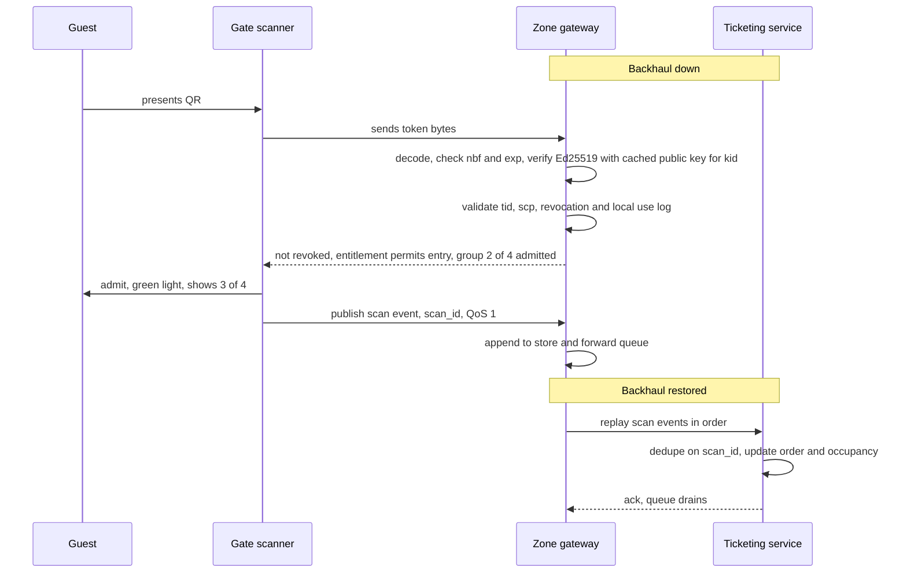

# Offline-verifiable signed ticket format

This document defines the ticket token that lets a gate admit a guest with no connection to the cloud, which is the single most important thing the platform must do on a day the backhaul is down. The design is a compact signed token in a QR code, verified locally with a public key, backed by a small revocation list, with scans replayed and deduplicated when the link returns.

## Token fields

| Field | Type | Purpose |
|---|---|---|
| `tid` | 16-byte identifier, base32 | Ticket identifier, unique for ever |
| `oid` | identifier | Order identifier, for reconciliation only |
| `typ` | small integer | Product type: adult, child, concession, family pass, annual pass, staff |
| `grp` | identifier, optional | Group identifier shared by the members of a family pass |
| `gsz` | small integer, optional | Number of members in the group, so the gate can show 3 of 4 admitted |
| `nbf` | unix time | Not valid before, the start of the visit window |
| `exp` | unix time | Not valid after, the end of the visit window |
| `zon` | bitmask | Zones the ticket admits to, for zoned products such as aquatic house entry |
| `scp` | small integer | Admission scope and reuse policy: initial entry, permitted re-entry, ride/day-pass use, or single use |
| `kid` | small integer | Identifier of the signing key used |
| `sig` | 64 bytes | Ed25519 signature over all fields above |

The token is encoded as CBOR then Base32 and rendered as a QR code. At these sizes the payload is roughly 120 to 150 bytes. Base32 expands by exactly 8/5, so that is **192 to 240 characters**. Base32 uses only the QR alphanumeric character set: at medium error correction, version 8 holds 221 alphanumeric characters and version 9 holds 262. The token therefore needs a **version 8 or 9** code, depending on which optional fields are present. The arithmetic is worked in the [fitness-function scorecard](../architecture/05-characteristics.md#settled-by-arithmetic) and the capacity figures come from the [Denso Wave QR Code table](https://www.denso-wave.com/fsys/en/adcd/download/category/catalog/autoid_products/DENSOWAVE_AUTO-ID_2407_en.pdf). Estate scanner and phone-screen testing is still a release check; if a smaller code is wanted, the lever is dropping optional fields such as `grp` and `gsz` from single tickets, not changing the encoding. Nothing personal is in the token; names and emails live only in the cloud CRM against the order.

## Signing and key rotation

- The Ticketing service holds the private keys in a cloud key management service. Tickets are signed at issue time.
- Two keys are live at any time, identified by `kid`. Rotation issues a new key, pushes the public key to the gateways on the retained `config/keys` topic, waits until every gateway has acknowledged, then starts signing with it. The old key stays valid until the last ticket signed with it has expired.
- Gateways hold the public keys only. A compromised gateway cannot mint tickets.
- Ed25519 is chosen for small signatures, fast verification on modest scanner hardware and no configuration choices to get wrong.

### Offline kiosk delegation

An offline walk-up sale is a deliberate, bounded exception to cloud-only signing. Each kiosk has a distinct, low-privilege issuer key in its secure element, with its own `kid`; its private key is neither a gateway key nor the Ticketing service's primary signing key. The public half is distributed to gateways in the same retained key bundle, marked as an **offline-kiosk issuer**.

- An offline-kiosk key may issue only the approved walk-up product scopes, with a validity window no longer than the operating day and a fixed daily ticket cap. It cannot issue annual passes, discounts, staff products, refunds or revocations.
- The kiosk maintains an append-only, tamper-evident local sales journal containing its sequence number, `tid`, locally allocated `oid`, product, payment reference or approved offline-payment reference, and key identifier. It replays that journal to Ticketing before normal operation resumes.
- Ticketing reconciles the journal, the signed `tid`s and the cap. A missing sequence, cap breach or unexpected scope disables that kiosk `kid`, raises a fraud review and publishes the revoked issuer key to every gateway.
- The ticket format does not authorise payment: the kiosk may issue only after its separate, approved payment procedure has completed, and it never stores card data.

This delegation preserves offline walk-up sales while limiting the blast radius of a stolen or compromised kiosk. It does not weaken the rule above: gateways retain public verification keys only and cannot mint tickets.

## Revocation

Most tickets are never revoked, so the list is small. Entries are added for refunds, chargebacks and detected fraud, and each entry carries the ticket's `exp` so it can be dropped once expired. The list is published on the retained `config/revocations` topic as a full snapshot with a version number, typically a few hundred entries. Gateways hold the latest snapshot; a gate that has been offline uses the last one it saw. The trade-off is that a refund issued during an outage is honoured at the gate until the link returns, which is acceptable.

## Family passes

A family pass is a group of tokens that share `grp` and `gsz`. Each member holds a distinct `tid` and scans individually, so a family can split up and re-enter when the product's `scp` permits it. The gate shows how many distinct group members have entered today. A single shared token was rejected because it either admits the whole group in one scan, which breaks re-entry and counting, or requires the gate to keep group state online.

## Scan dedupe and re-entry

Every scan produces an event with a unique `scan_id`, the `tid`, `scp`, gate identifier, the gateway's time and the decision. The gateway keeps a scan log for the current day plus one. Rules:

| Situation | Decision |
|---|---|
| First scan in the window, within entitlement | Admit and record the `tid`, `scp` and admission date |
| Repeat in a permitted re-entry or ride/day-pass scope | Admit and record it as the product allows; it is not a second initial admission |
| Repeat in a single-use scope at the same gateway | Deny from the local scan log |
| Repeat in a single-use scope at another gateway | May admit until cloud reconciliation correlates the two scan logs; flag the conflict for review |
| Same ticket outside its window | Deny, show the window |
| Ticket on the revocation list | Deny, refer to the ticket office |
| Signature invalid or unknown `kid` | Deny |
| Scanner cannot reach the gateway | No automatic admission. Restore the gateway path with the cold spare or use the trained, controlled manual-admission log |

Replay to the cloud carries `scan_id`, so a scan that is delivered twice is counted once. Occupancy counts derive from scans and counters together, so a re-entry is not a new visitor.

## Offline scan sequence

## Online versus offline behaviour

| Aspect | Online | Offline |
|---|---|---|
| Signature check | Local, same as offline | Local |
| Revocation | Latest snapshot, minutes old | Last snapshot received |
| Duplicate detection for a single-use scope | Gateway log prevents same-gateway repeats; cloud correlates cross-zone scans within seconds, after an admission decision | Gateway log prevents same-gateway repeats; cross-zone conflicts are reconciled when the partition ends |
| Ticket sales at the gate | Kiosk sells and signs via the cloud | Kiosk issues a paper or on-screen ticket with its delegated secure-element key, limited scope, operating-day validity and daily cap; its append-only journal is reconciled later |
| Guest experience | Identical | Identical |

## Related

- [03-edge-zone.md](../architecture/03-edge-zone.md)
- [04-data-flow.md](../architecture/04-data-flow.md)
- [MQTT topics](mqtt-topics.md)
- [ADR-003 Offline-verifiable signed tickets](../adr/ADR-003-offline-verifiable-signed-tickets.md)
- [ADR-002 MQTT topology and store-and-forward](../adr/ADR-002-mqtt-topology-and-store-and-forward.md)
- [ADR-013 Privacy-preserving footfall and consent](../adr/ADR-013-privacy-preserving-footfall-and-consent.md)
