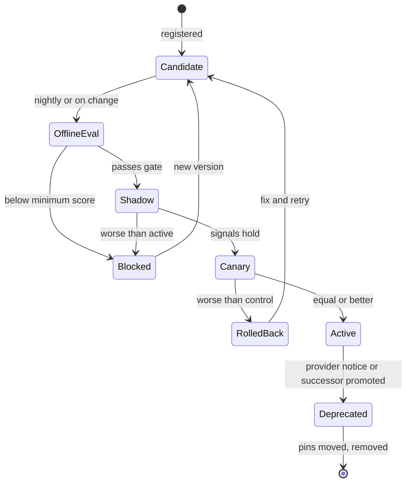
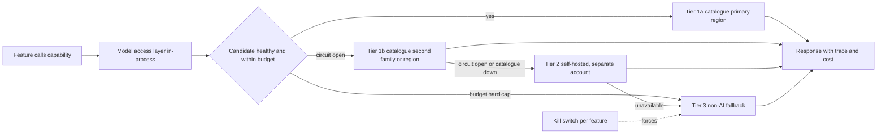

# Dealing with Uncertainty in AI

How the Von Digitalis platform survives three things the brief asks about directly: the best model changing, the provider changing prices, and the provider shutting down.

## The principle

**Models are configuration, not code.**

Every AI feature in this architecture names a *capability* it needs, never a model. Which model serves that capability is a registry entry, chosen by policy, gated by evaluation. A model change, a price change or a provider disappearing is therefore an operational event handled by configuration and automation, not a rewrite.

The second principle is about who carries it: **the indirection is configuration, not a component.** A shared client library resolves a capability to a model; a single hyperscaler model catalogue does the provider adaptation. Nothing new sits on the path of a guest chat, and there is no adapter backlog. What that costs is stated plainly in "[What this decision costs](#what-this-decision-costs)" below rather than buried in a trade-off table.

Related decisions: [ADR-005](adr/ADR-005-model-access-and-capability-contracts.md), [ADR-006](adr/ADR-006-multi-provider-portfolio.md), [ADR-007](adr/ADR-007-model-registry-and-cost-policies.md), [ADR-008](adr/ADR-008-evaluation-gated-promotion.md), [ADR-009](adr/ADR-009-rag-over-fine-tuning.md), [ADR-014](adr/ADR-014-caching-and-batch-cost-levers.md).

## Integration options considered

| Option | Description | Strengths | Weaknesses | Verdict |
|---|---|---|---|---|
| A. Direct SDK, single vendor | Each service calls one provider's SDK | Fastest to build; full access to provider features | Total dependency; price and shutdown risk unmitigated; no central metering | Rejected |
| B. Hyperscaler model catalogue, capability map in configuration | Bedrock, Vertex AI or Azure AI Foundry as the only integration; a shared client resolves capability to model from config | One bill, IAM, private networking, committed-use pricing, data residency; the catalogue's unified API is the adapter layer, so several model families are reachable with no adapter work; no component added to the guest path | Correlated failure across one account and control plane; new models lag first-party APIs and some never arrive; hard budget caps and per-guest rate limits must be built | **Recommended** |
| C. Library-level abstraction over many providers | A framework wraps several providers inside each service | Light; no new component | Scattered across services; no aggregate budget view; frameworks churn as fast as models | Rejected |
| D. Independent AI Gateway | One internal service in front of all providers: routing, failover, metering, caching, guardrails, audit | The strongest isolation, and the only option with genuine cross-cloud failover; providers are plugins | Another component to run, secure and keep highly available, on the path of every guest chat; adapter parity work per provider | Rejected on cost of ownership; documented escalation if a second cloud becomes a requirement |

We adopt B, with a self-hosted open-weight tier outside the catalogue as the continuity path and a non-AI floor beneath that.

The choice between B and D is not about what is possible, it is about who maintains the adapters and who carries the pager. D's central control is real, and the estate gives some of it up. What it buys back is that the catalogue's unified API already does the provider adaptation that was D's largest recurring cost, and does it for more model families than a team of this size would ever wire up by hand. The capability contract, which is the part that actually delivers "models are configuration", survives intact in either design; only its hosting changes.

## The design

### Capability contracts

Each AI feature declares a capability, for example `chat.guide`, `summarise.welfare`, `explain.ops`, `classify.sentiment`, `generate.offer`, `embed.text`, and the AI-7 capabilities `triage.support`, `transcribe.notes` and `summarise.incident`. The full catalogue with targets is in [00-ai-overview.md](ai/00-ai-overview.md). A contract states:

- required features (structured output, vision, tool use, minimum context size)
- p95 latency ceiling
- maximum cost per 1,000 requests
- minimum evaluation score on the capability's golden set
- data handling class (may leave the estate, must stay in region, must stay on-premise)

The contract is the only thing feature code knows about. See [model-access-config.md](implementation/model-access-config.md) for the shape.

### Model registry

A versioned configuration artefact in git, reviewed like code and rendered to the cloud parameter store. It is not a service. Fields:

| Field | Purpose |
|---|---|
| model id, catalogue region, IAM role | Where to route. No service holds a model API key |
| tier | 1a and 1b inside the catalogue, 2 self-hosted open-weight, 3 non-AI |
| price sheet (input, output, cached input, batch), version, effective date | Single source of truth for cost |
| rate limits and quotas | Capacity planning and back-pressure |
| data residency and retention flags | Compliance routing |
| eval scores per capability, with date | Promotion gate input |
| status: candidate, active, deprecated, blocked | Routing eligibility |
| deprecation date, successor | Deprecation calendar |

A provider price change is applied once, in the registry. Every dashboard and budget policy reprices from it immediately. A model the estate wants but the catalogue does not carry is recorded as `blocked: not-in-catalogue`, so the cost of the single-catalogue decision stays on the page rather than being quietly forgotten.

### Routing policy

Per capability, an ordered list of eval-passing candidates, held in the capability map and read by the model access library with a 30-second TTL. Routing is by capability and provider health, not per-request cascading: prompt caches are model-scoped, so a cascade forfeits them. We measure a capable model at lower effort before ever building a cascade. Because the map is a cached configuration value rather than a service, repointing a capability reaches every service in the estate within half a minute and rolls back just as fast.

### Provider portfolio, ordered by failure domain

Ordered by failure domain, not by quality.

| Tier | Purpose | Failure domain | Example |
|---|---|---|---|
| 1a | Day-to-day quality | Catalogue, primary region | The best eval-passing frontier family in the catalogue |
| 1b | Model deprecation, model-specific degradation, regional capacity | Catalogue, secondary region | A second family, or the same family in another region |
| 2 | Loss of the catalogue, the account or the commercial relationship | Outside the catalogue's control plane | Llama, Qwen or Mistral class model on vLLM, separate account and provider |
| 3 | Product keeps working with zero GenAI | Our own services | FAQ search, templated reports, rule-based offers |

Tier 1a and 1b share an account and a control plane, so everything above the model level fails together. We say so rather than dressing two regions up as two vendors. The real independence lives at Tier 2, which is why it is funded and drilled rather than aspirational. Every GenAI capability has a Tier 3 behaviour designed and tested before launch, and Tier 2 is eval-scored like any other candidate. See [ADR-006](adr/ADR-006-multi-provider-portfolio.md).

### Cost governance

- Every request logs input, output and cached tokens plus the registry price at the time, tagged by capability, feature flag and, where relevant, tenant.
- Per-capability daily and monthly budgets. Thresholds: warn at 120% of plan; auto-shift to the next eval-passing candidate at 150%; degrade to Tier 3 at a hard cap. The catalogue alerts on budget but does not stop inference, and account-level budget actions are too blunt to apply to one capability, so the thing that actually enforces the cap is a metering consumer we write. It reads the metering stream rather than the bill, so it acts in minutes; it is off the request path, so it does not need to be highly available.
- Per-user and per-device rate limits on guest-facing chat. Abuse and runaway loops are the real budget risk, not list prices.
- Free levers are applied before any quality-affecting change: prompt caching of the stable prefix (system prompt, knowledge chunks), semantic caching of repeated guest questions, batch processing for nightly briefs and offer generation, lower effort settings for routine calls.

### Availability governance

- Circuit breaker per candidate, opening on error rate or latency, with breaker state shared between service replicas through the same parameter cache the capability map uses, so one service discovering an outage does not leave the rest to find out alone.
- Automatic failover to the next candidate in the capability map.
- Health probes on every candidate, including Tier 2, which is the one most likely to have rotted unnoticed.
- Per-feature kill switch behind a feature flag; flipping it hands the feature to Tier 3.

### Quality governance

Evaluations are what make swapping safe: a model can only be replaced if the replacement can be measured. The full loop is in [validation.md](validation.md).

### Data ownership and exit plan

Prompts, completions, traces, eval sets, feedback labels, embeddings *and their source text* live in our own storage. Re-embedding is a batch job, so an embedding model can be replaced. Prompt templates are provider-agnostic with small per-model dialect overlays. Fine-tuning closed models is avoided; if it is ever done, the fine-tune is treated as disposable and the training set is kept.

### What we deliberately do not depend on

- Proprietary stateful features (hosted memory, assistant threads, hosted vector stores) without an adapter that can be re-pointed.
- Fine-tunes of closed models as the only way a capability works.
- Provider-specific prompt or tool features that have no equivalent on the Tier 2 model, unless wrapped in a per-model overlay with a plain fallback.
- Provider-side evaluation or logging as the system of record. The catalogue's native evaluation harness is used for convenience, never as the gate; the gate is our golden sets ([ADR-008](adr/ADR-008-evaluation-gated-promotion.md)).
- Catalogue-hosted agent, memory or knowledge-base features. These are the parts of a catalogue that are genuinely hard to leave, and the estate keeps retrieval, orchestration and state in its own services precisely so that the single-catalogue decision stays reversible.

### Edge AI is immune

Vision and anomaly models are owned artefacts (ONNX), versioned in our own model registry and deployed to zone gateways over MQTT. No external model provider is in that path. See [ADR-010](adr/ADR-010-edge-vision-no-cloud-video.md).

## Model lifecycle

Every transition is a registry status change driven by measured signals, never by opinion.

## Playbooks for the three scenarios

### 1. A better model appears

| Step | Action | Who | Elapsed |
|---|---|---|---|
| 1 | Add a registry entry with status candidate, prices and residency flags | Platform team | Hour 0 |
| 2 | Nightly offline eval runs against every capability's golden set | Automated | Day 1 |
| 3 | If it passes the minimum score, shadow 2 to 5% of live traffic, scored offline against the active model | Automated | Days 1 to 3 |
| 4 | If shadow signals hold, canary 10% of live traffic with online signals compared to control | Automated, platform team watches | Days 3 to 5 |
| 5 | Promote to first candidate for the capabilities where it won; leave others unchanged | Platform team | Day 5 |

Zero code changes. Reversible by config at any step.

### 2. The provider changes prices

| Step | Action | Who | Elapsed |
|---|---|---|---|
| 1 | Update the price sheet in the registry with the new version and effective date | Platform team | Minutes |
| 2 | Cost dashboards reprice historical and forecast spend per capability | Automated | Minutes |
| 3 | If a capability breaches its budget threshold, the policy engine shifts traffic to the next eval-passing candidate | Automated | Minutes to hours |
| 4 | Apply free levers first: caching, batch, effort settings | Platform team | Days |
| 5 | Negotiate committed-use pricing on the catalogue, or promote the alternative candidate permanently | Product and finance | Weeks |

### 3. The provider shuts down

This scenario now has two quite different shapes, and separating them is the honest way to answer it.

**A model is withdrawn, or one model family fails**

| Step | Action | Who | Elapsed |
|---|---|---|---|
| 1 | Circuit breaker opens on error rate | Automated | Seconds |
| 2 | Traffic moves to the next candidate in the capability map, a second family or region inside the catalogue | Automated | Seconds |
| 3 | Mark the model blocked in the registry; re-run evals on the remainder | Platform team | Hours |

This is the common case and the catalogue absorbs it completely.

**The catalogue, the account or the commercial relationship is lost**

| Step | Action | Who | Elapsed |
|---|---|---|---|
| 1 | Breakers open across every candidate at once, because they share a control plane | Automated | Seconds |
| 2 | **Tier 3 takes the whole load immediately.** Every capability's non-AI fallback is in-process and needs no capacity anywhere | Automated | Seconds |
| 3 | Tier 2's warm pool absorbs what it can, at eval-verified quality, in a separate account with a separate provider | Automated | Seconds |
| 4 | Tier 2 scales out towards the current request rate; traffic moves off Tier 3 as capacity appears | Automated | Minutes, model and provider dependent |
| 5 | Guests and staff see the "reduced mode" notice; capabilities Tier 2 cannot serve stay on Tier 3 | Automated | Seconds |
| 6 | Open the second-catalogue escalation in [ADR-006](adr/ADR-006-multi-provider-portfolio.md); re-point the capability map as it lands | Platform team | Days to weeks |

**Tier 2 is a warm pool, not a hot standby.** It serves the traffic its warm capacity can take immediately; overflow falls to Tier 3 while the pool scales. A peak-sized hot standby would cost more than the traffic it protects, so [ADR-006](adr/ADR-006-multi-provider-portfolio.md) keeps the smallest model that passes the capability's minimum evaluation score warm. Nothing waits on a cold start, because Tier 3 is available throughout.

The practical reading: **at low traffic a catalogue outage is barely visible, and at peak it is a visible quality dip that recovers over minutes.** Guests get a working product throughout either way, because Tier 3 is a designed behaviour rather than an error path. Cold-start time is measured in the monthly drill so the width of that dip is a known number rather than a surprise.

Every generative feature degrades together in this case, which is the accepted consequence of a single catalogue. What limits the damage is that the degradation is designed, measured and rehearsed rather than discovered: Tier 2 is eval-scored, Tier 3 is exercised in every eval run, and the monthly partition drill covers both. Nothing is lost because all state, prompts, embeddings and labels are ours.

**Announced deprecation**

| Step | Action | Who | Elapsed |
|---|---|---|---|
| 1 | Registry deprecation calendar raises a ticket 90 days before end of life | Automated | Day 0 |
| 2 | Successor registered as candidate and evaluated early | Platform team | Week 1 |
| 3 | Shadow, canary, promote on our schedule | Automated | Weeks 2 to 4 |
| 4 | Version pins moved, deprecated entry removed | Platform team | Before end of life |

## Failure scenarios

Note what the diagram does not show: a box between the feature and the model. That is the point of the decision.

## Worked cost model

The guest guide dominates GenAI spend. Assumptions at target scale: 15,000 visitors a day, 25% use the guide, 6 turns each, about 2,500 input tokens per turn (mostly a cacheable prefix) and 250 output tokens. That is roughly 56M input and 5.6M output tokens per day.

The prices below are illustrative first-party list-rate assumptions as of June 2026. They are used to show workload sensitivity, not to claim parity with a hyperscaler catalogue. Procurement enters the chosen catalogue's effective regional price sheet into the registry before a capability is enabled; the live price sheet, not this prose, controls routing and budget enforcement.

| Model routed to `chat.guide` | Input $/M | Output $/M | Approx. daily, uncached | Approx. monthly |
|---|---|---|---|---|
| Claude Haiku 4.5 | 1.00 | 5.00 | $84 | $2.5k |
| Claude Sonnet 5 | 2.00 | 10.00 | $169 | $5.1k |
| Claude Opus 5 | 5.00 | 25.00 | $421 | $12.6k |

**Sensitivity.** A 2x price rise on the chosen model doubles these figures, which at the Haiku tier moves monthly spend from roughly $2.5k to $5k. Prompt caching on the stable prefix cuts the input side substantially because cache reads are billed at a fraction of base input price; semantic caching removes repeated questions entirely. Nightly welfare briefs, ops summaries and offer generation are a few hundred calls a day and are negligible. The larger cost risk is abuse or a runaway loop on the guest chat, which is why per-user rate limits and hard budget caps exist.

**Conclusion.** The worked figures are not a revenue claim or a procurement quote; they show that GenAI is a bounded recurring cost that must be metered, rate-limited and capped. A price hike is uncomfortable, not fatal, because the capability contract, portfolio and evaluation gate provide an evaluated lower-cost route and finally a non-AI floor. Those are the risks that deserve architecture: **dependency** (availability and deprecation) and **quality drift**. A separately operated AI gateway remains an escalation option if the estate later requires two independent catalogues; it is not assumed necessary at this scale.

## What the platform costs around the models

The token model above prices the part of the bill that is exposed to a vendor. This section prices the part that is not, because "cost transparency" is meaningless if only one line item is ever costed.

**The resource bill is derived, not guessed.** Every quantity below follows from the device inventory and publish rates worked in [03-edge-zone](architecture/03-edge-zone.md#capacity-what-those-devices-actually-generate):

| Resource | At 5,000 visitors/day | At 15,000 visitors/day | Why it is this size |
|---|---|---|---|
| Event volume | 330,000/day, ~7/s while open (~3.8/s across 24 hours) | 400,000/day, ~9/s while open (~4.6/s across 24 hours) | Only the scan row scales with visitors; sensors and rides do not |
| Raw event storage | ~99 MB/day, **36 GB/year** | ~120 MB/day, **44 GB/year** | 300-byte envelope. Five years fits in ~220 GB |
| Object storage, compressed | ~7 GB/year | ~9 GB/year | Open table format, roughly 5:1 on JSON-shaped events |
| Telemetry database | One managed Postgres instance with a time-series extension | Same instance, larger tier | The load is two orders of magnitude below what one instance serves |
| Compute | Four containers on a managed runtime | Same, scaled out; Kubernetes only if [its trigger](delivery-plan.md#the-minimum-cloud-baseline) fires | Services are stateless |
| Inbound bandwidth | ~17 kbit/s steady | ~25 kbit/s steady | Ingest is normally unbilled; egress is dashboards and the guest app |

**What this section deliberately does not do is quote a rate card.** A precise infrastructure total would imply that every provider, region, support plan and discount had been re-quoted. They have not, and procurement must do that before commitment. An honest band is more useful than false precision.

What can be said without inventing anything:

- **The shape of this bill is "one small database, four containers, and tens of gigabytes a year."** At any major provider's published list prices that is a **low-hundreds-of-dollars-per-month** workload, not a thousands-per-month one. The uncertainty is the multiplier, not the order of magnitude.
- **Token spend dominates infrastructure by roughly an order of magnitude once the guest guide is live.** Against the $2.5k–$12.6k a month in the table above, a few hundred dollars of infrastructure is noise. This is the finding that matters architecturally, and it is robust to the infrastructure estimate being wrong by a factor of three.
- **That is why the cost levers in [ADR-014](adr/ADR-014-caching-and-batch-cost-levers.md) are all token levers** — prompt caching, semantic caching, batch, effort settings. Optimising the infrastructure bill would be optimising the wrong number.

**Per visitor, as a function of the monthly bill.** The estate can substitute its own quotes:

| | 5,000/day (1.83M visits/yr) | 15,000/day (5.48M visits/yr) |
|---|---|---|
| Infrastructure at $250/mo | $0.0016/visit | $0.0005/visit |
| Infrastructure at $1,000/mo | $0.0066/visit | $0.0022/visit |
| Tokens at $2,500/mo (Haiku tier) | $0.0164/visit | $0.0055/visit |
| Tokens at $5,100/mo (Sonnet tier) | $0.0335/visit | $0.0112/visit |

**Per visitor, without inventing a ticket price.** At 5,000 visits a day, the conservative combination shown above — $5,100/month for tokens and $1,000/month for infrastructure — is **about $0.0401 per visit**. The Haiku and $250/month scenario is about $0.018 per visit. At 15,000 visits a day those same scenarios are about $0.0134 and $0.0060 respectively. The per-visitor cost falls as the estate grows because the fixed edge and most sensor traffic do not scale with visitors.

**What would change this conclusion.** Three things, in order of likelihood: guest-guide adoption far above the 25% assumed in the token model; abuse or a runaway loop on the guest chat (bounded by per-user rate limits and the hard cap); or a decision to retain CCTV-style video, which is not a function of this platform and would dominate every figure on this page ([03-edge-zone](architecture/03-edge-zone.md#capacity-what-those-devices-actually-generate)).

## What this decision costs

Choosing a single catalogue is a real trade and it is stated here rather than left for a reader to find.

| What we gave up | Why it is acceptable | What we did instead |
|---|---|---|
| Independent Tier 1 paths. One account and one control plane sit in front of every generative feature | A catalogue-wide outage is rarer than a model-level one, and its blast radius is bounded by a designed reduced mode rather than by an outage | Tier 2 self-hosted in a separate account with a separate provider, funded and drilled; Tier 3 exercised in every eval run |
| Access to models the catalogue does not carry. Frontier models reach first-party APIs first, and some never arrive | The capabilities in this estate are served well by the catalogue's range today, and the eval gate would have to pass a new model anyway | Registry records the gap as `blocked: not-in-catalogue`, so it is a visible procurement question rather than an invisible ceiling |
| A single place to change per-call policy. Assertions and metering now ship with service deployments | The policy that changes most often is the capability map, and that is still one config edit | Managed guardrails carry the content rules; the library carries only what must also hold at Tier 2 and Tier 3 |
| Inherited budget enforcement. The catalogue alerts, it does not stop | The cap is a small, testable consumer off the request path | A metering consumer we own, plus rate limits at the public API edge as the first line |
| Cheap portability to a second cloud. Guardrails, inference profiles and batch jobs are catalogue-shaped | The expensive assets, prompts, eval sets, embeddings and traces, are ours and are portable | Catalogue-hosted agent, memory and knowledge-base features are avoided, so the surface to rebuild stays small |

The escalation is documented and unglamorous: if dependence on one catalogue becomes unacceptable, commercially or after an outage beyond the estate's agreed tolerance, the second-catalogue option in [ADR-006](adr/ADR-006-multi-provider-portfolio.md) is opened, and at that point the independent gateway in option D is reconsidered on its merits. The capability contract is what makes that a migration rather than a rewrite, and it exists either way.
