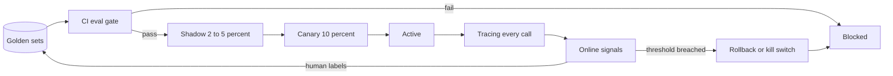

# Validation and Verification of AI

How we know the AI works before release, and how we know when it stops working in production. Deterministic parts of the platform are tested in the ordinary way; this document covers the non-deterministic parts.

Related decisions: [ADR-008](adr/ADR-008-evaluation-gated-promotion.md), [ADR-011](adr/ADR-011-human-in-the-loop.md), [ADR-012](adr/ADR-012-llm-observability-and-kill-switches.md). Harness design: [eval-harness.md](implementation/eval-harness.md).

## The loop

Labels captured in production (keeper verdicts, guest feedback, manual counts) flow back into the golden sets, so the evaluation improves as the system is used.

## Before production

### Golden datasets

One human-labelled golden set per capability, versioned alongside the prompts. Minimum sizes: 200 rows for guest-facing chat, 100 per species group for welfare, 50 labelled frame sets per tank for counting. Example rows:

| Capability | Input | Expected | Required evidence |
|---|---|---|---|
| `chat.guide` | "Which rides are safe for a four year old and have no queue right now?" | List of height-appropriate rides, ordered by current queue, each citing the ride page and live occupancy feed | Citations to at least one knowledge chunk and the occupancy snapshot |
| `chat.guide` | "Can I feed the piranhas?" | Refusal with the safety rule and a pointer to keeper talks | Cites the safety policy chunk; no invented feeding times |
| `summarise.welfare` | Structured anomalies for enclosure E12: feed leftover up 40% for three days, water ammonia trending up | Brief that names both anomalies, links them, recommends a keeper check, cites the two data series | Every claim maps to an anomaly id; no anomaly invented |
| `count.piranha` | 30 second clip at feeding time, tank T3 | Count 47, interval 44 to 50 | Ground truth from keeper manual count the same day |

### Metrics

| Metric | Applies to | Method |
|---|---|---|
| Accuracy or task success | All | Reference match, rubric score, or numeric error |
| Groundedness | GenAI | Every factual claim maps to a cited source chunk or data point |
| Citation coverage | GenAI | Share of answers with at least one valid citation |
| Refusal correctness | Guest-facing | Refuses on safety and medical topics; does not refuse benign questions |
| Schema validity | Structured outputs | Parses against the declared schema |
| Tone | Guest and offer content | Rubric score, human calibrated |
| Latency and cost | All | p95 latency and cost per 1,000 requests against the capability contract |
| Count accuracy | AI-1 | Absolute error and interval coverage against manual counts |
| Anomaly precision and recall | AI-2, AI-6 | Against keeper or inspector verdicts |
| Forecast error | AI-3 | MAPE against actual occupancy |

### LLM-as-judge with a human-calibrated rubric

A judge model scores free-text outputs against a written rubric. Before the judge is trusted, a human panel scores a sample and the judge's agreement with the panel must exceed an agreed threshold; the rubric is edited until it does. The judge is itself a registry capability (`judge.rubric`) and can be swapped like any other model. A sampled human review continues on every run.

### CI gate

The eval runs on every change to a prompt, a retrieval index, a guardrail policy or a registry entry, and nightly. No model or prompt goes live below the capability's minimum score. Results are attached to the change and to the registry entry.

### Determinism where possible

Structured outputs, low temperature, deterministic pre- and post-processing, fixed retrieval ordering, and versioned prompts. Only the language layer remains non-deterministic, and it is bounded by schema checks and citation requirements.

## In production

### Tracing

Every model call is traced with OpenTelemetry into an LLM observability tool such as Langfuse or Arize Phoenix: capability, model and version, prompt version, retrieved chunks, final output, tokens, cost from the registry price sheet, latency, guardrail decisions, and any user or keeper feedback attached later.

### Online signals

| Signal | Source | Threshold | Action |
|---|---|---|---|
| Schema failure rate | Model access layer assertions | Above 1% over 15 minutes | Alert; auto-rollback if in canary |
| Citation coverage | Catalogue grounding check plus our own citation assertion | Below 95% over 1 hour | Alert owning team |
| Guest thumbs-down rate | App feedback | Above 2x trailing 7-day baseline | Alert; review sample |
| Escalation to human | App and support | Above 2x baseline | Alert |
| Keeper rejection rate on brief items | Keeper tablet | Above 30% for a species group | Pause that species group's model; review |
| Refusal rate | Managed guardrail outcomes | Outside 0.5x to 2x baseline | Alert |
| p95 latency | Model access layer traces | Above contract for 5 minutes | Circuit breaker; failover |
| Cost per 1,000 requests | Token metering and registry price sheet | Above 120% of plan | Warn; 150% auto-shift; hard cap to Tier 3 |
| Forecast error | Ops service | MAPE above 20% for 3 days | Retrain trigger; ops notified |
| Count disagreement | Edge vision versus manual | Manual count outside the model interval | Recalibrate; audit frames |
| Confidence interval width | Edge vision | Widening for 7 days | Camera or lighting check |

### Drift monitors

Output distributions (length, refusal share, topic mix), retrieval hit rates and confidence distributions are tracked against a baseline captured at promotion. A statistically significant shift raises an alert even when no single threshold above is breached.

### Shadow, canary, rollback

Every model or prompt change goes through shadow (mirrored traffic scored offline) and canary (live share with online signals compared against the control). The canary is rolled back automatically when its signals fall below the control's by more than the agreed margin. See the lifecycle diagram in [uncertainty.md](uncertainty.md).

### Kill switch

Each AI feature sits behind a feature flag. Flipping it hands the feature to its Tier 3 fallback without a deploy. The on-call runbook lists the flag per feature.

### Human audit cadence

| Audit | Cadence | Who |
|---|---|---|
| Sampled guest conversations against the rubric | Weekly | Guest experience lead |
| Sampled welfare briefs against the underlying data | Weekly | Head keeper |
| Manual animal counts versus model counts | Monthly per tank | Keepers |
| Roster suggestions versus outcomes | Monthly | Operations manager |
| Ride anomaly flags versus inspection findings | Every inspection | Ride safety inspector |
| Offer content and pricing suggestions | Before each campaign | Marketing and finance |
| Judge calibration against the human panel | Quarterly and on judge change | Platform team |

## Per use case

| Use case | Primary quality metric | Ground truth source | Production signal | Audit cadence |
|---|---|---|---|---|
| AI-1 Piranha counting | Absolute count error and interval coverage | Keeper manual counts | Count disagreement, interval width | Monthly per tank |
| AI-2 Welfare anomaly and brief | Anomaly precision and recall; brief groundedness | Keeper and vet verdicts | Keeper rejection rate, citation coverage | Weekly |
| AI-3 Crowd flow and staffing | Forecast MAPE; roster acceptance | Actual occupancy; ops decisions | Forecast error, queue outcomes | Monthly |
| AI-4 Guest guide | Rubric score, groundedness, refusal correctness | Golden set, human panel | Thumbs-down, escalation, citation coverage | Weekly |
| AI-5 Retention and revenue | Propensity lift; offer rubric score | Return visits; human panel | Conversion versus control; complaint rate | Per campaign |
| AI-6 Ride condition monitoring | Anomaly precision against inspection | Inspector findings | Flag versus finding agreement | Every inspection |
| AI-7 Company copilots | Rubric score; time saved | Staff review | Edit distance before acceptance | Monthly |
