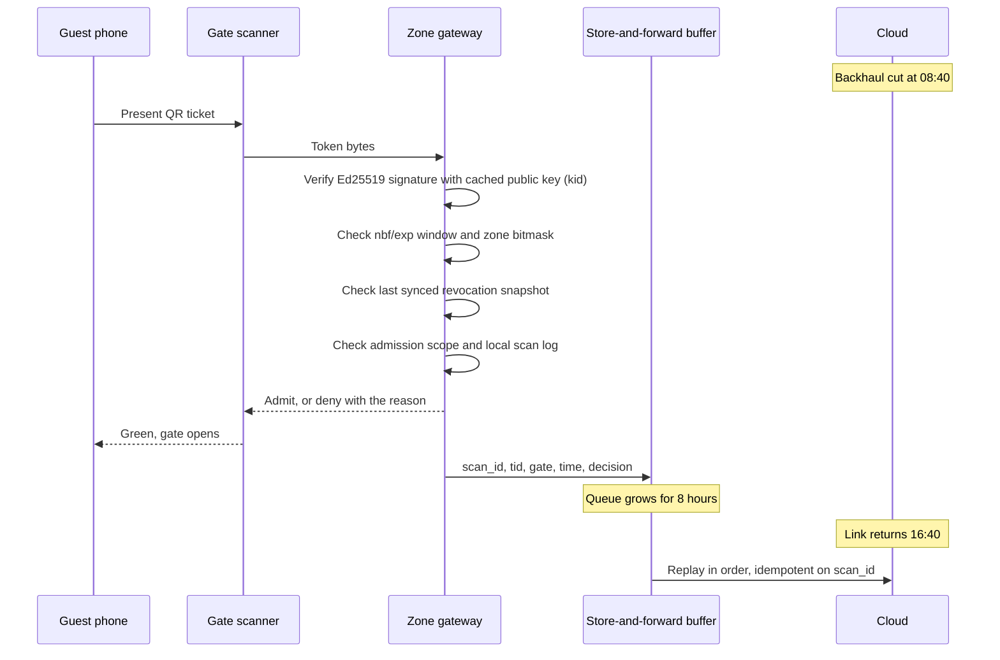
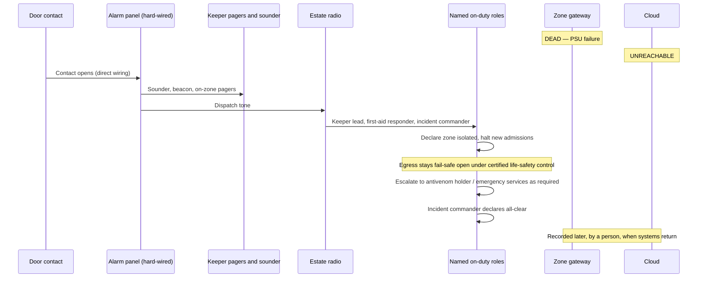
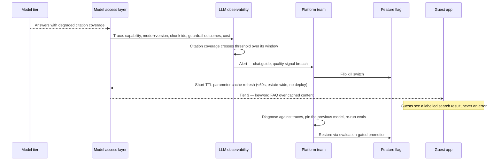

# Three walkthroughs

Three scenarios, followed end to end. They are chosen because each one is a claim this architecture makes that a reader should not have to take on trust: that the park keeps selling and admitting with the cloud gone, that a keeper survives an incident with the computers gone, and that a generative feature can be withdrawn mid-conversation without a guest hitting an error.

Each walkthrough names the components, the timings, the human decisions and the evidence that proves it. Nothing below invokes a component that the phase it belongs to has not yet built ([delivery plan](delivery-plan.md)).

---

## 1. Gate admission during an eight-hour outage

**Phase 1. No AI anywhere in this scenario.**

A contractor cuts the fibre at 08:40. Cellular failover at the network room degrades rather than restores — enough for a trickle, not for the estate. The park opens at 09:00 and 5,000 people arrive.

### What happens, hour by hour

| Time | What the estate sees |
|---|---|
| 08:40 | Fibre cut. Gateways detect the bridge down; buffers begin filling. Ops dashboard switches to zone-local view, showing counts from each gateway instead of estate occupancy |
| 09:00 | Gates open. Every scan is verified locally against the cached public key — [no cloud call is on this path by design](architecture/02-containers.md#coupling-rules) |
| 09:00–16:40 | Admissions, re-entries and family passes all work. Occupancy is computed per zone at the 15-minute grain and shown on the local dashboard. Alarm rules keep evaluating on their last synced definitions |
| 16:40 | Link returns. Buffers replay in order. Replay is **idempotent on `scan_id`**: a scan delivered twice is counted once, so occupancy and revenue do not double-count. This is a statement about records, not about admissions |
| 16:45 | Estate-wide occupancy backfills. Nothing was lost |

### What degrades, stated plainly

| Degradation | Consequence | Why it is accepted |
|---|---|---|
| New online ticket sales pause | Walk-ups are sold at the gate against the local product list | The revenue at risk is hours of online sales; the revenue protected is the whole gate |
| A refund issued during the outage is still honoured at the gate | One admitted guest who should not have been | Bounded by the revocation snapshot's age and reconciled on replay. Stated in [signed-ticket-format](implementation/signed-ticket-format.md#revocation) |
| **A single-use entitlement can be used at two different zone gates** | Bounded ticket fraud for the duration of the outage. A permitted re-entry or ride/day-pass scan is recorded as allowed use, while a same-gateway single-use repeat is refused from the local log | A partitioned gateway cannot see other gateways' scan logs, and the alternative — putting a cloud lookup in every scan — fails the first ranked characteristic on the estate's most common failure. Every scan carries its gateway identifier and admission scope, so the exposure is measurable after the fact. Full statement of the trade in [known limitations](limitations.md#the-availability-versus-fraud-trade) |
| Estate-wide occupancy is stale | Ops sees seven zone views rather than one estate view | Each zone view is live and correct; the aggregate is the only casualty |
| A scanner that cannot reach its own gateway | It cannot admit automatically; the cold spare restores the validator, or staff use the trained controlled manual-admission log | The gateway holds revocation and local-use state. Pretending that a scanner can replace it would silently widen the fraud and revocation exposure |

### What it proves

That [availability under partition](architecture/05-characteristics.md) — the first ranked characteristic — is a property of the design and not a hope. The gate validator has its cached public key, revocation snapshot and clock on the zone gateway; no cloud call is needed. The decision to make tickets offline-verifiable ([ADR-003](adr/ADR-003-offline-verifiable-signed-tickets.md)) is what makes this a normal day rather than an incident.

**Evidence.** The eight-hour cut drill is a Phase 1 gate: every valid ticket admitted, no manual fallback used, and a replay that reconciles exactly once per `scan_id` with no welfare event lost ([delivery plan](delivery-plan.md#phase-1-keep-the-park-open), [traceability](traceability.md)).

---

## 2. Welfare alarm with the cloud and the gateway both unavailable

**Phase 1. No AI anywhere in this scenario — deliberately.**

A door contact on a venomous enclosure opens outside a maintenance window. At the same moment, the zone gateway is dead: failed PSU, and the cold spare has not yet been swapped in. The cloud is also unreachable. This is the worst credible state of the estate's most consequential requirement.

### Why the alarm still sounds

The detection-to-alerting path is wired, not routed. The alarm panel is driven directly by the contact; its safety-owned local bypass is used only during an authorised maintenance window. The gateway can receive a non-blocking copy for context and recording, but it cannot suppress or create the alarm. A keeper who cannot reach a device at all still has layer 4, a fixed panic station at floor level, wired to the same panel and to radio dispatch.

| Layer | State in this scenario | Contribution |
|---|---|---|
| 1 Physical containment | Intact | Held until the breach |
| 2 Gateway context and recording | **Failed** | Context enrichment and automatic recording lost; no safety consequence |
| 3 Hard-wired alerting | Working | Sounder, beacon, pagers |
| 4 Keeper duress | Working | Independent of everything above it |
| 5 Human response | Working | Named roles, radio, drilled procedure |

Layer 5 is the floor: if 2, 3 and 4 were all gone, the estate is in the state it managed this collection in before any of this was built — trained people and a radio.

### What is missing, and what it costs

The incident record. The append-only welfare record, licence reporting and timeline reconstruction all depend on the gateway buffer and the cloud, and in this scenario both are gone. The record is reconstructed afterwards by a person, from the radio log and the incident commander's notes.

That is the correct trade and it is the point of the [safety case](architecture/06-safety-case.md): the recording path is allowed to fail because it is **dashed** on the response diagram. Every solid arrow — detection, alerting, dispatch, isolation, escalation, all-clear — is free of software, network and AI dependency.

### What is deliberately not here

No model scores this event. No cloud service decides anything. No software actuates a door: automatic containment could trap a keeper and would need certification as a safety function, and it is rejected in [ADR-016](adr/ADR-016-local-incident-response.md). Egress is held by the certified life-safety system, and no estate-written service can lock a person in.

### What it proves

That the boundary between "AI advises" and "deterministic systems decide" is drawn in hardware, not in policy language. Anyone can write "human in the loop"; this scenario shows the loop with the computers switched off.

**Evidence.** The containment and duress drill is a Phase 1 gate, run with the cloud powered off, measured against the fitness functions in the [safety case](architecture/06-safety-case.md#fitness-functions).

---

## 3. The guest guide answers with citations, then is killed safely mid-season

**Phase 3. This is the GenAI scenario, and it is a two-act story: the feature working, then the feature being withdrawn.**

### Act one: a grounded answer

A family asks the guide, *"Is the Victorian Carousel suitable for our 4-year-old, and what's the queue like?"*

| Step | Component | What it does |
|---|---|---|
| 1 | Guest app | Sends the question with the family profile the guest supplied |
| 2 | Engagement service | Consent check, PII redaction, per-user rate limit |
| 3 | Engagement service | Semantic cache lookup — miss, because the queue half of the question is live |
| 4 | Engagement service → vector store | Retrieves the carousel's approved ride-restriction content |
| 5 | Engagement service → Park Ops | Tool call for the current queue estimate, from the 15-minute occupancy grain |
| 6 | Model access layer *(a library inside Engagement, not a hop)* | Resolves the `chat.guide` **capability** — not a model — from the capability map, checks the kill switch, opens the span |
| 7 | Model catalogue | Tier 1a model, stable prefix served from prompt cache |
| 8 | Model access layer | **Asserts citation coverage and schema** before the answer leaves |
| 9 | Guest app | Answer, with citations to estate content and a map link |

The guide answers: minimum-height rule with a citation to the estate's own ride page, current queue with a timestamp, and a suggestion of a quieter half-hour later. Note where the work happens: **the Engagement service orchestrates, the model access layer only governs the call.** Retrieval, caching and tool calls belong to the service; capability resolution, the kill switch, metering and the output assertions belong to the library ([ADR-005](adr/ADR-005-model-access-and-capability-contracts.md)). The assertion at step 8 is the load-bearing one — an answer that cites nothing is not returned. The guide says it does not know and points to staff.

Had the family asked whether their child's medication is safe in the heat, the answer would be a fixed refusal and a route to a staff member, scored on the medical and safety golden set at 100% refusal correctness ([validation](validation.md)).

### Act two: quality breaches, and the feature is withdrawn

Six weeks later the catalogue serves a minor model update inside the same version alias. Nothing in the estate changed.

**What the guest experiences.** Mid-session, the question box keeps working. The answer becomes a keyword search result over the same approved content, labelled as such. No spinner, no error page, no dead feature — the Tier 3 fallback is the same fallback the app already uses when a guest's phone has no signal, so it is exercised every single day rather than being emergency code that has never run.

**What makes this possible, and where each part is decided.**

| Mechanism | Why it matters here | Decided in |
|---|---|---|
| Features name capabilities, never models | The switch is one configuration value, estate-wide | [ADR-005](adr/ADR-005-model-access-and-capability-contracts.md) |
| Assertions live in the access layer, not the catalogue | Citation checks hold for Tier 2 and Tier 3 answers too | [ADR-012](adr/ADR-012-llm-observability-and-kill-switches.md) |
| Every GenAI feature has a non-AI floor | There is somewhere safe to fall to | [ADR-006](adr/ADR-006-multi-provider-portfolio.md) |
| Kill switch and budget cap are one mechanism | Manual and automatic withdrawal cannot diverge | [ADR-007](adr/ADR-007-model-registry-and-cost-policies.md) |
| Restoration needs eval, shadow and canary | The feature cannot come back on a hunch | [ADR-008](adr/ADR-008-evaluation-gated-promotion.md) |

### What it proves

That the estate's exposure to model churn, price moves and vendor decisions is bounded by configuration rather than by code. The scenario that usually forces an emergency release here produces an alert, a flag flip, and a degraded-but-working feature — under a minute, no deploy, and the guest never sees a failure.

**Evidence.** The kill-switch drill is a Phase 3 gate: guide withdrawn estate-wide inside a minute, guests land on keyword FAQ, no error state ([delivery plan](delivery-plan.md#phase-3-act-on-them)).

---

## Related

- [Delivery plan](delivery-plan.md), the phases these scenarios sit in
- [06-safety-case](architecture/06-safety-case.md), the full design behind walkthrough 2
- [signed-ticket-format](implementation/signed-ticket-format.md), the token behind walkthrough 1
- [AI-4 Guest guide](ai/ai-04-guest-guide.md) and [validation](validation.md), behind walkthrough 3
- [traceability](traceability.md), every requirement to its design and its evidence
