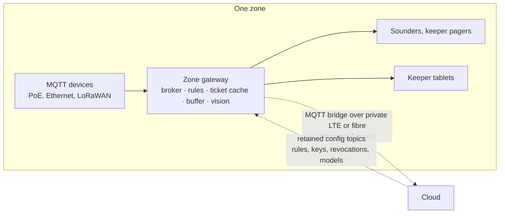

# Zone gateways

*What they are, why the estate is divided this way, and what would break without them.*

---

## The short answer

A zone gateway is a physical computer — a fanless industrial PC in a cabinet — installed in each part of the park. There are about eight of them. Every MQTT device nearby (scanner, sensor kit, feeder, camera, counter) connects to its zone gateway rather than to the internet.

It is not a router and not a protocol converter. It is the machine that holds the logic the zone needs to keep running with nothing else reachable.

## The idea

**The zone is the unit that must survive on its own.**

Trace what happens without one. A family scans a family pass at the turnstile. If that scan must reach a cloud server to get a yes or no, then a dropped link means a dead turnstile and a queue of families who paid and cannot get in. ADR-001 puts it bluntly: *a queue of families at a dead turnstile is a lost day.*

The same reasoning, with worse consequences, in the aquatic house. A pH probe reads ammonia above the species band. If the alarm has to round-trip to the cloud before a sounder goes off and a keeper is paged, then patchy connectivity becomes dead fish.

So the design starts from a different question than "where should the servers go". It asks: **what is the largest area that can be cut off from everything else and still do its job?** The answer is a zone. Put a computer in each one, give it everything that zone needs to run unattended, and the connectivity constraint stops being an existential problem and becomes a data-freshness problem.

## Why not the obvious alternatives

ADR-001 considered three shapes and rejected two:

| Option | Summary | Why not |
|---|---|---|
| A. Cloud-centric | Thin devices publish straight to a cloud IoT hub; all logic runs in the cloud | Fails the connectivity constraint outright. Every gate scan, alarm and keeper action becomes a cloud round trip on a link known to be unreliable |
| B. Edge-heavy | Everything runs on estate hardware; the cloud is a backup | Robust in the field, but 3x visitor growth means buying and operating more on-site compute every season, analytics tooling is weak, and access to frontier AI models is awkward |
| C. Edge-first hybrid | Zone gateways run local validation, alarms and buffering; the cloud owns ticketing, analytics, AI and long-term data | **Chosen.** Each side degrades gracefully without the other |

The word doing the work in option C is *gracefully*. Cloud unreachable: gates admit, alarms fire, keepers work, data queues. Edge gateway dead: that one zone falls back to its spare while the rest of the estate and all cloud services continue.

## What actually runs on the box

Five things, and the list is deliberately short:

| Component | What it does | Why it cannot live in the cloud |
|---|---|---|
| Local MQTT broker | Every device in the zone publishes here; keeper tablets subscribe here | Devices must reach a broker over a cable 50 m away, not a link 300 km away |
| Alarm rule engine | Water chemistry out of band, venomous enclosure door open, feeder underdispensed, device gone silent | An alarm that waits for a network is not an alarm |
| Ticket validation cache | Signing keys, validity windows and a revocation list, so a scanner verifies a signature locally | Entry must work with the backhaul down (ADR-003) |
| Store-and-forward buffer | Disk queue sized for 72 hours of zone events at peak rate | It exists precisely because the link is not there |
| Edge vision (Z4, Z5 only) | Cameras feed RTSP into a GPU module; it emits counts, confidence and sampled frames | Video bandwidth would not survive the backhaul, and video should not leave the estate at all (ADR-010) |

Note what is *not* on the list: no ticket sales, no CRM, no analytics warehouse, no generative AI. Those want central data and elastic compute, so they stay in the cloud. The gateway holds only what the zone needs during a partition.

## How a zone hangs together

The solid lines keep working during a partition. The dotted line is the only one that is allowed to fail.

## Why the zones are drawn where they are

The boundaries are not arbitrary; each zone has a stated reason for existing separately.

| Zone | Covers | Why it is its own zone |
|---|---|---|
| Z1 Entrance | Main gates, ticket office, car park | Highest scan rate; must admit guests with nothing else working |
| Z2 Rides North | About 20 of the 40 rides | Ride operators need local advisories and gate scans; vibration data is high rate |
| Z3 Rides South | The other 20 rides | Two zones keep the PoE and radio runs short |
| Z4 Aquatic House | Tanks including the piranha collection | Water chemistry alarms are life-critical; vision counting needs a GPU |
| Z5 Terrestrial House | Land enclosures including the venomous collection | Environmental alarms, activity cameras, keeper safety |
| Z6 Gardens and Plants | Carnivorous plants, walks, outdoor enclosures | Low-rate sensors over long distances: LoRaWAN territory |
| Z7 Back of House | Kitchens, feed store, vet room, workshop | Feed weights, vet records, energy metering |
| Z8 Central | Site core, backhaul aggregation, spare gateway | Aggregates backhaul and holds the hot spare |

Two patterns are visible in that table. **Cable distance** splits the rides into two zones. **Criticality and hardware** separate the animal houses, because they are the places where a partition has welfare consequences and where a GPU is required.

## Hardware classes

Only three, so that spares and configuration stay simple:

| Class | Zones | Spec sketch |
|---|---|---|
| Standard | Z1, Z2, Z3, Z6, Z7 | Fanless industrial PC, 8 cores, 32 GB RAM, 1 TB SSD, dual NIC, PoE switch alongside |
| Vision | Z4, Z5 | Standard plus a Jetson-class GPU module |
| Spare | Z8 | One Vision-class unit, cold, configured to take over any zone by restoring its config and buffer |

The spare is the availability answer for the gateway itself. A Vision-class spare can stand in for a Standard zone; the reverse would not work, which is why the spare is the more capable class.

## How devices reach it

Guest WiFi is never on this path. That is the whole point.

| Link | Used for |
|---|---|
| PoE and Ethernet | Fixed devices in buildings: scanners, sensor kits, feeders, cameras. Power and data on one cable |
| LoRaWAN | Low-rate outdoor sensors in Z6 and outlying enclosures. Kilometre range, years of battery |
| Private LTE or 5G, point-to-point radio | Gateway to site core where fibre does not exist |
| Guest WiFi | The guest app only, which is offline-first and never on the critical path |

## The part that is easy to miss

The sync is **two-way and retained**.

Alarm rule definitions, ticket signing keys, revocation lists and ML model artifacts are all authored in the cloud and published to *retained* MQTT configuration topics. A gateway that has been offline for a day reconnects and immediately receives the latest version of each, without anyone visiting the cabinet.

This is what stops the design becoming eight snowflake servers that drift apart and have to be maintained by hand. The gateway is best understood as **a cache with a rule engine**: the cloud stays the source of truth for rules, keys and models, and the gateway simply never blocks on reaching it.

## What it buys

| Ranked characteristic | How the gateway carries it |
|---|---|
| 1. Availability under partition | Gate validation, enclosure alarms and keeper tools all work with the cloud unreachable |
| 4. Data integrity | 72-hour buffer plus per-device sequence numbers means no event lost and none double-counted on replay |
| 5. Elastic scalability | The cloud scales to 3x elastically; the edge scales by **adding a zone**, not by resizing one |
| 7. Security and privacy | Video never crosses the zone boundary; only counts, confidence and sampled frames do |

The fitness functions attached to those characteristics are specific and testable: gate validation succeeds with the backhaul down for 8 hours, an enclosure alarm reaches a keeper within 30 seconds with the cloud unreachable, a gateway buffers 72 hours of telemetry without loss.

## Common misreadings

**"It is just an MQTT broker."** The broker is one of five components. Without the rule engine and the ticket cache, a partition still stops alarms and entry — the broker alone would just be collecting messages nobody acts on.

**"Why not one gateway for the whole estate?"** Cable distance and blast radius. PoE runs are limited to about 100 m, and a single box means one failure takes the whole estate offline instead of one zone.

**"Why not one per enclosure?"** Cost and operational load. Eight ruggedised PCs are something a small estate team can actually maintain, spare and patch; fifty-five are not.

**"Does the estate lose data during an outage?"** No. The buffer holds 72 hours and replays in publication order on reconnect; consumers deduplicate on device identifier and sequence number. An outage produces late data, not missing data.

## Where this is specified

This note explains the idea. The specifications are:

- [03-edge-zone.md](../architecture/03-edge-zone.md) — the deployment view: zones, device counts per zone, the full wiring diagram, hardware classes, connectivity, local alarm rules
- [04-data-flow.md](../architecture/04-data-flow.md) — an event traced through a multi-hour outage and the drain on reconnect
- [ADR-001](../adr/ADR-001-edge-first-hybrid-architecture.md) — the edge-first hybrid decision and the alternatives
- [ADR-002](../adr/ADR-002-mqtt-topology-and-store-and-forward.md) — broker topology, QoS, topic scheme, store and forward
- [ADR-003](../adr/ADR-003-offline-verifiable-signed-tickets.md) — why the ticket cache works
- [ADR-010](../adr/ADR-010-edge-vision-no-cloud-video.md) — why vision runs here and video stays here

Related explainers: [estate-to-cloud path](02-estate-to-cloud-path.md), which is the link the gateway is designed to live without.
