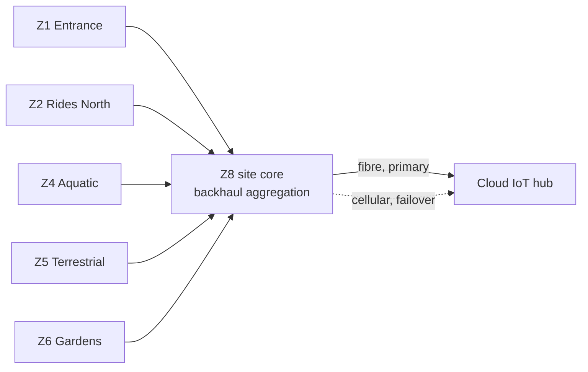

# Z8, the site core and the spare gateway

*Why one of the zones has no devices in it, what "independent zones" actually means, and where the single point of failure really is.*

---

## The short answer

Z8 is not a part of the park. It is the estate's network core, given a zone number so that it appears in deployment planning alongside everything else. It is the only zone absent from the device estimates table, because it has no scanners, sensors, feeders or cameras of its own.

It does two unrelated jobs that happen to share a rack:

1. **Site core and backhaul aggregation.** The single point where the estate's network meets the outside world.
2. **Housing the spare gateway.** One unit that can take over any zone whose gateway has failed.

Neither job involves talking to a device.

## The plain version

Before the precise answer, the shape of it.

### It is seven zones, not eight

Z1 through Z7 each manage a real part of the park. **Z8 manages nothing.** It is a network cabinet: the estate's connection to the outside world, plus a spare computer on a shelf. It carries a zone number for bookkeeping, which is the main reason the list of eight reads as confusing.

So: seven working zones, and one network room.

### Every zone pushes its own data

Each zone gateway runs its own sending software, with its own queue, its own credentials and its own connection to the cloud. Nothing sends on its behalf. **Z8 does not collect data from the zones and forward it.**

### They share one road out

The village version:

- Each of the seven zones is a house. Each writes its own letters and keeps its own outbox.
- Z8 is the one road out of the village.
- Every house posts its own letters. All the letters travel down the same road.
- If the road is blocked, each house keeps its own letters in its own sack until it reopens. No post office collected them and lost them; they never left the house.

Each zone sends independently. The sending travels over shared infrastructure.

### Follow one reading

A pH probe in the piranha tank reads high ammonia.

1. The probe sends to **Z4's gateway**, over a cable. The reading never touches the cloud.
2. Z4's gateway checks its own rules and **fires the sounder and pages the keeper**, locally, in under a second.
3. Z4's gateway puts a copy in **its own outbox** for the cloud.
4. That copy travels Z4 to Z8 to cloud.

Steps 1 to 3 happen whatever else is broken. Step 4 is the only one that can fail.

### What happens when something breaks

| What fails | Effect |
|---|---|
| Z4's gateway | Only Z4 is affected. Z1 gates still admit guests, Z5 alarms still fire. Bring the spare from Z8 |
| Z4's link to the core | Z4 keeps working completely: alarms, gates, counting. Its outbox fills. Other zones are unaffected |
| Z8, the road | All seven zones keep working locally. All seven outboxes fill. Nothing reaches the cloud |
| The cloud itself | Identical to Z8 failing, from a zone's point of view. Outboxes fill |

The bottom three rows all say the same thing: **keeps working, outbox fills.** Never *stops working*.

That is the design goal stated as a failure table. A zone can do its entire job alone — admit guests, fire alarms, count piranhas, notify keepers — with the rest of the estate and the whole internet switched off. What it cannot do alone is reach the cloud. The architecture makes the second one survivable by making sure nothing urgent ever needs it: cloud data arriving late is acceptable, a gate that will not open is not.

The rest of this note is the same answer stated precisely.

## Are the zones independent?

Yes and no, and the distinction is the interesting part of this note. "Independent" is doing three different jobs in that sentence:

| Sense of independent | Independent? | What it means |
|---|---|---|
| Operational autonomy | **Yes, completely** | Broker, alarm rules, ticket cache, buffer and vision are all local. A zone does its whole job with nothing else on the estate reachable |
| Logical cloud connection | **Yes** | Each gateway bridges to the cloud IoT hub as its own MQTT client, with its own credentials, its own disk queue and its own replay position |
| Physical transit | **No** | Every zone's traffic leaves the estate through Z8 |

So the topology is **logically a star and physically a hub and spoke**:

The deployment diagram in 03-edge-zone.md shows the same thing from one zone's point of view: the store-and-forward buffer bridges "to the core", and the core goes on "to cloud IoT hub".

Each gateway keeps its own queue and its own session. Those sessions simply share one pipe out of the estate.

## Why aggregate rather than give each zone its own uplink

Seven separate fibre or cellular services would mean seven contracts, seven security perimeters, seven sets of firewall rules, and seven things to monitor and patch. Aggregating gives the estate one egress point to secure, one place to watch, and one cellular failover that covers the whole site rather than one zone.

For an estate with a small technical team, the operational saving is the argument. The cost is stated in the next section rather than hidden.

## Then Z8 is a single point of failure

**For cloud connectivity, yes — and it is worth being honest about the shape of it.** Z8 failing does not partition one zone. It partitions *every* zone at once. That is a correlated failure, not an isolated one, and correlated failures are the ones that usually hurt.

The reason it is tolerable here is that it is the precise scenario the architecture is already built to absorb. With Z8 down:

- Gates keep admitting guests, because ticket signatures verify locally against cached keys and a revocation list (ADR-003)
- Enclosure alarms keep firing and keepers keep being paged, because rules run on the zone gateway
- Piranha counting keeps running, because the model is on the Z4 GPU and the video never needed to leave anyway (ADR-010)
- Every zone buffers for 72 hours and drains in order when the core returns (ADR-002)

The thing Z8 is a single point of failure *for* is cloud connectivity, and cloud connectivity is deliberately on the non-critical path. That is the whole point of ranking availability under partition first. Cellular failover at the core is a second physical path layered on top.

What genuinely degrades during a Z8 outage: dashboards and forecasts go stale, online ticket sales pause, the guest app falls back to cached content, and nothing new reaches the data lake until the link returns.

## Why the zone table marks it "(optional)"

Because aggregation is a convenience, not a structural requirement. At a smaller site, or in a first phase, one zone gateway could carry the backhaul directly and the others could reach it, or a zone could have its own uplink. Z8 exists because it is the tidier answer at eight zones, not because the design collapses without it.

Reading it as optional also makes the phasing obvious: the estate can build Z1 and Z4 first and add the central zone when the number of zones makes aggregation worth the rack.

## The spare gateway

One unit, **Vision class**, kept cold.

**The class matters.** The spare has to be able to replace Z4 or Z5, which need a GPU module for vision. A Standard unit could not stand in for those. A Vision unit can stand in for a Standard zone perfectly well, just with hardware that goes unused. So the spare is the more capable class, and one unit covers all seven zones.

**Cold, not hot.** It is not running and mirroring a zone; it is a configured unit on a shelf that takes over by having that zone's configuration and buffer restored onto it. Recovery is measured in the hour or two it takes to carry it to the cabinet and restore, not in seconds.

That is a deliberate trade. A hot standby per zone would mean seven more industrial PCs, continuously powered and continuously synchronised, to protect against a failure whose consequence is one zone losing cloud connectivity while its local functions are moved to a replacement box. The ranked characteristics do not justify that spend; cost transparency is on the list too.

**What restores itself and what does not.** Most of a gateway's configuration comes back on its own, because rules, signing keys, revocation lists and model artifacts are all published to *retained* MQTT configuration topics. A freshly imaged spare connects and receives the current version of each without anyone editing a file.

The exception is the store-and-forward buffer. Events that were queued on the failed gateway and never forwarded live on that gateway's disk. If the disk is recoverable, it moves with the replacement. If the failure destroyed it, those queued events are gone — the loss is bounded by how far behind the bridge was when the unit died, which on a healthy link is seconds and during an outage could be hours of that zone's telemetry.

This is the one place where the "no event is ever lost" claim has a real edge, and it is worth stating plainly rather than leaving implied. Ticket scans are the sensitive case; they carry unique identifiers and are reconciled centrally, so a lost queue shows up as a gap in reconciliation rather than a silent miscount.

## What to watch

| Risk | Why it matters | Response in the design |
|---|---|---|
| Z8 outage partitions all zones at once | Correlated failure, no zone escapes it | Everything critical is edge-local; buffers sized for 72 hours; cellular failover at the core |
| One spare for seven zones | A second gateway failing before the first is replaced leaves a zone uncovered | Zones degrade rather than stop; the failed zone's devices keep publishing but have no local broker until replaced |
| Cold spare recovery time | Hours, not seconds | Accepted deliberately against the cost of seven hot standbys |
| Unforwarded buffer on a dead disk | Bounded event loss | Reconciliation on unique identifiers surfaces the gap; the window is small on a healthy link |

## Where this is specified

- [03-edge-zone.md](../architecture/03-edge-zone.md) — the zone table, the hardware classes including the spare, the connectivity table with the fibre and cellular failover rows, and the deployment diagram showing the path through the core
- [ADR-001](../adr/ADR-001-edge-first-hybrid-architecture.md) — six to eight zones, gateways bridging to a cloud IoT hub with store and forward
- [ADR-002](../adr/ADR-002-mqtt-topology-and-store-and-forward.md) — the disk queue, replay order and deduplication that make a core outage survivable
- [04-data-flow.md](../architecture/04-data-flow.md) — the trace of an event through an outage and the drain on reconnect

Related explainers: [zone gateways](01-zone-gateways.md), the units Z8 holds a spare for; [the estate-to-cloud path](02-estate-to-cloud-path.md), the link that starts at the core; [device connectivity](04-device-connectivity.md), why the other zone boundaries fall where they do.
